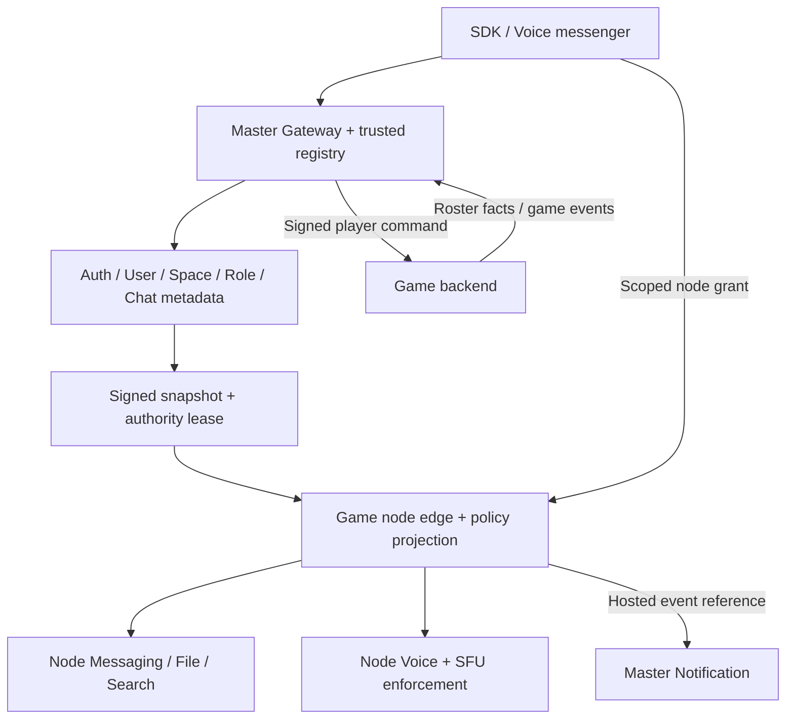

# Федерация для игр — authority, данные и нода студии

**Proposed target, runtime deferred.** [Продукт](../features/game-integrations.md),
[Game API](game-integration-api.md), [SDK](../sdk/game-sdk.md).
Этот документ предлагает уточнение старого [federation design](../features/federation.md)
для игр. До принятия решений и implementation gate он не включает deployment,
`federation_db`, migrations, readiness или alerts в G0–G4.

## 1. Что такое нода игры

Нода студии — зарегистрированное размещение контента игровых Space в общей сети
Voice. Пользователь продолжает использовать центральный аккаунт и выбранный
профиль. Разработчик размещает текст, файлы и media соответствующих сообществ;
игрок читает те же разрешённые чаты из SDK или обычного мессенджера.

Это не отдельная независимая сеть identity и не bridge двух копий переписки.
В одном Space один authoritative content home. Несколько Space корпораций могут
жить на одной ноде; разные Space одной игры — на разных нодах. Одна нода на каждую
корпорацию не требуется. Нода и game simulation server — разные trust domains,
даже если ими управляет одна студия.

Hosted и federated deployments используют один внешний контракт. Первые пилоты
SDK и бота работают на master. Переключение на ноду не должно менять игровые
сценарии или заставлять разработчика реализовывать новый чат-протокол.

## 2. Явные уточнения прежнего дизайна

| Старый текст / gap | Предлагаемое правило для game federation |
|---|---|
| Feature/architecture говорят snapshot-only; service описывает last_event_id replay | Snapshot + revisioned live changes; обязательного replay API нет |
| Весь Space tree на node, но master возвращает роли | Master owns authoritative tree/lifecycle/membership/Role; node держит projection |
| Auth fallback 5–10 минут | Отдельная короткая authority lease; старый fallback не разрешает устаревший доступ |
| `NotifyUser` адресует account и содержит preview | Проверенный профиль/ресурс; master применяет privacy, opaque payload default |
| «Node unavailable — сообщение не принято» | Если ответа нет после send, результат неизвестен; проверить idempotency/status |
| Нода хостит Space, но нет lifecycle receipt модели | Remote participants включаются в freeze/restore/purge manifest и receipts |

Proto [s2s.proto](../../protos/voice/s2s/v1/s2s.proto) — существующий scaffold
контракт, не полная wire schema этого target. Его нужно расширить до реализации,
а не считать, что текущие Role/Ban fields покрывают membership и lifecycle.
Auth Java, DM на master и central matchmaking сохраняются. Self-hosted полностью
независимый identity server потребовал бы отдельного решения владельца.

## 3. Ownership и размещение

| Данные / решение | Master | Game node |
|---|---|---|
| Auth, credentials, session epochs | Единственный источник | Проверяет node-scoped grant и свежую authority |
| Profiles и privacy | User authority | Минимальная разрешённая projection |
| Space ID, owner, lifecycle и дерево | Space authority и registry | Read projection, локальные ресурсы для hosted refs |
| Chat metadata: type, settings, принадлежность Space | Master Chat — единственный writer create/update/delete | Node Chat — только projection и lifecycle participant |
| Membership, roles, overrides, bans | Space/Role authority | Versioned authorization projection |
| Roster корпорации | Integration принимает game facts | Не изменяет master membership напрямую |
| Сообщения и история hosted Space | Routing/metadata минимум | Messaging authority и durable storage |
| Files hosted Space | Resource placement registry | File service и собственное object storage |
| Voice | Central policy + node placement | Voice service, LiveKit, TURN и active media enforcement |
| DM / standalone party вне Space | На master | Не хостит в первом этапе |
| Push tokens и уведомления | Notification authority | Передаёт проверяемую заявку на уведомление |
| Поиск | Разрешённый fan-out/aggregation | ACL-aware local index; partial result при недоступности |
| Боты | Registry/consent/actor delegation | Только explicit installation/hosted scopes |

Это осознанное изменение старой формулировки «весь backend на ноде». Ноде не
выдаются master database credentials и общие NATS subscriptions. Node имеет свои
service-owned stores; репликация — через scoped S2S API. Managed hosting может
скрывать эту топологию, но не смешивает ownership.

Master сохраняет служебные IDs/permissions/placement, а не вторую полную историю.
Через gateway, поиск или push relay некоторые разрешённые данные могут проходить
через master; «хранение на ноде» не означает «master никогда не видит содержимое».
Нельзя обещать E2E-приватность от оператора ноды, если node Messaging обрабатывает
plaintext. Пользователь видит оператора и размещение Space до вступления.

## 4. Регистрация и доверие

Node lifecycle: `pending → approved → active → draining/suspended → retired`;
`defederated` — отзыв доверия. Approval привязывает operator, endpoint allowlist,
certificate/public keys, region, supported protocol/capabilities и contact.
Sandbox/prod и tenant identities независимы.

S2S использует mutually authenticated TLS и node-scoped signing identity,
rotation overlap и explicit revocation. Endpoint ownership проверяется при
registration; discovery не следует произвольному URL из пользовательского чата.
Secret rotation не меняет node ID или home mapping. Утечка ключа отзывает node
session и блокирует новые grants до повторного admission.

Регистрация доверяет оператору в пределах ToS/контракта. Она не доказывает, что
оператор не читает диски и не сохраняет копии. Node не получает право создавать
центральные аккаунты, подделывать user commands, DM/MM events или роли Owner.
Game-server, bot и node credentials различны и имеют разные audiences.

## 5. Routing и resource identity

UUID ресурса не меняется при размещении на ноде. Master registry содержит
`resource_id`, type, `space_id`, `home_node_id`, `routing_generation`, lifecycle
state и supported capabilities. Пара node/resource — route context, не новый
глобальный идентификатор вместо канонического UUID.

1. SDK/messenger обращается к доверенному Gateway за ресурсом.
2. Registry проверяет доступ и возвращает либо proxied response, либо подписанный
   node route + ограниченный grant; точный транспорт выбирается capabilities.
3. Node проверяет audience/node/space/resource/profile, binding/session epochs,
   routing generation и authority lease. JWT от другого node/environment отвергается.
4. История и WS подключаются только к разрешённому node edge. Media идёт к node SFU.
5. SDK всё равно получает канонические chat/message IDs и error semantics.

Master refresh token и широкий access JWT на node не пересылаются. Grant содержит
минимум subject/profile, app/env/installation (где применимо), node/Space/resources,
scopes, epochs, expiry, nonce и route generation. Права проверяются также при
доставке событий, скачивании файлов, search и повторной выдаче media grant.

Client cache partitioned by environment/profile/node/route generation.
Удалённый доступ не восстанавливается кешем и не раскрывает старую историю
новому профилю. Deep link содержит opaque resource target, не credential и не
непроверенный home URL. Домашний master Gateway остаётся точкой discovery.

## 6. Authorization snapshot и live изменения

Projection включает полный набор для области: Space lifecycle/generation,
membership additions/removals, role definitions/assignments, chat/voice overrides,
account bans, профильные ограничения, ownership freeze, resource registry,
app/binding revocations и relevant session epoch floors. Глобальные account bans
применяются к любому профилю/персонажу; removal профиля не выдаётся за account ban.

Snapshot имеет scope, schema version, snapshot ID, revision/watermark, page count,
hash/completeness marker и подпись. Pages staged отдельно; activation атомарна
после проверки всех частей. Truncated/failed page не означает отсутствие bans.
Неизвестный authority field/version → fail closed + upgrade/reconcile.

Handshake: открыть scoped stream → получить snapshot на watermark R и буфер
изменений после R → атомарно активировать snapshot → применить последовательные
изменения → ACK applied revision → получить свежую lease. Если буфер переполнен,
revision gap или конфликт hash — повторить snapshot; разрешения не расширять.
Повтор revision с тем же payload — no-op, с иным — contract mismatch.

Reconnect всегда допускает полный snapshot; node не требует глобального
`last_event_id` replay. Server может иметь внутренний outbox/audit journal, но
не обещает клиенту вечный лог. S2S revision, client WS `s` и Messaging history
cursor — три разные вещи.

Lease renewal удостоверяет **applied authority revision**, а не живой TCP socket.
Master после изменения запрещает продление lease для stale projection. Heartbeat
не продлевает старые permissions. Node больше не выдаёт новые grants, если
последовательность/источник authority неизвестны.

## 7. Отзыв прав и partition

Канонический Voice target — eject активного media за **2s p95 / 5s max** после
authority change, см. [Voice Service](../microservices/voice-service.md).
Десятиминутный auth cache этому противоречит. Game-node admission требует
authority lease с бюджетом propagation + lease expiry + clock skew + media eject
**не более 5 секунд**. Конкретные lease/renewal values выбираются и проверяются
нагрузочным и partition тестом до активации (G08). Если бюджет не выполнен,
federated voice capability не включается.

Обычный LiveKit JWT не отзывается изменением app epoch. Существующий Voice
contract допускает stale reconnect до ≤60s expiry с повторным eject; это ограничение
сохраняется для hosted baseline. Строгая game-node lease требует media-side
admission verifier/enforcement, который проверяет текущую authority и не позволяет
старому bearer открыть track после её истечения, включая reconnect при упавшем
control plane. Это новая prerequisite, не существующая возможность LiveKit.
Без доказанного механизма нельзя обещать непрерывный fail-closed media доступ
или включать строгую game federation capability.

При потере authority связь может оставаться открытой для диагностики, но после
lease deadline node закрывает governed reads/writes/subscriptions/media. Нельзя
продолжать разрешённый ранее voice только потому, что media transport жив.
SDK может продолжить отображать уже разрешённый локальный UI по cache policy,
но не считает это правом получать новый контент.

Источники revoke: game roster removal/rank loss, unlink, integration suspension,
account ban/session revoke, role override, Space freeze/delete, node suspension.
Изменение в игре должно попасть в Voice authority через надёжный roster path.
Пять секунд считаются от commit authority в Voice; задержка game→Voice измеряется
отдельно и ограничивается roster freshness contract (G09). До его согласования
нельзя обещать «исключение в игре закрывает доступ за пять секунд».

При stale game roster интеграция закрывает managed доступ по отдельной lease
источника; бесконечное сохранение membership при падении game backend запрещено.
Срок допуска и read-only/offline policy фиксируются студией до pilot. Friendly
постоянные группы Voice, не управляемые roster игры, от этого не исчезают.

## 8. Надёжность сообщений, команд и notifications

Node Messaging подтверждает send только после durable commit; replication/backup
RPO не равен нулю автоматически. Потеря ответа после commit — unknown outcome;
тот же client message ID позволяет получить прежний результат. Master не создаёт
дубликат чата, пока node недоступен.

Game commands используют [durable bot protocol](../features/game-bot-interactions.md).
Node не подтверждает игровой эффект; signed actor proof от master/доверенного
Auth обязателен независимо от node transport identity. Сервер игры повторно
проверяет binding и игровую authority при исполнении.

Notifications — best-effort сигнал о durable событии. Node предоставляет hosted
resource/event reference, intended profile и разрешённую категорию. Master
проверяет hosting, membership/privacy/consent, DND и dedupe. Preview опционален
и подчинён настройкам; push credentials не уходят node. Node не может прислать
DM или match_found от имени master. Потерянный push не теряет command/result.

Federated поиск обращается только к доступным пользователю ресурсам; unavailable
node даёт partial indicator. Search snippets и файлы проверяют authority на чтении,
а не только во время индексации. Signed download URLs ограничены audience/expiry
и lifecycle policy; длинный URL lifetime не должен обходить revoke.

## 9. Freeze, purge, restore и дефедерация

Master Space остаётся lifecycle coordinator. Manifest включает все требуемые
participants текущего Space, включая remote Chat/Messaging/File/Voice и новые
Integration/Bot consumers, если они владеют данными. Нельзя уменьшать существующий
participant set ради доступности ноды.

Freeze/generation распространяются до подтверждения операции. Receipts подписаны
node/service identity и связаны с exact Space, generation, manifest и phase.
Disconnected/untrusted node = pending/unavailable, не `purge complete`. Recovery
window и переходы следуют существующему Space lifecycle, включая receipt gates;
данный дизайн не задаёт новую дату физического удаления.

Restore использует новую generation, проверяет permanent purge fences и не
воскрешает retired roles. Backup restore node выполняет reconciliation/fences
до открытия внешнего доступа. Старый snapshot не может продлить authority lease.
Deletion receipts — аттестация оператора/сервиса, не криптографическое доказательство
отсутствия копий на чужом диске.

Дефедерация отзывает credentials, routing и новые connections; приложение честно
показывает недоступный Space и контакты оператора по принятой policy. Нельзя
обещать, что дефедерация физически стёрла данные или перенесла их на master.
Правила export/appeal/permanent loss требуют G10, а не автоматического обещания.

## 10. Миграция между нодами

Online migration не входит в первый pilot. Пока нет проверенного migration
protocol, `home_node_id` immutable для активного Space. Недоступность не запускает
автоматическое перемещение и не меняет storage region без решения оператора.

Будущий перенос: drain writes → consistent manifest/export под lifecycle fence →
copy/checksums → verify IDs/history/files/retention/command dedupe → bump routing
generation → fence старого home → admit нового → reconcile clients. Old node не
принимает writes по старой generation. Rollback допустим только если исключён
двойной writer и не потеряны подтверждённые writes нового home. Нужны отдельные
RPO/RTO и пользовательское уведомление (G10).

## 11. Failure matrix

| Сбой | Требуемое поведение |
|---|---|
| Node недоступен до send | Retryable unavailable, без создания shadow chat |
| Ответ потерян после send | Pending/unknown, read/retry со стабильным ID |
| Master недоступен | Нет новых grants; expire authority lease, закрыть governed доступ |
| Game backend недоступен | Commands queued до expiry; roster по freshness lease; честный UI |
| S2S gap / неполный snapshot | Не активировать, запросить полный snapshot |
| Пропущен revoke | Lease bound fences доступ; проверить failure injection |
| SFU жив, node control plane упал | Отдельный enforcement/watchdog обязан закрыть media в бюджете |
| Истёк сертификат / defederation | Нет implicit fallback на незащищённый endpoint |
| Node восстановлен из backup | Fence reconciliation до serving; старые credentials не оживают |
| Node operator злонамеренный | Отзыв network trust; не обещать защиту локального plaintext от оператора |

## 12. Эксплуатационный gate

Нужны versioned deployment profile, TLS/DNS/egress requirements, storage/SFU
capacity, backups с restore proof, upgrade/rollback, health/capability negotiation,
queue lag и lease-expiry metrics, rate limits и tenant isolation. Global readiness
master не падает из-за одной сторонней ноды; её Space имеют собственный статус.

Нагрузка проверяется по active memberships, chats fan-out, concurrent media и
reconciliation size. Metrics не содержат raw messages/character secrets.
Support boundary разделяет отказ игры, Voice master и operator node. SLA и
цены не объявляются до G07/G08/G10. Первый пилот включает одну ноду, два Space,
разные роли, игрока в SDK и игрока в мессенджере, partition/revoke и backup restore.
