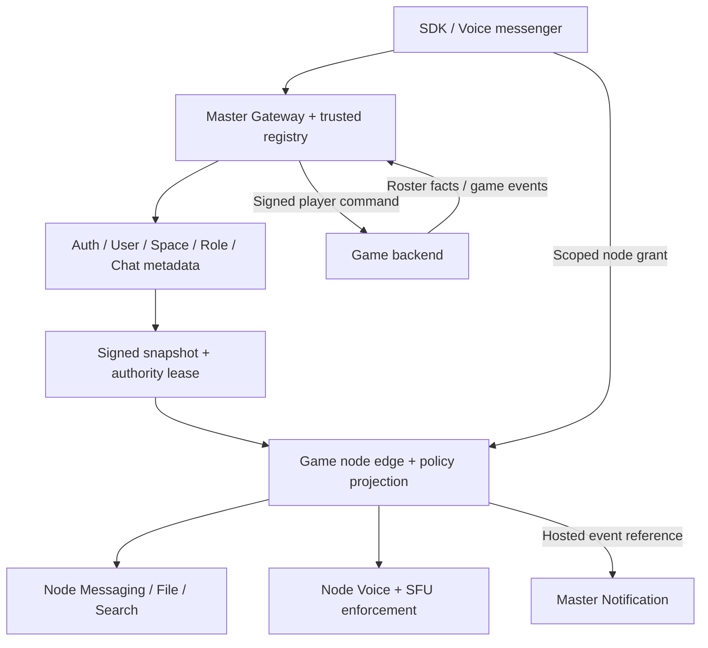

# Федерация для игр — authority, данные и нода студии

**Proposed target, runtime deferred.** [Продукт](../features/game-integrations.md),
[Game API](game-integration-api.md), [SDK](../sdk/game-sdk.md).
Этот документ предлагает уточнение старого [federation design](../features/federation.md)
для игр. До принятия решений и implementation gate он не включает deployment,
`federation_db`, migrations, readiness или alerts в G0–G4.
Voice Node bundle входит в спринт Voice. Распространяемые SDK/assets — отдельная
задача; все SDK-сценарии приёмки ноды здесь выполняются внутренним protocol/media
test client и мессенджером, не требуют Unity/Unreal packages.

## 1. Что такое нода игры

Нода студии — зарегистрированное размещение контента игровых Space в общей сети
Voice. Пользователь продолжает использовать центральный аккаунт и выбранный
профиль. Разработчик размещает текст, файлы и media соответствующих сообществ;
игрок читает те же разрешённые чаты из SDK или обычного мессенджера.

Это не отдельная независимая сеть identity и не bridge двух копий переписки.
В одном Space один authoritative content home. Несколько Space корпораций могут
жить на одной ноде; разные Space одной игры — на разных нодах. Одна нода на каждую
корпорацию не требуется. Нода и game simulation server — разные trust domains,
даже если ими управляет одна студия.

Hosted и federated deployments используют один внешний контракт и входят в
общую приёмку одного спринта. Переключение на ноду не должно менять игровые
сценарии или заставлять разработчика реализовывать новый чат-протокол.

## 2. Явные уточнения прежнего дизайна

| Старый текст / gap | Предлагаемое правило для game federation |
|---|---|
| Feature/architecture говорят snapshot-only; service описывает last_event_id replay | Snapshot + revisioned live changes; обязательного replay API нет |
| Весь Space tree на node, но master возвращает роли | Master owns authoritative tree/lifecycle/membership/Role; node держит projection |
| Auth fallback 5–10 минут | Отдельная короткая authority lease; старый fallback не разрешает устаревший доступ |
| `NotifyUser` адресует account и содержит preview | Проверенный профиль/ресурс; master применяет privacy, opaque payload default |
| «Node unavailable — сообщение не принято» | Если ответа нет после send, результат неизвестен; проверить idempotency/status |
| Нода хостит Space, но нет lifecycle receipt модели | Remote participants включаются в freeze/restore/purge manifest и receipts |

Proto [s2s.proto](../../protos/voice/s2s/v1/s2s.proto) — существующий scaffold
контракт, не полная wire schema этого target. Его нужно расширить до реализации,
а не считать, что текущие Role/Ban fields покрывают membership и lifecycle.
Auth Java, DM на master и central matchmaking сохраняются. Self-hosted полностью
независимый identity server потребовал бы отдельного решения владельца.

## 3. Ownership и размещение

```mermaid
flowchart TB
  Client[SDK / Voice messenger] --> Master[Master Gateway + trusted registry]
  Master --> Central[Auth / User / Space / Role / Chat metadata]
  Central --> Projection[Signed snapshot + authority lease]
  Projection --> Edge[Game node edge + policy projection]
  Client -->|Scoped node grant| Edge
  Edge --> Content[Node Messaging / File / Search]
  Edge --> Voice[Node Voice + SFU enforcement]
  Game[Game backend] -->|Roster facts / game events| Master
  Master -->|Signed player command| Game
  Edge -->|Hosted event reference| Push[Master Notification]
```

| Данные / решение | Master | Game node |
|---|---|---|
| Auth, credentials, session epochs | Единственный источник | Проверяет node-scoped grant и свежую authority |
| Profiles и privacy | User authority | Минимальная разрешённая projection |
| Space ID, owner, lifecycle и дерево | Space authority и registry | Read projection, локальные ресурсы для hosted refs |
| Chat metadata: type, settings, принадлежность Space | Master Chat — единственный writer create/update/delete | Node Chat — только projection и lifecycle participant |
| Membership, roles, overrides, bans | Space/Role authority | Versioned authorization projection |
| Roster корпорации | Integration принимает game facts | Не изменяет master membership напрямую |
| Сообщения и история hosted Space | Routing/metadata минимум | Messaging authority и durable storage |
| Files hosted Space | Resource placement registry | File service и собственное object storage |
| Voice | Central policy + node placement | Voice service, LiveKit, TURN и active media enforcement |
| DM / standalone party вне Space | На master | Не хостит в scope этой поставки |
| Push tokens и уведомления | Notification authority | Передаёт проверяемую заявку на уведомление |
| Поиск | Разрешённый fan-out/aggregation | ACL-aware local index; partial result при недоступности |
| Боты | Registry/consent/actor delegation | Только explicit installation/hosted scopes |

Это осознанное изменение старой формулировки «весь backend на ноде». Ноде не
выдаются master database credentials и общие NATS subscriptions. Node имеет свои
service-owned stores; репликация — через scoped S2S API. Managed hosting может
скрывать эту топологию, но не смешивает ownership.

Master сохраняет служебные IDs/permissions/placement, а не вторую полную историю.
Через gateway, поиск или push relay некоторые разрешённые данные могут проходить
через master; «хранение на ноде» не означает «master никогда не видит содержимое».
Нельзя обещать E2E-приватность от оператора ноды, если node Messaging обрабатывает
plaintext. Пользователь видит оператора и размещение Space до вступления.

## 4. Регистрация и доверие

Node lifecycle: `pending → approved → active → draining/suspended → retired`;
`defederated` — отзыв доверия. Approval привязывает operator, endpoint allowlist,
certificate/public keys, region, supported protocol/capabilities и contact.
Sandbox/prod и tenant identities независимы.

S2S использует mutually authenticated TLS и node-scoped signing identity,
rotation overlap и explicit revocation. Endpoint ownership проверяется при
registration; discovery не следует произвольному URL из пользовательского чата.
Secret rotation не меняет node ID или home mapping. Утечка ключа отзывает node
session и блокирует новые grants до повторного admission.

Регистрация доверяет оператору в пределах ToS/контракта. Она не доказывает, что
оператор не читает диски и не сохраняет копии. Node не получает право создавать
центральные аккаунты, подделывать user commands, DM/MM events или роли Owner.
Game-server, bot и node credentials различны и имеют разные audiences.

### Авторизация узла и граница внутреннего NATS

Аналогия с NATS ACL — отдельная identity вызывающей стороны и минимальный набор
разрешённых операций. Внешняя нода не подключается к внутренней шине master
с credentials микросервисов. Федерационный S2S gateway проверяет mTLS peer,
node registry/status и краткоживущий grant с issuer/audience/node/env/scopes,
разрешёнными Space, placement generation и authority epoch. Сертификат
удостоверяет узел, но сам по себе не разрешает читать все Space или выполнять
произвольный RPC. Конкретный token schema — часть GI0/GI6.

Например, узел A может получить membership snapshot и отправить lifecycle
receipt для размещённого на нём Space X; тот же credential не позволяет читать
Space Y на узле B, назначать роли на master или публиковать user-auth events.
Если принятому запросу нужно внутреннее событие, его создаёт owning master
service со своим NATS credential после проверки S2S admission. Входящий payload
не выбирает произвольные внутренние NATS subjects. У ноды может быть собственный
внутренний NATS с собственными service ACL; trust domains не объединяются.

Ротация сохраняет node ID, а отзыв доверия запрещает новые вызовы и закрывает
действующие streams в принятом revocation budget. При недоступной authority
привилегированные вызовы fail closed; действуют отдельные quotas, аудит и
replay protection. Старый сертификат, истёкший grant, неверный audience/Space
и replay проверяются негативными acceptance tests.

Node authorization и user authorship независимы: право ноды передавать событие
не даёт права подписать сообщение за игрока. Для пользовательских сообщений
сохраняется device signature и master-authorized binding из
[Game API](game-integration-api.md#авторство-сообщений-пользователя).

## 5. Routing и resource identity

UUID ресурса не меняется при размещении на ноде. Master registry содержит
`resource_id`, type, `space_id`, `home_node_id`, `routing_generation`, lifecycle
state и supported capabilities. Пара node/resource — route context, не новый
глобальный идентификатор вместо канонического UUID.

1. SDK/messenger обращается к доверенному Gateway за ресурсом.
2. Registry проверяет доступ и возвращает либо proxied response, либо подписанный
   node route + ограниченный grant; точный транспорт выбирается capabilities.
3. Node проверяет audience/node/space/resource/profile, binding/session epochs,
   routing generation и authority lease. JWT от другого node/environment отвергается.
4. История и WS подключаются только к разрешённому node edge. Media идёт к node SFU.
5. SDK всё равно получает канонические chat/message IDs и error semantics.

Master refresh token и широкий access JWT на node не пересылаются. Grant содержит
минимум subject/profile, app/env/installation (где применимо), node/Space/resources,
scopes, epochs, expiry, nonce и route generation. Права проверяются также при
доставке событий, скачивании файлов, search и повторной выдаче media grant.

Client cache partitioned by environment/profile/node/route generation.
Удалённый доступ не восстанавливается кешем и не раскрывает старую историю
новому профилю. Deep link содержит opaque resource target, не credential и не
непроверенный home URL. Домашний master Gateway остаётся точкой discovery.

## 6. Authorization snapshot и live изменения

Projection включает полный набор для области: Space lifecycle/generation,
membership additions/removals, role definitions/assignments, chat/voice overrides,
account bans, профильные ограничения, ownership freeze, resource registry,
app/binding revocations и relevant session epoch floors. Глобальные account bans
применяются к любому профилю/персонажу; removal профиля не выдаётся за account ban.

Snapshot имеет scope, schema version, snapshot ID, revision/watermark, page count,
hash/completeness marker и подпись. Pages staged отдельно; activation атомарна
после проверки всех частей. Truncated/failed page не означает отсутствие bans.
Неизвестный authority field/version → fail closed + upgrade/reconcile.

The protected owning-read contract is `voice.authority.v1.AuthoritySourceService`
with `ReadSnapshot` and `ReadRevision`. Requests bind schema1, exact Space and
owner-specific subject sets to a deterministic signed request hash. Only a
`service:federation` principal with the exact owner audience/RPC is accepted on
the private mTLS listener, with replay protection. A successful snapshot echoes
the exact scope and returns explicit completeness, a positive durable revision,
canonical authorization-only state and an optional earlier validity cutoff.
Unknown request fields, malformed/sorted-duplicate IDs, incomplete reads,
oversized state and an unavailable/dirty/noncanonical source catalog fail closed.

Role's implemented source reads its per-Space Role floor and a global SDK grant
floor in the same read-only repeatable-read transaction as all Role authority.
Their monotonic sum invalidates the source for both kinds of writes; unrelated
SDK changes may conservatively invalidate other Spaces. The Role request's
sorted room IDs must come from the publisher's complete owning Space/resource
state and match that set before activation. Role cannot establish cross-store
room ownership. The payload includes roles, assignments, chat/voice overrides,
retirement/ownership/deletion fences and active SDK session grants, with no
receipt/proof/token material. Permission folding retains canonical Role defaults
and Owner behavior; SDK grants supply only `VOICE_JOIN`.

Role registration requires `ROLE_AUTHORITY_SOURCE_ENABLED=true`, its existing
private listener TLS/client CA/Redis configuration, and an additional exact
`federation` HTTPS entry in `S2S_JWKS_URLS_JSON`. A clean catalog16 preflight runs
before registration; every read checks the same catalog again. Absent/false
activation exposes no source service, and the legacy listener never registers it.
This owner implementation does not activate federation voice: complete remaining
owners, the publisher's unchanged-vector common cut, node bundle and measured
capacity/revocation gates are still required.

Space's implemented source uses clean catalog24 and its permanent per-Space
floor. It includes lifecycle/ownership gates, the current owner, complete manual
memberships, account bans, communication timeouts, voice rooms/categories/tree
references and raw community owner/member lease state. Cross-Space category or
room references refuse completeness. An unknown missing floor is unavailable;
a retained known floor with no Space row returns complete closed state.
Names, moderation reasons, audit/receipt bytes and game corporation keys are not
part of the authority payload. These owning references do not establish a Chat
content ACL or Federation resource hosting/routing by themselves.

Community membership requires active owner authority, exact owner generation,
an unrevoked member, and both owner/member leases still valid. The raw canonical
payload stays stable at a revision, including expired rows; the response's earlier
validity cutoff bounds any currently active managed grant. Publisher evaluation
must apply expiry even if no database write changes a revision. Public visibility
and `allow_guests` do not supply existing membership. Manual membership remains
independent of an expired managed roster; bans/profile/account and Role checks
still apply separately. Timeouts are projected as communication restrictions.

Space uses a source-only listener, enabled by `SPACE_AUTHORITY_SOURCE_ENABLED=true`
(default private address `:9097`). Its `SPACE_AUTHORITY_SOURCE_` settings require
`TLS_CERT_FILE`, `TLS_KEY_FILE`, `CLIENT_CA_FILE` and `REPLAY_REDIS_ADDR`; optional
settings are `REPLAY_REDIS_PASSWORD`, `JWKS_CA_FILE` and `GRPC_LISTEN`. Federation's
HTTPS endpoint comes from the `federation` entry in `S2S_JWKS_URLS_JSON`.
Shared S2S settings alone never enable the source. Partial local settings without
an explicit flag fail startup; explicit false disables the source. The source
service is never registered on legacy/privacy/GIS/Gateway listeners. Other owners
reuse this source-only runtime with their own audience and schema preflight.

User's implemented source requires clean catalog19 and returns one explicit fact
for every requested profile ID, including IDs with no User row. Existing profiles
carry only their account association, positive eligibility revision, deleted and
frozen flags and the durable account-inactive overlay. A missing opaque SDK actor
does not imply an inactive account or grant User eligibility; the publisher must
establish its exact Auth/GIS SDK tuple separately. Immutable historical actor
aliases carry exact source account/actor, target account/profile and revisions.
They are permanent source-actor deny facts and never grant target history or
import the target profile's permissions. Receipts, hashes, proofs, names and
privacy data stay in User.

User's global transactional floor covers profile, inactive-overlay and SDK
tombstone statements, including insertions/deletions. A repeatable-read cut
captures the floor and all scoped facts together; identity sequences are not
used as revision clocks. Catalog19 makes inactive overlays append-only and
preserves the floor and tombstones through refused downgrade; dirty maintenance
also stops an already serving reader. `USER_AUTHORITY_SOURCE_ENABLED=true` and
the corresponding `USER_AUTHORITY_SOURCE_` TLS/client-CA/replay settings activate
the separate source-only mTLS listener at `:9097`, with fixed Federation trust.
Ordinary, privacy, File, Search and Auth listeners never register the source.
GIS owning source, unchanged-vector publisher and combined native-media
acceptance remain prerequisites; this source alone enables no node authority.

Auth's implemented owning reader requires exactly one clean loader history:
Flyway V26 or golang-migrate 000027. Both catalogs install the same transactional
global revision over account eligibility/epochs, SDK identities, devices, keys,
sessions, linked sessions, authorizations, conversions, message grants and
handoff claims. The floor cannot be reset or removed. Source statements and
TRUNCATE advance it; refused downgrade preserves authority and enters maintenance.
The reader pins source tables, triggers and function bodies and reads the floor
and all scoped facts in one repeatable-read cut with a one-second whole-read
budget, including owning-pool checkout. Each requested account has explicit
ordinary-account and SDK-identity facts; standalone SDK identities need no
ordinary account row. Device/key generations, raw lease times, binding targets,
conversion states and durable message-grant revisions remain scoped to their
source account. Credentials, public keys, provider subjects, proof/receipt bytes,
token hashes and display data are omitted. The Go publisher codec shares an
exact byte fixture with the actual Java JDBC reader and rejects partial or
conflicting tuples. Time-only expiry keeps raw bytes and the revision stable;
the earliest upcoming key/session/linked-session boundary caps renewal.

`AUTH_AUTHORITY_SOURCE_ENABLED=true` activates a separate source-only mTLS
listener (default `:9097`). Its `AUTH_AUTHORITY_SOURCE_` settings require readable
`TLS_CERT_FILE`, `TLS_KEY_FILE`, `CLIENT_CA_FILE` and `REPLAY_REDIS_ADDR`; optional
`REPLAY_REDIS_PASSWORD`, `JWKS_CA_FILE`, `GRPC_LISTEN` and JWKS cache durations
follow the other owning source runtimes. Fixed Federation HTTPS trust comes from
`S2S_JWKS_URLS_JSON`. Exact Federation service principals bind the source RPC,
request ID and deterministic protobuf hash; Redis replay and principal expiry
are checked before admission and expiry is checked again after the database read.
Partial implicit activation is refused; explicit false disables retained settings.
The source is never registered on the legacy Auth or private proof listeners.
An SDK session row proves no particular caller credential, and an Auth binding
or message grant creates no Voice room permission. Exact caller/session admission,
Role/GIS rights, the unchanged-vector publisher and native node enforcement are
still required. This source alone activates no node authority.

Handshake: открыть scoped stream → получить snapshot на watermark R и буфер
изменений после R → атомарно активировать snapshot → применить последовательные
изменения → ACK applied revision → получить свежую lease. Если буфер переполнен,
revision gap или конфликт hash — повторить snapshot; разрешения не расширять.
Повтор revision с тем же payload — no-op, с иным — contract mismatch.

Reconnect всегда допускает полный snapshot; node не требует глобального
`last_event_id` replay. Server может иметь внутренний outbox/audit journal, но
не обещает клиенту вечный лог. S2S revision, client WS `s` и Messaging history
cursor — три разные вещи.

Lease renewal удостоверяет **applied authority revision**, а не живой TCP socket.
Master после изменения запрещает продление lease для stale projection. Heartbeat
не продлевает старые permissions. Node больше не выдаёт новые grants, если
последовательность/источник authority неизвестны.

## 7. Отзыв прав и partition

Канонический Voice target — eject активного media за **2s p95 / 5s max** после
authority change, см. [Voice Service](../microservices/voice-service.md).
Десятиминутный auth cache этому противоречит. Game-node admission требует
authority lease с бюджетом propagation + lease expiry + clock skew + media eject
**не более 5 секунд**. Конкретные lease/renewal values выбираются и проверяются
нагрузочным и partition тестом до активации (G08). Если бюджет не выполнен,
federated voice capability не включается.

Обычный LiveKit JWT не отзывается изменением app epoch. Существующий Voice
contract допускает stale reconnect до ≤60s expiry с повторным eject; это ограничение
сохраняется для hosted baseline. Строгая game-node lease требует media-side
admission verifier/enforcement, который проверяет текущую authority и не позволяет
старому bearer открыть track после её истечения, включая reconnect при упавшем
control plane. Это новая prerequisite, не существующая возможность LiveKit.
Без доказанного механизма нельзя обещать непрерывный fail-closed media доступ
или включать строгую game federation capability.

Текущий implementation candidate использует поддерживаемую сборку LiveKit
v1.8.4 с отдельным приватным JWT claim `voice_media_grant`; account/profile,
resource/session epoch, node/environment, Space generation/authority epoch и
явное RTC room name подписывает master. Claim не публикуется в participant
metadata/attributes. Проверка на выбранном SFU узле выполняется до создания
или resume участника и повторяется непосредственно перед join/resume.
Независимый watchdog внутри SFU проверяет сохранённый admission по текущему
полностью проверенному per-Space snapshot и lease; остановка controller не
останавливает этот watchdog. Обычный refresh LiveKit JWT сохраняет исходный
claim и не продлевает его срок либо authority lease.

The current candidate also signs the positive routing generation, fresh nonce,
optional complete app/environment/binding/installation tuple and publish right.
A separated master Voice mTLS role resolves the canonical route and projected
tuple, then issues the credential; the opt-in Voice consumer exchanges it at
the node's HTTPS `node-media` edge for a locally signed LiveKit JWT. The master
user token and Voice client certificate are never forwarded to the node.
Publishing requires projected `media_publish` as well as `media`; exchange and
SFU independently enforce this restriction and current complete policy. Only
an explicit unhosted result for a globally unmapped resource permits hosted
fallback. Production owning-service projection, full TLS node bundle and
qualified capacity remain required activation gates.

Candidate limits: signed snapshot/lease ≤2s; fixture refresh 100ms с lease
1.5s; SFU watchdog 100ms; clock uncertainty ≤250ms; admission credential ≤30s.
Deadline переводится в локальное monotonic time, точный replay не продлевает
его, наблюдённое истечение и clock rollback не оживляют старую authority.
Expiry admission credential запрещает новый вход; уже принятый участник
продолжает только по свежей независимой authority. Dedicated node SFU отказывает
при старте без trust/authority configuration. Эти значения ещё должны пройти
G08 capacity/partition qualification. Controlled signer + real-media fixture
проверяет механизм SFU и не заменяет master/Gateway/node-bundle acceptance,
production owning-service projection/grant issuance, permanent-fence reconciliation при restore
или измерение 2s p95 / 5s max при квалифицированной и 2× нагрузке.

Отдельный production node controller уже проверяет полный signed policy по
mTLS до ACK и атомарно публикует Bundle для SFU. Local controlled-signer test
запускает его отдельным процессом UID/GID 10001, затем выполняет SIGKILL/reap:
signer продолжает новые revisions, файлы/ACK перестают обновляться, SFU остаётся
healthy, media закрывается по lease expiry и свежий bearer не открывает reconnect.
Эта проверка не закрывает production master issuer, online boot, bundle или G08.

При потере authority связь может оставаться открытой для диагностики, но после
lease deadline node закрывает governed reads/writes/subscriptions/media. Нельзя
продолжать разрешённый ранее voice только потому, что media transport жив.
SDK может продолжить отображать уже разрешённый локальный UI по cache policy,
но не считает это правом получать новый контент.

Источники revoke: game roster removal/rank loss, unlink, integration suspension,
account ban/session revoke, role override, Space freeze/delete, node suspension.
Изменение в игре должно попасть в Voice authority через надёжный roster path.
Пять секунд считаются от commit authority в Voice; задержка game→Voice измеряется
отдельно и ограничивается roster freshness contract (G09). До его согласования
нельзя обещать «исключение в игре закрывает доступ за пять секунд».

При stale game roster интеграция закрывает managed доступ по отдельной lease
источника; бесконечное сохранение membership при падении game backend запрещено.
Срок допуска и read-only/offline policy фиксируются студией до pilot. Friendly
постоянные группы Voice, не управляемые roster игры, от этого не исчезают.

## 8. Надёжность сообщений, команд и notifications

Node Messaging подтверждает send только после durable commit; replication/backup
RPO не равен нулю автоматически. Потеря ответа после commit — unknown outcome;
тот же client message ID позволяет получить прежний результат. Master не создаёт
дубликат чата, пока node недоступен.

Game commands используют [durable bot protocol](../features/game-bot-interactions.md).
Node не подтверждает игровой эффект; signed actor proof от master/доверенного
Auth обязателен независимо от node transport identity. Сервер игры повторно
проверяет binding и игровую authority при исполнении.

Notifications — best-effort сигнал о durable событии. Node предоставляет hosted
resource/event reference, intended profile и разрешённую категорию. Master
проверяет hosting, membership/privacy/consent, DND и dedupe. Preview опционален
и подчинён настройкам; push credentials не уходят node. Node не может прислать
DM или match_found от имени master. Потерянный push не теряет command/result.

Federated поиск обращается только к доступным пользователю ресурсам; unavailable
node даёт partial indicator. Search snippets и файлы проверяют authority на чтении,
а не только во время индексации. Signed download URLs ограничены audience/expiry
и lifecycle policy; длинный URL lifetime не должен обходить revoke.

## 9. Freeze, purge, restore и дефедерация

Master Space остаётся lifecycle coordinator. Manifest включает все требуемые
participants текущего Space, включая remote Chat/Messaging/File/Voice и новые
Integration/Bot consumers, если они владеют данными. Нельзя уменьшать существующий
participant set ради доступности ноды.

Freeze/generation распространяются до подтверждения операции. Receipts подписаны
node/service identity и связаны с exact Space, generation, manifest и phase.
Disconnected/untrusted node = pending/unavailable, не `purge complete`. Recovery
window и переходы следуют существующему Space lifecycle, включая receipt gates;
данный дизайн не задаёт новую дату физического удаления.

Restore использует новую generation, проверяет permanent purge fences и не
воскрешает retired roles. Backup restore node выполняет reconciliation/fences
до открытия внешнего доступа. Старый snapshot не может продлить authority lease.
Deletion receipts — аттестация оператора/сервиса, не криптографическое доказательство
отсутствия копий на чужом диске.

Дефедерация отзывает credentials, routing и новые connections; приложение честно
показывает недоступный Space и контакты оператора по принятой policy. Нельзя
обещать, что дефедерация физически стёрла данные или перенесла их на master.
Правила export/appeal/permanent loss требуют G10, а не автоматического обещания.

## 10. Миграция между нодами

Online migration не входит в scope этой поставки. Пока нет проверенного migration
protocol, `home_node_id` immutable для активного Space. Недоступность не запускает
автоматическое перемещение и не меняет storage region без решения оператора.

Будущий перенос: drain writes → consistent manifest/export под lifecycle fence →
copy/checksums → verify IDs/history/files/retention/command dedupe → bump routing
generation → fence старого home → admit нового → reconcile clients. Old node не
принимает writes по старой generation. Rollback допустим только если исключён
двойной writer и не потеряны подтверждённые writes нового home. Нужны отдельные
RPO/RTO и пользовательское уведомление (G10).

## 11. Failure matrix

| Сбой | Требуемое поведение |
|---|---|
| Node недоступен до send | Retryable unavailable, без создания shadow chat |
| Ответ потерян после send | Pending/unknown, read/retry со стабильным ID |
| Master недоступен | Нет новых grants; expire authority lease, закрыть governed доступ |
| Game backend недоступен | Commands queued до expiry; roster по freshness lease; честный UI |
| S2S gap / неполный snapshot | Не активировать, запросить полный snapshot |
| Пропущен revoke | Lease bound fences доступ; проверить failure injection |
| SFU жив, node control plane упал | Отдельный enforcement/watchdog обязан закрыть media в бюджете |
| Истёк сертификат / defederation | Нет implicit fallback на незащищённый endpoint |
| Node восстановлен из backup | Fence reconciliation до serving; старые credentials не оживают |
| Node operator злонамеренный | Отзыв network trust; не обещать защиту локального plaintext от оператора |

## 12. Эксплуатационный gate

### Единый дистрибутив Voice Node

Решение владельца: федерационная нода поставляется как единый устанавливаемый
и обновляемый продукт, с одним экземпляром каждого необходимого сервиса.
Это монолит с точки зрения эксплуатации, но не обязательный единый executable.
Существующие сервисы сохраняют процессы, внутренние API и ownership данных;
им не требуется знать, что они запущены внутри общего дистрибутива. Переписывать
их в один процесс, дублировать экземпляры и вводить Kubernetes для базового
развёртывания не требуется. Один хост — базовая deployment topology.

Предлагаемый механизм поставки — versioned bundle с контейнерным manifest,
bootstrap/management CLI и совместимыми закреплёнными версиями компонентов.
Конкретный runtime/формат утверждается в GI6/GI8. Оператор задаёт единый node
config: адрес/DNS, регистрацию, storage paths, media/network параметры и лимиты.
Bootstrap формирует внутренние настройки и отдельные service credentials;
единый конфиг не означает общий привилегированный пароль всех процессов.

| Слой bundle | Состав и границы |
|---|---|
| Внешний вход и связь | Node edge/S2S, TLS, registry, authority projection |
| Контент | Messaging, File, Search и необходимые metadata projections |
| Голос | Voice control, LiveKit, TURN при необходимости, media enforcement |
| Локальная инфраструктура | Требуемые БД, object storage, cache/bus; один экземпляр каждого необходимого компонента |
| Управление | Install/register/start/stop/status, upgrade, backup/restore, diagnostics |

Auth/User authority, Game Integration Service, глобальный matchmaking, billing
и master Notification не копируются на ноду. Один физический database instance
может обслуживать несколько отдельных service databases/users при совместимости
движка; общие таблицы, cross-service SQL и master credentials запрещены.
Внутренние API, БД и NATS не публикуются наружу; public endpoints и media ports
перечислены явно. Разные processes сохраняют свои ACL и минимальные credentials.

Оператор работает с версией всего Voice Node. Release manifest фиксирует полный
набор совместимых images/binaries, migrations и protocol versions. Обновление
выполняет preflight, backup, при необходимости drain/maintenance, миграции и
readiness; не обещает zero downtime на одном экземпляре. После несовместимой
миграции нельзя просто запустить старые binaries: требуется проверенный путь
restore/recovery с учётом уже подтверждённых writes. Lifecycle fences и
master reconciliation обязательны и после восстановления всего bundle.

Один хост/экземпляр не даёт HA: его отказ делает соответствующие Space временно
недоступными. Это принятый базовый topology tradeoff, а не обещание достаточной
производительности для любой игры. Capacity проверяется до допуска нагрузки;
исчерпание ресурсов приводит к backpressure/лимитам, а не обходу admission.
Раздельное масштабирование не является обязательной подзадачей этого спринта.

Приёмка: чистый хост → установка из bundle → регистрация → два Space → чат,
файлы, поиск и голос из SDK/мессенджера; затем перезапуск, обновление, отказ
внутреннего компонента и backup/restore. Проверить отсутствие публичных внутренних
портов и отсутствие необходимости вручную настраивать каждый микросервис.

### Проверки эксплуатации

Нужны versioned deployment profile, TLS/DNS/egress requirements, storage/SFU
capacity, backups с restore proof, upgrade/rollback, health/capability negotiation,
queue lag и lease-expiry metrics, rate limits и tenant isolation. Global readiness
master не падает из-за одной сторонней ноды; её Space имеют собственный статус.

Нагрузка проверяется по active memberships, chats fan-out, concurrent media и
reconciliation size. Metrics не содержат raw messages/character secrets.
Support boundary разделяет отказ игры, Voice master и operator node. SLA и
цены не объявляются до G07/G08/G10. Общая приёмка спринта включает одну ноду, два Space,
разные роли, игрока в SDK и игрока в мессенджере, partition/revoke и backup restore.
