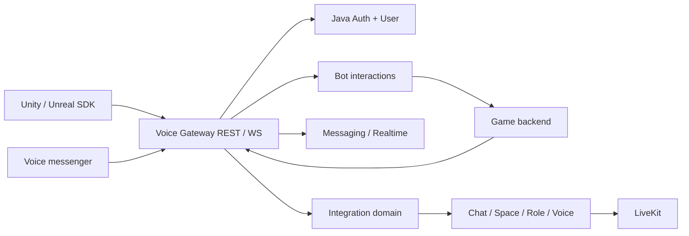

# Game Integration API — целевой внешний контракт

**Proposed target; все новые API ниже не реализованы.** Продуктовые требования —
[интеграции игр](../features/game-integrations.md); acceptance и решения —
[матрица](../testing/game-integrations-acceptance.md). API имена фиксируют
предлагаемую семантику; до реализации нужны reviewed OpenAPI/proto и error schema.

## 1. Границы и владельцы



Integration domain — предлагаемая ответственность за developer applications,
bindings, внешние resource mappings, communication sessions и orchestration
operations. Это не существующий сервис. Решение о выделении Go-сервиса/хранилища
принимается отдельно (G06); ни Gateway, ни бот не становятся универсальной БД.

| Владелец | Ответственность |
|---|---|
| Auth, Java/Spring | Identity proof, consent grants, delegated tokens, revocation/session epochs |
| User | Профиль, privacy, публичные атрибуты и допустимая presence |
| Integration domain | App/env, game bindings, external mappings, session orchestration, quotas |
| Chat / Space / Role | Членство, дерево, lifecycle, policy и effective permissions |
| Messaging / File | Сообщения/история/attachments и их access/retention |
| Realtime | WS delivery; per-connection `s` / `resume` |
| Voice | Voice admission, grants, media lifecycle, revocation |
| Bot | Installation, interaction delivery, credentials бота, response routing |
| Game backend | Roster facts, владение персонажами, экономика, допустимость и commit команд |

Ни один сервис не пишет в чужую БД. Межсервисные UUID — logical references без
FK. Существующие IDs сохраняют правила [DATA_MODEL](../DATA_MODEL.md): UUIDv4 для
ресурсов, UUIDv7 сообщений выдаёт Messaging. Внешние игровые IDs — opaque строки,
не доверенные UUID Voice и не основание доступа.

## 2. Ресурсы

| Ресурс | Ключ и значимые поля | Жизненный цикл |
|---|---|---|
| Application | `application_id`, owner, optional `game_id`, enabled capabilities | draft → sandbox → active → suspended/retired |
| Environment | `environment_id`, application, allowed origins/redirects/providers | sandbox и production строго раздельны |
| Installation | `installation_id`, app/env, approving actor, target scope | active → revoked; новая установка = новый ID |
| Player binding | `binding_id`, app/env/provider/external subject, selected profile, revision | pending → active → revoked |
| Character binding | game/realm/character key, binding, display policy | attached → detached/deleted |
| Communication session | `session_id`, kind party/match/fleet, external key, optional parent party | provisioning → active → closing → closed; failed |
| Resource mapping | app/env/external key → chat/voice/Space UUID | active → retired; не переиспользовать tombstoned key молча |
| Managed grant | origin external membership/rank, subject, bounded permission | desired → applied → revoked |
| Operation | `operation_id`, immutable request hash, stage/results/error | pending → succeeded/failed; reconcile after uncertainty |

Для bot invocation operation имеет неизменяемый `command_id` и domain status;
delivery ACK не переводит operation в succeeded. Terminal mapping и result CAS
определены в [bot protocol](../features/game-bot-interactions.md).

Предлагаемые unique constraints: app/env/external session key; app/env/provider/
subject для одной активной player binding; installation/event ID; actor-scoped
idempotency key. Несколько игровых аккаунтов у человека допустимы только по
явной политике приложения; ни nickname, ни email не используются для dedupe.
Профиль может получать grants от нескольких персонажей; причины хранятся
раздельно. Перенос персонажа другому аккаунту отзывает прежний binding/grants
до выдачи новых; старые карточки не переадресуются новому владельцу.

## 3. Три principal, три набора credentials

| Principal | Где хранится credential | Что может |
|---|---|---|
| Game service | Secret store backend игры | Создать свои sessions, передать подтверждённый roster, события |
| Delegated player | OS secure storage / память SDK | Чат/голос и разрешённые действия выбранного профиля |
| Bot actor | Secret store адаптера игры | Только installation/scopes/destinations бота |

Server secret нельзя положить в Unity asset, Blueprint, браузер, конфиг клиента
или deep link. SDK не принимает «admin token» как упрощённую авторизацию.
Bot Token не заменяет user session. Session grants не дают доступа к остальному
inbox, друзьям, другим играм и другим профилям.

### Вход и связывание

1. SDK получает краткоживущий доказуемый game login ticket. Issuer/audience,
   signature, nonce, expiry и replay проверяются сервером; поддержанные providers
   настраиваются в portal, ключи берутся из доверенного registry.
2. Voice создаёт binding challenge с `state` и одноразовым nonce. Пользователь
   проходит системный browser/device flow, выбирает профиль и scopes.
3. Authorization code + PKCE связывают callback с инициатором. Redirect URI
   совпадает с allowlist; custom scheme/deep link сам не доказывает владение.
4. Auth выдаёт delegated grant на app/env/binding/profile. Game server получает
   только разрешённую ему часть binding; не master refresh token пользователя.
5. Revoke/unlink, смена profile binding, удаление аккаунта и suspension приложения
   увеличивают authority revision/epoch; действующие сессии теряют разрешения.

В embedded браузер игры пароль Voice не вводится. Для устройства без браузера
нужен device code с expiry, ограниченным polling и явным подтверждением.
Alpha admission/invite/cohort cap не обходится через игровой endpoint.

`sdk-account` — отдельный Auth-supported principal с
централизованным владением. До его реализации SDK возвращает
`CAPABILITY_UNAVAILABLE`, а не создаёт скрытый regular/guest аккаунт.
Claim/upgrade требует proof обеих identity, описанного conflict flow и политики
истории. Автоматического merge друзей/профилей/истории нет.

### Конвертация sdk-account

Требование владельца: `sdk-account` — отдельный от текущего `guest` тип с доказанным game
subject и ограниченным app/env доверием, с конвертацией как в новый, так и в
существующий постоянный аккаунт. `ConvertGuest` не является готовым контрактом
для этой операции. Наличие identity не означает подтверждённый email или
неограниченный user credential. Auth остаётся центральным владельцем;
game service и federated node не создают постоянный аккаунт от имени игрока.

Предлагаемый протокол реализации (детали G01):

1. Начать durable conversion operation с idempotency key, исходной identity,
   expected binding revision и краткоживущим доказательством game subject.
2. В Auth зарегистрировать новый аккаунт либо аутентифицировать существующий;
   при существующем выбрать целевой профиль и подтвердить оба владения.
   Browser/PKCE flow и challenge связывают это с конкретной операцией.
3. Подготовить preview: переносимые game bindings, актуальные memberships,
   политика истории, конфликты. Никакого поиска/merge по email или имени.
   Если binding уже занят, вернуть конфликт без автоматического replacement;
   отдельный flow разрешения конфликтов утверждается в G01.
4. После подтверждения закрыть новые admission исходной identity и увеличить
   authority epoch. Проверить lifecycle/баны обеих сторон и заново вычислить
   grants выбранного профиля из актуального roster, без объединения рангов.
5. Выполнить перенос через журналируемые идемпотентные стадии владельцев данных.
   После необходимых receipts активировать целевую связь и выдать новые scoped
   credentials. Старые tokens/соединения отозвать; исходную identity оставить
   retired reference для аудита и исторического авторства, без самостоятельного
   доступа. Повторный game login разрешается в целевой binding.

Две БД не считаются атомарно обновлёнными по одному HTTP-ответу. Во время
перехода возможна явная пауза общения, но не два параллельных активных владельца
одного binding. Crash/retry продолжает ту же operation; отмена до commit не
меняет связь, после начала переноса требует recovery до terminal state, а не
слепого возврата старых tokens. Status доступен инициатору через доказанный
контекст операции и не зависит от уже отозванного обычного игрового токена.

Старые сообщения не переписываются массово на нового автора; alias/tombstone
mapping сохраняет audit и не раскрывает другим людям скрытые профили. Доступ
к старой истории не расширяется самим фактом конвертации. Перенос не оживляет
старые карточки/команды и не обходит баны; уже admitted команды завершаются
по существующим правилам in-flight admission. Unlink после конвертации не
воскрешает retired identity. Правила последующего нового игрового входа,
потери provider account, retention mapping и восстановления — открытая часть G01.

До включения capability нужны схемы Auth/store, отдельная trust/permissions
матрица, conversion endpoints и согласованные conflict/history/recovery UX.
Этот раздел задаёт требования и предлагаемый протокол, а не доступный API.

### Предлагаемые scopes

| Scope | Ограничение |
|---|---|
| `game.identity.read` | Только app-scoped subject и выбранный публичный профиль |
| `game.sessions.manage` | Server-only; собственные sessions, не произвольные chats |
| `game.memberships.sync` | Server-only; mapping allowlist и managed grants |
| `game.chat.read` / `game.chat.send` | Только доступные app-linked chats и история разрешённого периода |
| `game.voice.join` | Admission комнаты; speak проверяется отдельно Role/Voice |
| `game.presence.write` | Только activity своей игры, с user privacy |
| `game.invites.create` | Только разрешённая session; не импорт списка друзей |
| `game.events.publish` | Game backend → включённая bot installation |
| `game.commands.receive` | Проверенные interactions своей installation |
| `game.notifications.send` | Только отдельный user opt-in и разрешённые категории |

Это новые app scopes, они не добавляются молча в существующий Bot manifest.
Bot scopes продолжают ограничивать bot actor; пересечение scopes, installation,
membership, lifecycle и privacy всегда сужает доступ. Game owner не получает
неявного admin/Owner и не может повысить лимиты заменой ключа.

## 4. Предлагаемый REST surface

Base namespace: `/api/v1/game-integrations`. Это **reserved design**, Gateway
пока не реализует эти маршруты. JSON содержит UUID strings, UTC RFC3339 timestamps,
opaque external IDs, enum strings. Все mutations требуют authorization;
доверенный service context выводит app/env из credential, не из тела запроса.

| Method + suffix | Principal | Request → response | Повторы / основные ошибки |
|---|---|---|---|
| `GET /capabilities` | Player или service | client platform/version → enabled features, versions, limits | Read; 426 unsupported client |
| `POST /bindings/challenges` | Game login proof | provider ticket, redirect, PKCE challenge → challenge/authorize URL/expiry | nonce-bound; 400/401/429 |
| `POST /bindings/exchange` | Code + PKCE | challenge, code, verifier → delegated grant, binding | Одноразовый code; 401 invalid/replayed |
| `GET /bindings/me` | Player | — → selected profile, own bindings/scopes | Только собственные; 401 |
| `GET /bindings/{binding_id}/authority` | Service своей app/env | — → active/revoked, revision, разрешённый character context | Execution-time check, no shared cache beyond authority deadline; 403/503 |
| `DELETE /bindings/{binding_id}` | Владелец player | expected revision → revocation operation | Идемпотентно; 403/409 |
| `POST /sessions` | Service | external key, kind, parent party, policy, desired members → operation | Idempotency-Key; 409 mismatch |
| `PUT /sessions/{id}/roster` | Service | complete snapshot, source revision, bound members → operation | CAS/revision; 409 stale/conflict |
| `GET /sessions/{id}` | Authorized member/service | — → current state, applied roster revision, resource refs | 404 for inaccessible resources |
| `POST /sessions/{id}/join-grants` | Player | device instance, expected binding revision → bounded chat/media capability | Current admission; 403/409/503 |
| `POST /sessions/{id}/close` | Service | reason, expected revision → operation | Stable terminal state; 409 |
| `POST /sessions/{id}/keep-group` | Player | consenting participants, session revision → group operation | Individual consent; 403/409 |
| `POST /community-bindings` | Service + admin approval | external corporation key, allowed Space template → operation | Provision once; 403/409 |
| `PUT /community-bindings/{id}/roster` | Service | complete roster and ranks, source revision → operation | Snapshot rules; 409/422 |
| `POST /events` | Service | event envelope from bot spec → event/message operation | event_id dedupe; 409/422 |
| `GET /operations/{id}` | Initiator/authorized service | — → durable status, result IDs or error | Не раскрывает чужие operations |

Конкретные chat send/history и voice calls идут через существующие доменные
Gateway endpoints с новым ограниченным admission. Не вводится вторая модель
сообщений «только для SDK». Bot card actions описаны отдельно; публичный player
не может вызвать service-only roster sync.

Пример запроса создания (поля — proposal):

```json
{
  "external_session_key": "herdtrip:party:example-42",
  "kind": "party",
  "policy": {"history": "since_join", "persist_after_match": true},
  "members": [{"binding_id": "<uuid>", "character_binding_id": null}]
}
```

Ответ mutation обычно `202 {operation_id, status:"pending"}`. `201` допускается
только после durable завершения создания; `200` — прочитанный результат или
повтор завершённой операции. Ни 202, ни webhook ACK не означают игровой успех.

## 5. Idempotency, порядок и частичные сбои

`Idempotency-Key` scoped by principal/app/env/route и привязан к нормализованному
request hash. Повтор тех же данных возвращает тот же operation/result; тот же
ключ с иным body → `409 IDEMPOTENCY_CONFLICT`. Retention ключей/операций задаётся
до пилота и не короче документированного retry window. Долговечный external key
ресурса продолжает защищать от дубликатов после истечения transport-key cache.

Orchestration сохраняет intent, resource refs и stages. При падении после
создания Chat и до Voice provisioning worker продолжает тот же operation.
Session становится active только после согласованных ресурсов и membership;
временно созданный чат не публикуется чужим участникам. Cleanup удаляет лишь
ресурсы этой операции; общий party-chat не удаляется из-за неудачи нового match.

Roster snapshot атомарно сравнивает `source_revision`: ниже применённой — stale
no-op со статусом; та же revision + иной body → conflict; выше — новый desired
state. Частичные страницы собираются под snapshot ID/checksum и активируются
только целиком. Неудачный fetch/пустая страница не равны пустому roster.
Deletes представлены явным complete empty snapshot или tombstone.

Потеря membership немедленно закрывает новые admission; propagation к текущим
подпискам/медиа проверяется по принятому revocation SLO. `applied_revision`
публикуется только после требуемых consumer acknowledgements. При неопределённой
authority привилегированные операции fail closed. После перерыва — полная сверка.

## 6. Ошибки и recovery

Общий error body: `error_code`, безопасный `message`, `request_id`, `retryable`,
optional `operation_id`, `retry_after_ms`, `current_revision`. Tokens, чужие IDs,
permission details приватного ресурса и исходные provider claims не возвращаются.

| HTTP / code | SDK / backend |
|---|---|
| 400 `INVALID_ARGUMENT` | Исправить schema; не retry циклом |
| 401 `TOKEN_EXPIRED` | Single-flight refresh; один повтор с тем же mutation key |
| 403 `GRANT_REVOKED` / `SCOPE_DENIED` | Очистить scoped state; не auto-relink |
| 404 `RESOURCE_NOT_FOUND` | Единый ответ для отсутствующего/недоступного чужого ресурса |
| 409 `STATE_CONFLICT` / `STALE_REVISION` | Read authoritative state; не blind overwrite |
| 410 `RESOURCE_RETIRED` / `ACTION_EXPIRED` | Terminal; показать пользователю |
| 422 `CAPABILITY_UNAVAILABLE` | Fallback UI, без попытки угадать старый protocol |
| 426 `SDK_UPGRADE_REQUIRED` | Отключить affected feature, сообщить требуемую версию |
| 429 `RATE_LIMITED` | Retry-After, bounded queue, per-app quota feedback |
| 503 `AUTHORITY_UNAVAILABLE` / `NODE_UNAVAILABLE` | Backoff; не расширять доступ и не создавать замену ресурса |

Timeout после отправки mutation = unknown outcome. Сначала status/read с тем же
operation/key, затем допустимый retry. Сервер игры имеет собственный command
inbox и атомарную dedupe в транзакции игрового эффекта.

## 7. Realtime и присутствие

SDK использует REST Gateway и `/ws` через Realtime. `s`/`resume` относятся к
соединению, не к истории всех сообщений. После reconnect SDK сверяет разрешённые
sessions/chats, затем догружает историю Messaging по cursor каждого `chat_id`.
Сверка ограничена grant приложения; полный пользовательский inbox игре не виден.
Pagination cursor opaque и scoped by query/app/recipient/snapshot; default/max
page sizes публикует capabilities. Ошибка страницы не очищает локальное состояние.

Presence различает «игра запущена», «в меню», «в матче» и доступность в Voice.
Сервер проверяет, что приложение пишет только свою activity. Невидимость/DND
не меняются игрой, координаты и приватные lobby secrets не публикуются.
Invite — короткоживущий одноразовый либо ограниченный use-count opaque reference
на session, с серверной проверкой при accept. Deep link не несёт bearer token.

## 8. Данные и удаление

Owner stores хранят только необходимые связи; внешние provider subjects не
публикуются другим игрокам, логи их редактируют/псевдонимизируют. Персонаж в UI
показывается по разрешённому alias, без раскрытия других профилей владельца.
Удаление binding отзывает credentials, managed grants и подписки событий;
история сообщений следует lifecycle владельца, а не каскадному SQL delete.

Account/Space deletion, freeze и purge используют существующие lifecycle fences
и receipts; Integration и Bot обязаны быть учтены как потребители до активации.
Новая storage ownership/migration inventory добавляется в DATA_STORES только
в implementation milestone. Отзыв игры закрывает новые execution admissions;
ранее допущенные in-flight команды могут завершиться по правилам ниже.

## 9. Совместимость и admission разработчика

Перед расходованием игровых ресурсов service проверяет binding authority и
запрашивает execution admission. Предлагаемый контракт:
`POST /commands/{command_id}/admission` для owning app/env/installation возвращает
одноразовый permit с command/action/binding revision, `start_before` и
`complete_before`. Voice сериализует revoke и admission по одной authority epoch
в своей транзакции. Revoke первым → reject; admission первым → команда in-flight
и может завершиться после unlink в согласованном временном окне. Это явно
показывается при отключении игры; отмена уже допущенной команды не гарантируется.

Игра атомарно сохраняет command/permit dedupe и игровой эффект в своей БД,
проверяет start/completion bounds и игровую state version. Retry admission той
же команды возвращает тот же permit и не продлевает окно. Late/new execution
требует новой проверки; expired permit не оживает при повторе webhook. При
потере ответа Voice admission status восстанавливается по command ID; нельзя
выполнить эффект по догадке. Между БД Voice и игры нет distributed atomic commit.
Простой GET или offline token check эту семантику не заменяют. Числовые bounds и
правило для длительных игровых задач (команда назначает задачу, не ждёт её часы)
фиксируются G13 до GI2. Admission unavailable → новое исполнение не начинается.
Receipt о ранее committed результате принимается отдельным узким completion
правом, без возможности создать новую команду. Полностью отозванный/скомпрометированный
service credential не оживляется ради receipt: status требует доверенного
reconciliation с оператором игры и остаётся unknown до доказательства.

Portal показывает capabilities, app/env keys, allowed origins/redirects,
webhook status, quotas, billing status (если появится), SDK version support и
review requirements. Sandbox не имеет production bindings, tokens или данных.
Production admission проверяет identity/revoke, mute/report, limits и корректное
поведение сбоев; конкретные коммерческие условия — G07.

API major version не меняется молча; optional additive поля игнорируются только
если не влияют на authority. Неизвестный security/permission enum запрещает
операцию. Deprecated SDK получает migration guide и срок поддержки, который
должен быть принят перед публичным release. Контракт не требует включать друзья,
presence или invites ради одной voice capability: модульность — цель Voice.
