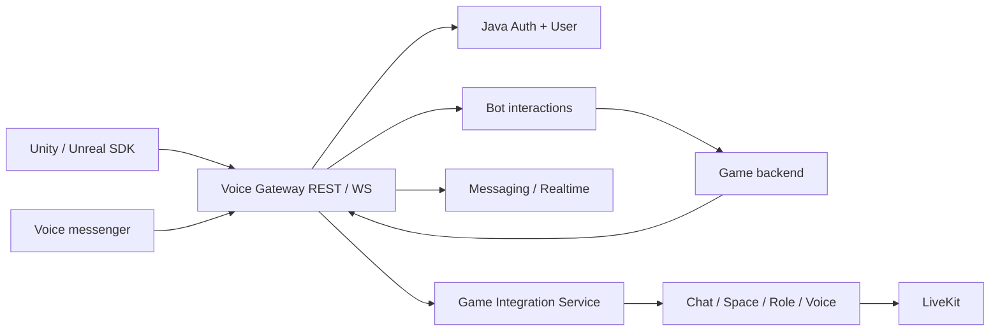

# Game Integration API — целевой внешний контракт

**Proposed target.** Ограниченный Auth bootstrap GAME-AUTH-01 реализован в
opt-in режиме; PostgreSQL/live-provider acceptance остаётся обязательным gate.
Остальные новые API ниже ещё не реализованы. Продуктовые требования —
[интеграции игр](../features/game-integrations.md); acceptance и решения —
[матрица](../testing/game-integrations-acceptance.md). API имена фиксируют
предлагаемую семантику; до реализации нужны reviewed OpenAPI/proto и error schema.

Этот контракт и его реализация в Voice входят в спринт. Unity/Unreal assets,
SDK wrappers, developer CLI/portal — отдельная задача; слово SDK обозначает
внешнего потребителя протокола, в тестах Voice заменяемого test client.

## 1. Границы и владельцы



Решение владельца: выделить **Game Integration Service**, отдельный Go-микросервис
со своим хранилищем для developer applications, bindings, внешних resource mappings,
communication sessions и orchestration operations. Сервис ещё не реализован.
G06 остаётся открытым для схемы хранилища, контрактов и deployment, но не для
выбора между отдельным сервисом и встраиванием в существующий. Ни Gateway,
ни бот не становятся универсальной БД; Auth сохраняет владение аккаунтами.

| Владелец | Ответственность |
|---|---|
| Auth, Java/Spring | Identity proof, consent grants, delegated tokens, revocation/session epochs |
| User | Профиль, privacy, публичные атрибуты и допустимая presence |
| Game Integration Service | App/env, game bindings, external mappings, session orchestration, quotas |
| Chat / Space / Role | Членство, дерево, lifecycle, policy и effective permissions |
| Messaging / File | Сообщения/история/attachments и их access/retention |
| Realtime | WS delivery; per-connection `s` / `resume` |
| Voice | Voice admission, grants, media lifecycle, revocation |
| Bot | Installation, interaction delivery, credentials бота, response routing |
| Game backend | Roster facts, владение персонажами, экономика, допустимость и commit команд |

Ни один сервис не пишет в чужую БД. Межсервисные UUID — logical references без
FK. Существующие IDs сохраняют правила [DATA_MODEL](../DATA_MODEL.md): UUIDv4 для
ресурсов, UUIDv7 сообщений выдаёт Messaging. Внешние игровые IDs — opaque строки,
не доверенные UUID Voice и не основание доступа.

## 2. Ресурсы

| Ресурс | Ключ и значимые поля | Жизненный цикл |
|---|---|---|
| Application | `application_id`, owner, optional `game_id`, enabled capabilities | draft → sandbox → active → suspended/retired |
| Environment | `environment_id`, application, allowed origins/redirects/providers | sandbox и production строго раздельны |
| Installation | `installation_id`, app/env, approving actor, target scope | active → revoked; новая установка = новый ID |
| Player binding | `binding_id`, app/env/provider/external subject, selected profile, revision | pending → active → revoked |
| Character binding | game/realm/character key, binding, display policy | attached → detached/deleted |
| Communication session | `session_id`, kind party/match/fleet, external key, optional parent party | provisioning → active → closing → closed; failed |
| Resource mapping | app/env/external key → chat/voice/Space UUID | active → retired; не переиспользовать tombstoned key молча |
| Managed grant | origin external membership/rank, subject, bounded permission | desired → applied → revoked |
| Operation | `operation_id`, immutable request hash, stage/results/error | pending → succeeded/failed; reconcile after uncertainty |

Для bot invocation operation имеет неизменяемый `command_id` и domain status;
delivery ACK не переводит operation в succeeded. Terminal mapping и result CAS
определены в [bot protocol](../features/game-bot-interactions.md).

Предлагаемые unique constraints: app/env/external session key; app/env/provider/
subject для одной активной player binding; installation/event ID; actor-scoped
idempotency key. Несколько игровых аккаунтов у человека допустимы только по
явной политике приложения; ни nickname, ни email не используются для dedupe.
Принято: sdk-account уникален в app/env/provider subject, между приложениями
нет автоматического объединения людей. Независимая identity authority не
раскрывает другим приложениям эти сопоставления. Новый device key регистрируется
через независимый user proof и отзывается отдельно; provider login не даёт
восстановить permanent Voice credentials. Конкретная recovery схема и защита
от смены владельца subject требуют G01 и Q03 из design audit.
Профиль может получать grants от нескольких персонажей; причины хранятся
раздельно. Перенос персонажа другому аккаунту отзывает прежний binding/grants
до выдачи новых; старые карточки не переадресуются новому владельцу.

## 3. Три principal, три набора credentials

| Principal | Где хранится credential | Что может |
|---|---|---|
| Game service | Secret store backend игры | Создать свои sessions, передать подтверждённый roster, события |
| Delegated player | OS secure storage / память SDK | Чат/голос и разрешённые действия выбранного профиля |
| Bot actor | Secret store адаптера игры | Только installation/scopes/destinations бота |

Server secret нельзя положить в Unity asset, Blueprint, браузер, конфиг клиента
или deep link. SDK не принимает «admin token» как упрощённую авторизацию.
Bot Token не заменяет user session. Session grants не дают доступа к остальному
inbox, друзьям, другим играм и другим профилям.

### Вход и связывание

1. SDK получает краткоживущий независимо проверяемый login proof. Для авторства
   пользователя заверения backend разработчика недостаточно: нужен вход Voice
   либо внешний provider flow, который Voice проверяет независимо от игры и
   связывает с ключом устройства. Game ticket может подтверждать roster/context,
   но не выдавать developer право получить user credential. Issuer/audience,
   signature, nonce, expiry и replay проверяются сервером; поддержанные providers
   настраиваются в portal, ключи берутся из доверенного registry; developer
   не может назначить свой issuer независимым удостоверением игрока.
2. Voice создаёт binding challenge с `state` и одноразовым nonce. Пользователь
   проходит системный browser/device flow, выбирает профиль и scopes.
3. Authorization code + PKCE связывают callback с инициатором. Redirect URI
   совпадает с allowlist; custom scheme/deep link сам не доказывает владение.
4. Auth выдаёт delegated grant на app/env/binding/profile. Game server получает
   только разрешённую ему часть binding; не master refresh token пользователя.
5. Revoke/unlink, смена profile binding, удаление аккаунта и suspension приложения
   увеличивают authority revision/epoch; действующие сессии теряют разрешения.

В embedded браузер игры пароль Voice не вводится. Для устройства без браузера
нужен device code с expiry, ограниченным polling и явным подтверждением.
Alpha admission/invite/cohort cap не обходится через игровой endpoint.

`sdk-account` — отдельный Auth-supported principal с
централизованным владением. До его реализации SDK возвращает
`CAPABILITY_UNAVAILABLE`, а не создаёт скрытый regular/guest аккаунт.
Claim/upgrade требует proof обеих identity, описанного conflict flow и политики
истории. Автоматического merge друзей/профилей/истории нет.

### Конвертация sdk-account

#### Auth durable conversion preparation GAME-AUTH-03

Auth создаёт durable operation до внешних owner effects. Новый target начинается
с current SDK credential и device proof; существующий — с linked-bootstrap
credential GAME-AUTH-02 и тем же device key. Обычный Voice Bearer остаётся в Voice
browser UI. Prepare фиксирует mode (`new` / `existing`), binding ID, source
app/env/device/generation и client UUID idempotency key. Повтор key с тем же
target/binding возвращает прежнюю operation без продления intent; другая нагрузка
даёт 409. Source account допускает несколько подготовленных intents, но только
одну подтверждённую conversion; confirmation остаётся отдельным preview/CAS шагом.

Prepare device payload:
`voice-sdk-conversion-new-v1\n<SHA-256 SDK token>\n<idempotency UUID>\n<binding UUID>`
или `voice-sdk-conversion-existing-v1\n<SHA-256 linked token>\n<idempotency UUID>\n<binding UUID>`.
Auth request hash — SHA-256 UTF-8
`<mode>\n<idempotency UUID>\n<binding UUID>\n<target account UUID or ->\n<target profile UUID or ->`.

New mode выдаёт Auth-owned `registration_intent_id` с TTL 15 минут. Обычный
Voice registration endpoint принимает optional `registrationIntentId`. В одной
локальной транзакции создаётся новый account, consumes одноразовый intent и
записывается его account ID в operation. Неверный/истёкший/использованный intent
откатывает создание account. Legacy guest registration с intent запрещена.
Pending email сохраняет обычный registration/OTP lifecycle. Attach target
требует current Voice proof **ровно записанного** account после перехода в
regular; существующий раньше account допустим только в existing mode.
New attach вызывает идемпотентный User EnsurePrimaryProfile, затем read-only
eligibility именно primary. Existing mode не вызывает provisioning или switch.

Recovery status доступен с сохранённым public device key operation даже после
отзыва source credential. Это только чтение, не player authority. Payload:
`voice-sdk-conversion-status-v1\n<operation UUID>\n<issued-at Unix seconds>`;
Auth принимает timestamp не старше 60 секунд и не дальше 30 секунд в будущем.
Ни provider credential, ни ordinary Voice token для status не сохраняются.
Prepare/status/attach ещё не freeze, не transfer и не завершённая conversion.
Последующие preview, explicit confirmation и owner receipts обязаны следовать
[conversion authority](game-conversion-authority.md); unavailable adapter
оставляет durable state без продвижения и никогда не создаёт no-op receipt.

Prepare/status/attach routes отдельно opt-in через `auth.sdk-conversion.enabled`
и доступны только при JDBC persistence:

| Route | Proof / request | Result |
|---|---|---|
| `POST /api/v1/auth/sdk/conversions/new` | SDK Bearer; `idempotencyKey`, `bindingId`, `deviceProof` | prepared operation и registration intent |
| `POST /api/v1/auth/sdk/conversions/existing` | Linked Bearer; те же поля | prepared operation с ранее выбранным permanent profile |
| `POST /api/v1/auth/sdk/conversions/{operationId}/status` | `issuedAt` Unix seconds и `deviceProof`; без source Bearer | durable operation state/revision и target/intent IDs |
| `POST /api/v1/auth/sdk/conversions/{operationId}/attach-new-target` | Current Voice Bearer; без authority fields в body | только зарегистрированный через intent новый target/primary |

Intent consume проверяет current source generation/device и lifecycle, но не
требует ещё живой пятиминутный bootstrap session. Отзыв устройства запрещает
consume, сохраняя только purpose-limited status. Unknown fields и malformed
requests дают безопасный `400`, invalid proof — `401`, изменённая idempotent
нагрузка — `409`. Registration intent не попадает в parser/validation logs.

#### Auth browser consent GAME-AUTH-02

Этот следующий Auth slice реализует подготовку связи из уже независимо
подтверждённого sdk-account. Consumer — существующий Voice browser/Flutter UI
и внутренний protocol client. Auth не принимает пароль Voice в игровом UI;
обычный Voice sign-in/registration остаётся существующим потоком. Device-code
вариант не включается без конкретного browserless consumer.

Registry policy читается через `SdkAuthorizationPolicy.resolve(app, env)`:
`applicationId`, `environmentId`, положительная immutable `revision`,
`displayName`, точные `redirectUris`, разрешённые `playerScopes`. Registry
владеет allowlist. Endpoint владельца —
`GET /internal/v1/authorizations/environments/{environment_id}`; только
выделенная Auth↔Game Integration workload identity. Недоступный policy adapter,
неактивное приложение, неверные IDs, неизвестный scope, смена revision закрывают
request/approval/exchange. Локальный developer allowlist не заменяет lookup.
Production adapter выключен до реализации проверяемого workload contract.

1. SDK создаёт authorization request с UUID idempotency key, точным redirect,
   S256 challenge (43 base64url chars), случайным state (43–128 base64url chars)
   и отсортированным набором scopes. Набор непустой, максимум 16 элементов;
   player subset — `game.identity.read`, `game.chat.read`, `game.chat.send`,
   `game.voice.join`, `game.presence.write`, `game.invites.create`; service-only
   scopes запрещены. Redirect — absolute URI без fragment/userinfo/CRLF;
   допустимые schemes задаёт registry, совпадение allowlist всегда exact.
   Source credential и device possession
   проверяются в той же транзакции. Повтор того же ключа/полезной нагрузки
   возвращает прежний request ID/expiry; другая нагрузка даёт conflict.
2. Canonical request digest — SHA-256 UTF-8
   `voice-sdk-authorization-request-v1\n<idempotency UUID>\n<redirect>\n<S256 challenge>\n<state>\n<sorted scopes joined by comma>`.
   Device JWS payload —
   `voice-sdk-authorize-v1\n<SHA-256 source token>\n<request digest>`.
   Lifetime ограничен меньшим из source-session expiry и now+5 минут.
3. Voice UI показывает app/окружение, scopes, исходный game context, выбранный
   профиль и явное согласие. UI читает эти данные из Auth consent-view с current
   regular Voice Bearer; переданные игрой display/scopes не являются источником
   consent UI. View повторно проверяет policy/source и ничего не утверждает.
   Approval требует обычный current Voice Bearer,
   **актуальный** `accounts.type=regular` в Auth DB, exact policy revision и
   read-only User eligibility выбранного profile (owner/nondeleted/nonfrozen
   и revision). `SwitchProfile` не вызывается; primary не подставляется молча.
   Pending email registration не является постоянным target до verification.
4. Approval выдаёт одноразовый random code (в store только SHA-256), TTL до
   60 секунд и не дольше request. Redirect совпадает с registry byte-for-byte;
   state возвращается неизменным. Повтор approval после успешного выпуска
   отвергается; потерянный ответ требует нового request, не восстанавливает code.
5. Exchange требует code, exact redirect, PKCE verifier (43–128 unreserved
   ASCII chars) и прежний device key. Payload:
   `voice-sdk-code-v1\n<request UUID>\n<SHA-256 code>\n<SHA-256 verifier>`.
   Перед consume заново проверяются current source/device generation,
   target regular/status/epoch/approval-session blacklist, registry revision
   и exact User eligibility revision. Expiry проверяется после ожидания locks.
6. Результат — отдельный opaque linked-bootstrap credential на 5 минут с
   app/env, исходной identity/device, **выбранным** target account/profile,
   scopes и consent/policy revision. Он не обычный Voice JWT/refresh и не
   активирует player binding или media. Binding activation и conversion
   требуют receipts по [conversion authority](game-conversion-authority.md).

Auth HTTP routes этого slice:

| Route | Proof / request | Result |
|---|---|---|
| `POST /api/v1/auth/sdk/authorizations` | SDK Bearer; `idempotencyKey`, `redirectUri`, `codeChallenge`, `state`, `scopes`, `deviceProof` | request ID, policy revision, display/scopes/expiry |
| `GET /api/v1/auth/sdk/authorizations/{requestId}` | Current regular Voice Bearer | authoritative consent view, game context, no mutation |
| `POST /api/v1/auth/sdk/authorizations/{requestId}/approve` | Current regular Voice Bearer; `profileId`, `policyRevision` | one-use code, redirect with original state, expiry |
| `POST /api/v1/auth/sdk/authorizations/{requestId}/exchange` | `code`, `redirectUri`, `codeVerifier`, `deviceProof` | linked-bootstrap credential |
| `POST /api/v1/auth/sdk/authorizations/linked-session` | Linked Bearer; `deviceProof` | current scoped claims, no returned raw token |

Linked-session possession payload:
`voice-sdk-linked-v1\n<SHA-256 linked token>`. This read checks source/device
lifecycle and generation, target epoch/logout, policy and profile revisions;
source bootstrap session expiry alone does not extend or revoke a linked grant.
Linked expiry is capped by the approval Voice token expiry. Unknown authority
fields are rejected; malformed requests return coarse `400`, invalid proof or
authority `401`, changed idempotency payload `409`.

Auth хранит authorization request/code/consent/grant отдельно от guest conversion.
Владелец User предоставляет отдельный read-only eligibility contract; до его
production adapter approval/exchange закрыты. Fake policy/eligibility допустимы
только в тестах. Scoped token не считается production-ready до binding
authority consumer и публичных Gateway limits. Direct Voice-only first login
без предварительного sdk-account остаётся последующим вариантом того же
authorization contract; этот slice не объявляет весь T14 завершённым.

#### Замороженный Auth identity slice GAME-AUTH-01

G01/Q11: первый независимый provider — Google OpenID Connect, issuer строго
`https://accounts.google.com`, RS256 и ключи только из Google JWKS. Для каждого
app/env оператор Voice регистрирует отдельный **Voice-owned** Google client ID;
developer не управляет issuer, JWKS или client ID. Google subject удостоверяет
пользователя, а не владение персонажем: соответствие игровому subject отдельно
подтверждает Game Integration Service. Email, имя и avatar не импортируются.
Обязательны единственный ожидаемый `aud`, совпадающий `azp` при наличии, непустой
`sub` длиной не более 255 символов,
`nonce`, `iat` не старше 5 минут и не более 30 секунд в будущем, неистёкший `exp`.
Источник protocol semantics: [Google OIDC](https://developers.google.com/identity/openid-connect/openid-connect).

Google — первый поддержанный provider, не исключительное продуктовое обещание.
Помимо него exchange **обязательно** проверяет отдельный RS256 game ticket
ключом backend из operator app/env registry: `iss=game:<application UUID>:<environment UUID>`,
`aud=voice:sdk-enroll`, `sub=<game subject>`, тот же `nonce`, `iat`/`exp`
с теми же freshness bounds, `independent_subject_hash=SHA-256(issuer + LF + sub)`
проверенного Google proof. Это связывает два доказательства и device challenge.
Скомпрометированный backend может лгать о game subject/roster, но не выпускать
Google proof, менять device key или получать permanent Voice credentials.
Game subject является контекстом session; назначение binding и его uniqueness
остаются Game Integration Service, а не доказательством со стороны Google.

Auth HTTP surface первого среза: `POST /api/v1/auth/sdk/challenges`
принимает `applicationId`, `environmentId`, публичный ES256/P-256 JWK;
возвращает `challengeId`, `nonce`, `clientId`, `expiresAt`. Challenge живёт
5 минут и неизменно связывает app/env/provider audience/device key.
`POST /api/v1/auth/sdk/exchange` принимает `challengeId`, `providerToken`, `gameTicket`,
`deviceProof`: compact ES256 JWS с payload **в точности** UTF-8
`voice-sdk-enroll-v1\n<challenge UUID>\n<nonce>` и зарегистрированным ключом.
Auth атомарно consumes challenge, создаёт/находит sdk identity, регистрирует
устройство и возвращает `accountId`, `actorId`, `deviceId`, `accessToken`,
`expiresAt`, `accountType=sdk-account`. Повтор exchange, включая потерянный
ответ, отвергается; новый независимый login восстанавливает ту же identity.
Новый device требует нового independent login; отозванный ключ нельзя оживить.

Первый credential — случайный opaque 256-bit token, в БД только SHA-256,
TTL 5 минут, purpose `sdk-identity-bootstrap`. Он не JWT обычного Voice,
не refresh token и не даёт chat/voice access. `POST /api/v1/auth/sdk/session`
проверяет Bearer token **и** ES256 proof с точным UTF-8 payload
`voice-sdk-session-v1\n<SHA-256 lowercase hex token>`; возвращает только
собственные app/env/account/actor/device IDs. Это read-only проверка владения
bootstrap credential; replay не создаёт эффект. `POST /api/v1/auth/sdk/revoke`
с token и proof `voice-sdk-revoke-v1\n<token hash>` отзывает текущее устройство
и все его sessions. Повтор после revoke отвергается. Обычные Voice endpoints
не принимают этот opaque credential. Все identity denial ошибки одинаковы.

Хранилище Auth: отдельные `sdk_identities`, `sdk_devices`, `sdk_challenges`,
`sdk_sessions`; это отдельный тип principal, без строки legacy guest, пароля,
refresh или автоматического User profile. Уникальность app/env/issuer/sub;
случайный `actorId` стабилен только внутри identity и не является `profile_id`.
В этом срезе admitted app/env задаются operator configuration, с cap 1000
identities на app/env и не более 10 активных устройств на identity; issuance
проверяет admission повторно. Registry consumer заменит конфигурационный список
доверенным контрактом; конфигурация неизменяема в процессе, исключение app/env
из списка после restart прекращает challenge/exchange/session. Online
suspension registry и propagation требуют следующего slice до production.
Не публиковать маршруты в Gateway до его rate limits и registry activation gate.

Q03: ownership generation начинается с 1. Не угадываем transfer по IP/email/
новому устройству; Google `sub` не передаётся по обычному flow. При заявленном
compromise/transfer identity блокируется; отдельная reviewed recovery operation
закроет прежние grants и создаст новое generation без private history/consent.
Автоматическое обнаружение смены человека за provider account не обещается.

Q07: до conversion один private app-scoped actor, без дополнительного User
profile. Existing-target conversion выбирает уже существующий разрешённый
profile, поэтому заполненный лимит 2/5 не создаёт обхода или extra profile.
New-target conversion создаёт один primary profile через User API. Public
payload будущих roster/cards/presence не должен сериализовать account ID,
provider subject или скрытые permanent profiles.

Q08: до доказанного linking account-wide voice применяется отдельно к каждому
sdk-account. Conversion блокирует новые source admission, требует Voice receipt
о завершении source session; занятый target возвращает `VOICE_CONFLICT` до
commit, либо получает отдельное явное handoff consent. Reconnect и lease renewal
проверяют новую generation; mute/deafen не снимаются переносом.

Q10: revoked device public key/thumbprint, retired/deleted identity UUID,
app/env/issuer/sub fence и ownership generation сохраняются без TTL как
минимальный security tombstone; это pseudonymous anti-resurrection data, не
public profile. Provider login не снимает suspension/deletion/retirement.
Raw provider token никогда не сохраняется. Истёкшие challenges/sessions можно
удалять после expiry; текущий срез не делает erasure/restore. Backup restore
перед serving обязан сверить tombstone generation с внешним durable lifecycle
journal; пока такой journal не подключён, восстановленная Auth DB не включается
для этой capability. Raw provider subject pseudonymization и key-retention
механизм должны пройти отдельный deletion slice до production admission.

План следующих executable slices (не реализовано GAME-AUTH-01):

1. GAME-AUTH-02: registry admission + Gateway limits, Voice-owned browser
   redirect/code+PKCE/consent и User actor contract; реальная Google acceptance
   с отдельными sandbox/prod client IDs, allowed redirect/origin, двумя device
   keys и nonce replay. Без credentials остаётся только crypto fixture evidence.
2. GAME-AUTH-03: durable conversion operation/status/hash/expected revision;
   source independent proof + device possession; новый permanent target через
   существующую email registration/verification и User primary-profile RPC;
   preview/consent, source fence, Voice receipt, owner receipts, target activation.
   Tests: crash/retry каждого перехода, email pending, account bans, old token.
3. GAME-AUTH-04: existing permanent proof через browser+PKCE, explicit existing
   profile, conflict preview; occupied binding → 409, no replacement/union;
   тот же журнал и owner receipts. Tests: full profile limit, concurrent targets,
   hidden profiles, target already in voice, source reconnect.
4. GAME-AUTH-05: unlink/delete/restore/recovery, HMAC subject tombstones и
   external monotonic journal, anti-resurrection на старом backup; identity
   lookup после conversion следует target binding только после permanent
   proof, а unlink никогда не воскрешает retired source. ID09–ID13/Q08/Q10
   закрываются только этими executable тестами.

Подтверждение исходного sdk-account включает proof-of-possession его device key
и независимую пользовательскую авторизацию; одного server-issued game ticket
недостаточно для конвертации или замены device key.

Требование владельца: `sdk-account` — отдельный от текущего `guest` тип с доказанным game
subject и ограниченным app/env доверием, с конвертацией как в новый, так и в
существующий постоянный аккаунт. `ConvertGuest` не является готовым контрактом
для этой операции. Наличие identity не означает подтверждённый email или
неограниченный user credential. Auth остаётся центральным владельцем;
game service и federated node не создают постоянный аккаунт от имени игрока.

Предлагаемый протокол реализации (детали G01):

1. Начать durable conversion operation с idempotency key, исходной identity,
   expected binding revision и краткоживущим доказательством game subject.
2. В Auth зарегистрировать новый аккаунт либо аутентифицировать существующий;
   при существующем выбрать целевой профиль и подтвердить оба владения.
   Browser/PKCE flow и challenge связывают это с конкретной операцией.
3. Подготовить preview: переносимые game bindings, актуальные memberships,
   политика истории, конфликты. Никакого поиска/merge по email или имени.
   Если binding уже занят, вернуть конфликт без автоматического replacement;
   отдельный flow разрешения конфликтов утверждается в G01.
4. После подтверждения закрыть новые admission исходной identity и увеличить
   authority epoch. Проверить lifecycle/баны обеих сторон и заново вычислить
   grants выбранного профиля из актуального roster, без объединения рангов.
5. Выполнить перенос через журналируемые идемпотентные стадии владельцев данных.
   После необходимых receipts активировать целевую связь и выдать новые scoped
   credentials. Старые tokens/соединения отозвать; исходную identity оставить
   retired reference для аудита и исторического авторства, без самостоятельного
   доступа. Повторный game login разрешается в целевой binding.

Две БД не считаются атомарно обновлёнными по одному HTTP-ответу. Во время
перехода возможна явная пауза общения, но не два параллельных активных владельца
одного binding. Crash/retry продолжает ту же operation; отмена до commit не
меняет связь, после начала переноса требует recovery до terminal state, а не
слепого возврата старых tokens. Status доступен инициатору через доказанный
контекст операции и не зависит от уже отозванного обычного игрового токена.

Старые сообщения не переписываются массово на нового автора; alias/tombstone
mapping сохраняет audit и не раскрывает другим людям скрытые профили. Доступ
к старой истории не расширяется самим фактом конвертации. Перенос не оживляет
старые карточки/команды и не обходит баны; уже admitted команды завершаются
по существующим правилам in-flight admission. Unlink после конвертации не
воскрешает retired identity. Правила последующего нового игрового входа,
потери provider account, retention mapping и восстановления — открытая часть G01.

The concrete owner revisions, receipts, state machine and recovery floor for
both conversion paths are fixed in
[game-conversion-authority](game-conversion-authority.md). До включения capability нужны схемы Auth/store, отдельная trust/permissions
матрица, conversion endpoints и согласованные conflict/history/recovery UX.
Этот раздел задаёт требования и предлагаемый протокол, а не доступный API.

### Авторство сообщений пользователя

Принятая владельцем гарантия: серверный credential студии не позволяет отправить
сообщение от лица игрока; запрос приходит от авторизованного игрового клиента.
Это не гарантия намерения человека против злонамеренного игрового executable,
который контролирует SDK process и может сам вызвать отправку. Для такой более
сильной гарантии потребовался бы независимый доверенный UI подтверждения.

SDK создаёт отдельный device key для app/env, хранит private key в доступном
OS secure storage и регистрирует public key после независимого user proof.
Game backend, bot и node не получают этот private key, permanent credentials
или возможность выпускать player tokens. Сообщение подписывает канонический
envelope с actor/binding/device, app/env, chat, message ID, content digest,
authority revision, audience и freshness/replay fields. Receiver проверяет
подпись, актуальное admission и dedupe; та же message ID с иным содержимым
отвергается. Подпись не заменяет membership, scope или rate limit.

Нода проверяет user signature по master-authorized device binding, а не по
ключу оператора ноды; происхождение должно оставаться проверяемым получателем
через доверенные master keys. Wire format, алгоритм, canonicalization, key
rotation/recovery и receiver verification фиксируются в GI0/G01 до реализации.
Игра без независимого способа подтвердить пользователя не получает capability
создания sdk-account на основании одного собственного service credential.
Конвертация сохраняет app-scoped полномочия и не экспортирует ключи постоянного
аккаунта. Подпись удостоверяет происхождение, но не скрывает текст сообщения.

### Предлагаемые scopes

| Scope | Ограничение |
|---|---|
| `game.identity.read` | Только app-scoped subject и выбранный публичный профиль |
| `game.sessions.manage` | Server-only; собственные sessions, не произвольные chats |
| `game.memberships.sync` | Server-only; mapping allowlist и managed grants |
| `game.chat.read` / `game.chat.send` | Только доступные app-linked chats и история разрешённого периода |
| `game.voice.join` | Admission комнаты; speak проверяется отдельно Role/Voice |
| `game.presence.write` | Только activity своей игры, с user privacy |
| `game.invites.create` | Только разрешённая session; не импорт списка друзей |
| `game.events.publish` | Game backend → включённая bot installation |
| `game.commands.receive` | Проверенные interactions своей installation |
| `game.notifications.send` | Только отдельный user opt-in и разрешённые категории |

Это новые app scopes, они не добавляются молча в существующий Bot manifest.
Bot scopes продолжают ограничивать bot actor; пересечение scopes, installation,
membership, lifecycle и privacy всегда сужает доступ. Game owner не получает
неявного admin/Owner и не может повысить лимиты заменой ключа.

## 4. Предлагаемый REST surface

Base namespace: `/api/v1/game-integrations`. Это **reserved design**, Gateway
пока не реализует эти маршруты. JSON содержит UUID strings, UTC RFC3339 timestamps,
opaque external IDs, enum strings. Все mutations требуют authorization;
доверенный service context выводит app/env из credential, не из тела запроса.

| Method + suffix | Principal | Request → response | Повторы / основные ошибки |
|---|---|---|---|
| `GET /capabilities` | Player или service | client platform/version → enabled features, versions, limits | Read; 426 unsupported client |
| `POST /bindings/challenges` | Game login proof | provider ticket, redirect, PKCE challenge → challenge/authorize URL/expiry | nonce-bound; 400/401/429 |
| `POST /bindings/exchange` | Code + PKCE | challenge, code, verifier → delegated grant, binding | Одноразовый code; 401 invalid/replayed |
| `GET /bindings/me` | Player | — → selected profile, own bindings/scopes | Только собственные; 401 |
| `GET /bindings/{binding_id}/authority` | Service своей app/env | — → active/revoked, revision, разрешённый character context | Execution-time check, no shared cache beyond authority deadline; 403/503 |
| `DELETE /bindings/{binding_id}` | Владелец player | expected revision → revocation operation | Идемпотентно; 403/409 |
| `POST /sessions` | Service | external key, kind, parent party, policy, desired members → operation | Idempotency-Key; 409 mismatch |
| `PUT /sessions/{id}/roster` | Service | complete snapshot, source revision, bound members → operation | CAS/revision; 409 stale/conflict |
| `GET /sessions/{id}` | Authorized member/service | — → current state, applied roster revision, resource refs | 404 for inaccessible resources |
| `POST /sessions/{id}/join-grants` | Player | device instance, expected binding revision → bounded chat/media capability | Current admission; 403/409/503 |
| `POST /sessions/{id}/close` | Service | reason, expected revision → operation | Stable terminal state; 409 |
| `POST /sessions/{id}/keep-group` | Player | consenting participants, session revision → group operation | Individual consent; 403/409 |
| `POST /community-bindings` | Service + admin approval | external corporation key, allowed Space template → operation | Provision once; 403/409 |
| `PUT /community-bindings/{id}/roster` | Service | complete roster and ranks, source revision → operation | Snapshot rules; 409/422 |
| `POST /events` | Service | event envelope from bot spec → event/message operation | event_id dedupe; 409/422 |
| `GET /operations/{id}` | Initiator/authorized service | — → durable status, result IDs or error | Не раскрывает чужие operations |

Конкретные chat send/history и voice calls идут через существующие доменные
Gateway endpoints с новым ограниченным admission. Не вводится вторая модель
сообщений «только для SDK». Bot card actions описаны отдельно; публичный player
не может вызвать service-only roster sync.

Пример запроса создания (поля — proposal):

```json
{
  "external_session_key": "herdtrip:party:example-42",
  "kind": "party",
  "policy": {"history": "since_join", "persist_after_match": true},
  "members": [{"binding_id": "<uuid>", "character_binding_id": null}]
}
```

Ответ mutation обычно `202 {operation_id, status:"pending"}`. `201` допускается
только после durable завершения создания; `200` — прочитанный результат или
повтор завершённой операции. Ни 202, ни webhook ACK не означают игровой успех.

## 5. Idempotency, порядок и частичные сбои

`Idempotency-Key` scoped by principal/app/env/route и привязан к нормализованному
request hash. Повтор тех же данных возвращает тот же operation/result; тот же
ключ с иным body → `409 IDEMPOTENCY_CONFLICT`. Retention ключей/операций задаётся
до пилота и не короче документированного retry window. Долговечный external key
ресурса продолжает защищать от дубликатов после истечения transport-key cache.

Orchestration сохраняет intent, resource refs и stages. При падении после
создания Chat и до Voice provisioning worker продолжает тот же operation.
Session становится active только после согласованных ресурсов и membership;
временно созданный чат не публикуется чужим участникам. Cleanup удаляет лишь
ресурсы этой операции; общий party-chat не удаляется из-за неудачи нового match.

Roster snapshot атомарно сравнивает `source_revision`: ниже применённой — stale
no-op со статусом; та же revision + иной body → conflict; выше — новый desired
state. Частичные страницы собираются под snapshot ID/checksum и активируются
только целиком. Неудачный fetch/пустая страница не равны пустому roster.
Deletes представлены явным complete empty snapshot или tombstone.

Потеря membership немедленно закрывает новые admission; propagation к текущим
подпискам/медиа проверяется по принятому revocation SLO. `applied_revision`
публикуется только после требуемых consumer acknowledgements. При неопределённой
authority привилегированные операции fail closed. После перерыва — полная сверка.

## 6. Ошибки и recovery

Общий error body: `error_code`, безопасный `message`, `request_id`, `retryable`,
optional `operation_id`, `retry_after_ms`, `current_revision`. Tokens, чужие IDs,
permission details приватного ресурса и исходные provider claims не возвращаются.

| HTTP / code | SDK / backend |
|---|---|
| 400 `INVALID_ARGUMENT` | Исправить schema; не retry циклом |
| 401 `TOKEN_EXPIRED` | Single-flight refresh; один повтор с тем же mutation key |
| 403 `GRANT_REVOKED` / `SCOPE_DENIED` | Очистить scoped state; не auto-relink |
| 404 `RESOURCE_NOT_FOUND` | Единый ответ для отсутствующего/недоступного чужого ресурса |
| 409 `STATE_CONFLICT` / `STALE_REVISION` | Read authoritative state; не blind overwrite |
| 410 `RESOURCE_RETIRED` / `ACTION_EXPIRED` | Terminal; показать пользователю |
| 422 `CAPABILITY_UNAVAILABLE` | Fallback UI, без попытки угадать старый protocol |
| 426 `SDK_UPGRADE_REQUIRED` | Отключить affected feature, сообщить требуемую версию |
| 429 `RATE_LIMITED` | Retry-After, bounded queue, per-app quota feedback |
| 503 `AUTHORITY_UNAVAILABLE` / `NODE_UNAVAILABLE` | Backoff; не расширять доступ и не создавать замену ресурса |

Timeout после отправки mutation = unknown outcome. Сначала status/read с тем же
operation/key, затем допустимый retry. Сервер игры имеет собственный command
inbox и атомарную dedupe в транзакции игрового эффекта.

## 7. Realtime и присутствие

SDK использует REST Gateway и `/ws` через Realtime. `s`/`resume` относятся к
соединению, не к истории всех сообщений. После reconnect SDK сверяет разрешённые
sessions/chats, затем догружает историю Messaging по cursor каждого `chat_id`.
Сверка ограничена grant приложения; полный пользовательский inbox игре не виден.
Pagination cursor opaque и scoped by query/app/recipient/snapshot; default/max
page sizes публикует capabilities. Ошибка страницы не очищает локальное состояние.

Presence различает «игра запущена», «в меню», «в матче» и доступность в Voice.
Сервер проверяет, что приложение пишет только свою activity. Невидимость/DND
не меняются игрой, координаты и приватные lobby secrets не публикуются.
Invite — короткоживущий одноразовый либо ограниченный use-count opaque reference
на session, с серверной проверкой при accept. Deep link не несёт bearer token.

## 8. Данные и удаление

Owner stores хранят только необходимые связи; внешние provider subjects не
публикуются другим игрокам, логи их редактируют/псевдонимизируют. Персонаж в UI
показывается по разрешённому alias, без раскрытия других профилей владельца.
Удаление binding отзывает credentials, managed grants и подписки событий;
история сообщений следует lifecycle владельца, а не каскадному SQL delete.

Account/Space deletion, freeze и purge используют существующие lifecycle fences
и receipts; Integration и Bot обязаны быть учтены как потребители до активации.
Новая storage ownership/migration inventory добавляется в DATA_STORES только
в implementation milestone. Отзыв игры закрывает новые execution admissions;
ранее допущенные in-flight команды могут завершиться по правилам ниже.

## 9. Совместимость и admission разработчика

Перед расходованием игровых ресурсов service проверяет binding authority и
запрашивает execution admission. Предлагаемый контракт:
`POST /commands/{command_id}/admission` для owning app/env/installation возвращает
одноразовый permit с command/action/binding revision, `start_before` и
`complete_before`. Voice сериализует revoke и admission по одной authority epoch
в своей транзакции. Revoke первым → reject; admission первым → команда in-flight
и может завершиться после unlink в согласованном временном окне. Это явно
показывается при отключении игры; отмена уже допущенной команды не гарантируется.

Игра атомарно сохраняет command/permit dedupe и игровой эффект в своей БД,
проверяет start/completion bounds и игровую state version. Retry admission той
же команды возвращает тот же permit и не продлевает окно. Late/new execution
требует новой проверки; expired permit не оживает при повторе webhook. При
потере ответа Voice admission status восстанавливается по command ID; нельзя
выполнить эффект по догадке. Между БД Voice и игры нет distributed atomic commit.
Простой GET или offline token check эту семантику не заменяют. Числовые bounds и
правило для длительных игровых задач (команда назначает задачу, не ждёт её часы)
фиксируются G13 до GI2. Admission unavailable → новое исполнение не начинается.
Receipt о ранее committed результате принимается отдельным узким completion
правом, без возможности создать новую команду. Полностью отозванный/скомпрометированный
service credential не оживляется ради receipt: status требует доверенного
reconciliation с оператором игры и остаётся unknown до доказательства.

Portal показывает capabilities, app/env keys, allowed origins/redirects,
webhook status, quotas, billing status (если появится), SDK version support и
review requirements. Sandbox не имеет production bindings, tokens или данных.
Portal — будущий инструмент вне спринта; соответствующие registry/provisioning/
status API и серверная авторизация входят в Voice и проверяются test harness.
Production admission проверяет identity/revoke, mute/report, limits и корректное
поведение сбоев; конкретные коммерческие условия — G07.

API major version не меняется молча; optional additive поля игнорируются только
если не влияют на authority. Неизвестный security/permission enum запрещает
операцию. Deprecated SDK получает migration guide и срок поддержки, который
должен быть принят перед публичным release. Контракт не требует включать друзья,
presence или invites ради одной voice capability: модульность — цель Voice.
