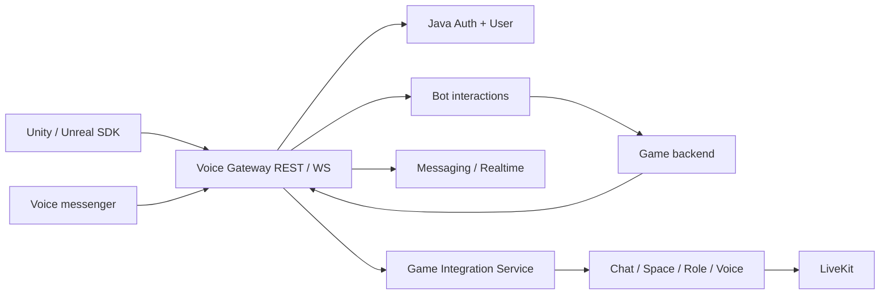

# Game Integration API — целевой внешний контракт

**Proposed target.** Ограниченный Auth bootstrap GAME-AUTH-01 реализован в
opt-in режиме; PostgreSQL/live-provider acceptance остаётся обязательным gate.
Этот T31 slice реализует Chat-side recipient provisioning contract ниже;
остальные новые API и полная GIS orchestration ещё не реализованы.
Продуктовые требования —
[интеграции игр](../features/game-integrations.md); acceptance и решения —
[матрица](../testing/game-integrations-acceptance.md). API имена фиксируют
предлагаемую семантику; до реализации нужны reviewed OpenAPI/proto и error schema.

Этот контракт и его реализация в Voice входят в спринт. Unity/Unreal assets,
SDK wrappers, developer CLI/portal — отдельная задача; слово SDK обозначает
внешнего потребителя протокола, в тестах Voice заменяемого test client.

## 1. Границы и владельцы


```mermaid
flowchart LR
  Engine[Unity / Unreal SDK] --> Edge[Voice Gateway REST / WS]
  Game[Game backend] --> Edge
  Messenger[Voice messenger] --> Edge
  Edge --> Auth[Java Auth + User]
  Edge --> Integration[Game Integration Service]
  Integration --> Domains[Chat / Space / Role / Voice]
  Edge --> Messaging[Messaging / Realtime]
  Edge --> Bot[Bot interactions]
  Bot --> Game
  Domains --> Media[LiveKit]
```

Решение владельца: выделить **Game Integration Service**, отдельный Go-микросервис
со своим хранилищем для developer applications, bindings, внешних resource mappings,
communication sessions и orchestration operations. Сервис ещё не реализован.
G06 остаётся открытым для схемы хранилища, контрактов и deployment, но не для
выбора между отдельным сервисом и встраиванием в существующий. Ни Gateway,
ни бот не становятся универсальной БД; Auth сохраняет владение аккаунтами.

| Владелец | Ответственность |
|---|---|
| Auth, Java/Spring | Identity proof, consent grants, delegated tokens, revocation/session epochs |
| User | Профиль, privacy, публичные атрибуты и допустимая presence |
| Game Integration Service | App/env, game bindings, external mappings, session orchestration, quotas |
| Chat / Space / Role | Членство, дерево, lifecycle, policy и effective permissions |
| Messaging / File | Сообщения/история/attachments и их access/retention |
| Realtime | WS delivery; per-connection `s` / `resume` |
| Voice | Voice admission, grants, media lifecycle, revocation |
| Bot | Installation, interaction delivery, credentials бота, response routing |
| Game backend | Roster facts, владение персонажами, экономика, допустимость и commit команд |

### Chat provisioning boundary (T31 recipient contract)

Chat remains the sole owner of its chats and membership rows. GIS calls a
dedicated `GameIntegrationChatService` on Chat's TLS listener with a verified
client certificate chained to a GIS-dedicated CA and a service principal; it
never connects to `chat_db`.
That listener exposes exactly `ProvisionManagedChat` and
`SyncManagedChatMembers`. The ordinary player `ChatService` listener does not
register this service. GIS signing keys are resolved only from its configured
HTTPS JWKS endpoint, credentials must bind issuer `gameintegration`, audience
`chat`, the exact full RPC name, the operation UUID as `x-request-id`, and the
deterministic protobuf SHA-256 of the complete request. Chat requires the
single bearer authorization and request ID metadata, rejects raw identity
headers, and records credential JTIs in Redis before calling a handler. Missing
or partial listener configuration fails startup; the GIS listener is disabled
when all its configuration is absent. Deployment network policy must allow
only GIS workloads to reach its listener. Staging/production service ports,
secret mounts, and that network policy are not wired by this recipient slice;
the listener remains disabled there until those deployment changes ship.

`ProvisionManagedChat` creates a standalone group owned by the application
and environment. It has no human creator, owner, or administrator. The unique
`(application_id, environment_id, external_chat_key)` mapping and durable
operation receipt are stored by Chat in the same transaction as resource
creation. Repeating an operation UUID and request hash returns the same chat;
reusing that UUID with another RPC or hash conflicts. `SyncManagedChatMembers`
replaces the desired roster atomically and assigns every profile `member` role.
Its persisted receipt makes a retry return the original roster result. Normal
player `AddMembers`, `RemoveMember`, `LeaveChat`, group role, ownership transfer,
and chat update paths cannot mutate a managed roster or promote a player to
owner/admin; only the two exact GIS methods can change it.

The request ID is the operation ID; the JWT `jti` is a separate, short-lived
credential replay nonce. A transport retry must use a fresh principal credential
with the same operation ID and identical deterministic request hash. Chat's
durable receipt, rather than the short JWT replay window, provides operation
idempotency. This is a recipient-side Chat slice: GIS orchestration, Voice
resource provisioning, grants, compensation, and cross-service crash recovery
remain open T31 work.

Ни один сервис не пишет в чужую БД. Межсервисные UUID — logical references без
FK. Существующие IDs сохраняют правила [DATA_MODEL](../DATA_MODEL.md): UUIDv4 для
ресурсов, UUIDv7 сообщений выдаёт Messaging. Внешние игровые IDs — opaque строки,
не доверенные UUID Voice и не основание доступа.

## 2. Ресурсы

| Ресурс | Ключ и значимые поля | Жизненный цикл |
|---|---|---|
| Application | `application_id`, owner, optional `game_id`, enabled capabilities | draft → sandbox → active → suspended/retired |
| Environment | `environment_id`, application, allowed origins/redirects/providers | sandbox и production строго раздельны |
| Installation | `installation_id`, app/env, approving actor, target scope | active → revoked; новая установка = новый ID |
| Player binding | `binding_id`, app/env/provider/external subject, selected profile, revision | pending → active → revoked |
| Character binding | game/realm/character key, binding, display policy | attached → detached/deleted |
| Communication session | `session_id`, kind party/match/fleet, external key, optional parent party | provisioning → active → closing → closed; failed |
| Resource mapping | app/env/external key → chat/voice/Space UUID | active → retired; не переиспользовать tombstoned key молча |
| Managed grant | origin external membership/rank, subject, bounded permission | desired → applied → revoked |
| Operation | `operation_id`, immutable request hash, stage/results/error | pending → succeeded/failed; reconcile after uncertainty |

Для bot invocation operation имеет неизменяемый `command_id` и domain status;
delivery ACK не переводит operation в succeeded. Terminal mapping и result CAS
определены в [bot protocol](../features/game-bot-interactions.md).

Предлагаемые unique constraints: app/env/external session key; app/env/provider/
subject для одной активной player binding; installation/event ID; actor-scoped
idempotency key. Несколько игровых аккаунтов у человека допустимы только по
явной политике приложения; ни nickname, ни email не используются для dedupe.
Принято: sdk-account уникален в app/env/provider subject, между приложениями
нет автоматического объединения людей. Независимая identity authority не
раскрывает другим приложениям эти сопоставления. Новый device key регистрируется
через независимый user proof и отзывается отдельно; provider login не даёт
восстановить permanent Voice credentials. Конкретная recovery схема и защита
от смены владельца subject требуют G01 и Q03 из design audit.
Профиль может получать grants от нескольких персонажей; причины хранятся
раздельно. Перенос персонажа другому аккаунту отзывает прежний binding/grants
до выдачи новых; старые карточки не переадресуются новому владельцу.

## 3. Три principal, три набора credentials

| Principal | Где хранится credential | Что может |
|---|---|---|
| Game service | Secret store backend игры | Создать свои sessions, передать подтверждённый roster, события |
| Delegated player | OS secure storage / память SDK | Чат/голос и разрешённые действия выбранного профиля |
| Bot actor | Secret store адаптера игры | Только installation/scopes/destinations бота |

Server secret нельзя положить в Unity asset, Blueprint, браузер, конфиг клиента
или deep link. SDK не принимает «admin token» как упрощённую авторизацию.
Bot Token не заменяет user session. Session grants не дают доступа к остальному
inbox, друзьям, другим играм и другим профилям.

### Вход и связывание

1. SDK получает краткоживущий независимо проверяемый login proof. Для авторства
   пользователя заверения backend разработчика недостаточно: нужен вход Voice
   либо внешний provider flow, который Voice проверяет независимо от игры и
   связывает с ключом устройства. Game ticket может подтверждать roster/context,
   но не выдавать developer право получить user credential. Issuer/audience,
   signature, nonce, expiry и replay проверяются сервером; поддержанные providers
   настраиваются в portal, ключи берутся из доверенного registry; developer
   не может назначить свой issuer независимым удостоверением игрока.
2. Voice создаёт binding challenge с `state` и одноразовым nonce. Пользователь
   проходит системный browser/device flow, выбирает профиль и scopes.
3. Authorization code + PKCE связывают callback с инициатором. Redirect URI
   совпадает с allowlist; custom scheme/deep link сам не доказывает владение.
4. Auth выдаёт delegated grant на app/env/binding/profile. Game server получает
   только разрешённую ему часть binding; не master refresh token пользователя.
5. Revoke/unlink, смена profile binding, удаление аккаунта и suspension приложения
   увеличивают authority revision/epoch; действующие сессии теряют разрешения.

В embedded браузер игры пароль Voice не вводится. Для устройства без браузера
нужен device code с expiry, ограниченным polling и явным подтверждением.
Alpha admission/invite/cohort cap не обходится через игровой endpoint.

`sdk-account` — отдельный Auth-supported principal с
централизованным владением. До его реализации SDK возвращает
`CAPABILITY_UNAVAILABLE`, а не создаёт скрытый regular/guest аккаунт.
Claim/upgrade требует proof обеих identity, описанного conflict flow и политики
истории. Автоматического merge друзей/профилей/истории нет.

### Конвертация sdk-account

#### Auth durable conversion preparation GAME-AUTH-03

Auth создаёт durable operation до внешних owner effects. Новый target начинается
с current SDK credential и device proof; существующий — с linked-bootstrap
credential GAME-AUTH-02 и тем же device key. Обычный Voice Bearer остаётся в Voice
browser UI. Prepare фиксирует mode (`new` / `existing`), binding ID, source
app/env/device/generation и client UUID idempotency key. Повтор key с тем же
target/binding возвращает прежнюю operation без продления intent; другая нагрузка
даёт 409. Source account допускает несколько подготовленных intents, но только
одну подтверждённую conversion; confirmation остаётся отдельным preview/CAS шагом.

Prepare device payload:
`voice-sdk-conversion-new-v1\n<SHA-256 SDK token>\n<idempotency UUID>\n<binding UUID>`
или `voice-sdk-conversion-existing-v1\n<SHA-256 linked token>\n<idempotency UUID>\n<binding UUID>`.
Auth request hash — SHA-256 UTF-8
`<mode>\n<idempotency UUID>\n<binding UUID>\n<target account UUID or ->\n<target profile UUID or ->`.

New mode выдаёт Auth-owned `registration_intent_id` с TTL 15 минут. Обычный
Voice registration endpoint принимает optional `registrationIntentId`. В одной
локальной транзакции создаётся новый account, consumes одноразовый intent и
записывается его account ID в operation. Неверный/истёкший/использованный intent
откатывает создание account. Legacy guest registration с intent запрещена.
Pending email сохраняет обычный registration/OTP lifecycle. Attach target
требует current Voice proof **ровно записанного** account после перехода в
regular; существующий раньше account допустим только в existing mode.
New attach вызывает идемпотентный User EnsurePrimaryProfile, затем read-only
eligibility именно primary. Existing mode не вызывает provisioning или switch.

Recovery status доступен с сохранённым public device key operation даже после
отзыва source credential. Это только чтение, не player authority. Payload:
`voice-sdk-conversion-status-v1\n<operation UUID>\n<issued-at Unix seconds>`;
Auth принимает timestamp не старше 60 секунд и не дальше 30 секунд в будущем.
Ни provider credential, ни ordinary Voice token для status не сохраняются.
Prepare/status/attach ещё не freeze, не transfer и не завершённая conversion.
Последующие preview, explicit confirmation и owner receipts обязаны следовать
[conversion authority](game-conversion-authority.md); unavailable adapter
оставляет durable state без продвижения и никогда не создаёт no-op receipt.

Prepare/status/attach routes отдельно opt-in через `auth.sdk-conversion.enabled`
и доступны только при JDBC persistence:

| Route | Proof / request | Result |
|---|---|---|
| `POST /api/v1/auth/sdk/conversions/new` | SDK Bearer; `idempotencyKey`, `bindingId`, `deviceProof` | prepared operation и registration intent |
| `POST /api/v1/auth/sdk/conversions/existing` | Linked Bearer; те же поля | prepared operation с ранее выбранным permanent profile |
| `POST /api/v1/auth/sdk/conversions/{operationId}/status` | `issuedAt` Unix seconds и `deviceProof`; без source Bearer | durable operation state/revision и target/intent IDs |
| `POST /api/v1/auth/sdk/conversions/{operationId}/attach-new-target` | Current Voice Bearer; без authority fields в body | только зарегистрированный через intent новый target/primary |

Intent consume проверяет current source generation/device и lifecycle, но не
требует ещё живой пятиминутный bootstrap session. Отзыв устройства запрещает
consume, сохраняя только purpose-limited status. Unknown fields и malformed
requests дают безопасный `400`, invalid proof — `401`, изменённая idempotent
нагрузка — `409`. Registration intent не попадает в parser/validation logs.

#### Auth browser consent GAME-AUTH-02

Этот следующий Auth slice реализует подготовку связи из уже независимо
подтверждённого sdk-account. Consumer — существующий Voice browser/Flutter UI
и внутренний protocol client. Auth не принимает пароль Voice в игровом UI;
обычный Voice sign-in/registration остаётся существующим потоком. Device-code
вариант не включается без конкретного browserless consumer.

Registry policy читается через `SdkAuthorizationPolicy.resolve(app, env)`:
`applicationId`, `environmentId`, положительная immutable `revision`,
`displayName`, точные `redirectUris`, разрешённые `playerScopes`. Registry
владеет allowlist. Endpoint владельца —
`GET /internal/v1/authorizations/environments/{environment_id}`; только
выделенная Auth↔Game Integration workload identity. Недоступный policy adapter,
неактивное приложение, неверные IDs, неизвестный scope, смена revision закрывают
request/approval/exchange. Локальный developer allowlist не заменяет lookup.
Production adapter выключен до реализации проверяемого workload contract.

1. SDK создаёт authorization request с UUID idempotency key, точным redirect,
   S256 challenge (43 base64url chars), случайным state (43–128 base64url chars)
   и отсортированным набором scopes. Набор непустой, максимум 16 элементов;
   player subset — `game.identity.read`, `game.chat.read`, `game.chat.send`,
   `game.voice.join`, `game.presence.write`, `game.invites.create`; service-only
   scopes запрещены. Redirect — absolute URI без fragment/userinfo/CRLF;
   допустимые schemes задаёт registry, совпадение allowlist всегда exact.
   Source credential и device possession
   проверяются в той же транзакции. Повтор того же ключа/полезной нагрузки
   возвращает прежний request ID/expiry; другая нагрузка даёт conflict.
2. Canonical request digest — SHA-256 UTF-8
   `voice-sdk-authorization-request-v1\n<idempotency UUID>\n<redirect>\n<S256 challenge>\n<state>\n<sorted scopes joined by comma>`.
   Device JWS payload —
   `voice-sdk-authorize-v1\n<SHA-256 source token>\n<request digest>`.
   Lifetime ограничен меньшим из source-session expiry и now+5 минут.
3. Voice UI показывает app/окружение, scopes, исходный game context, выбранный
   профиль и явное согласие. UI читает эти данные из Auth consent-view с current
   regular Voice Bearer; переданные игрой display/scopes не являются источником
   consent UI. View повторно проверяет policy/source и ничего не утверждает.
   Approval требует обычный current Voice Bearer,
   **актуальный** `accounts.type=regular` в Auth DB, exact policy revision и
   read-only User eligibility выбранного profile (owner/nondeleted/nonfrozen
   и revision). `SwitchProfile` не вызывается; primary не подставляется молча.
   Pending email registration не является постоянным target до verification.
4. Approval выдаёт одноразовый random code (в store только SHA-256), TTL до
   60 секунд и не дольше request. Redirect совпадает с registry byte-for-byte;
   state возвращается неизменным. Повтор approval после успешного выпуска
   отвергается; потерянный ответ требует нового request, не восстанавливает code.
5. Exchange требует code, exact redirect, PKCE verifier (43–128 unreserved
   ASCII chars) и прежний device key. Payload:
   `voice-sdk-code-v1\n<request UUID>\n<SHA-256 code>\n<SHA-256 verifier>`.
   Перед consume заново проверяются current source/device generation,
   target regular/status/epoch/approval-session blacklist, registry revision
   и exact User eligibility revision. Expiry проверяется после ожидания locks.
6. Результат — отдельный opaque linked-bootstrap credential на 5 минут с
   app/env, исходной identity/device, **выбранным** target account/profile,
   scopes и consent/policy revision. Он не обычный Voice JWT/refresh и не
   активирует player binding или media. Binding activation и conversion
   требуют receipts по [conversion authority](game-conversion-authority.md).

Auth HTTP routes этого slice:

| Route | Proof / request | Result |
|---|---|---|
| `POST /api/v1/auth/sdk/authorizations` | SDK Bearer; `idempotencyKey`, `redirectUri`, `codeChallenge`, `state`, `scopes`, `deviceProof` | request ID, policy revision, display/scopes/expiry |
| `GET /api/v1/auth/sdk/authorizations/{requestId}` | Current regular Voice Bearer | authoritative consent view, game context, no mutation |
| `POST /api/v1/auth/sdk/authorizations/{requestId}/approve` | Current regular Voice Bearer; `profileId`, `policyRevision` | one-use code, redirect with original state, expiry |
| `POST /api/v1/auth/sdk/authorizations/{requestId}/exchange` | `code`, `redirectUri`, `codeVerifier`, `deviceProof` | linked-bootstrap credential |
| `POST /api/v1/auth/sdk/authorizations/linked-session` | Linked Bearer; `deviceProof` | current scoped claims, no returned raw token |

Linked-session possession payload:
`voice-sdk-linked-v1\n<SHA-256 linked token>`. This read checks source/device
lifecycle and generation, target epoch/logout, policy and profile revisions;
source bootstrap session expiry alone does not extend or revoke a linked grant.
Linked expiry is capped by the approval Voice token expiry. Unknown authority
fields are rejected; malformed requests return coarse `400`, invalid proof or
authority `401`, changed idempotency payload `409`.

Auth хранит authorization request/code/consent/grant отдельно от guest conversion.
Владелец User предоставляет отдельный read-only eligibility contract; до его
production adapter approval/exchange закрыты. Fake policy/eligibility допустимы
только в тестах. Scoped token не считается production-ready до binding
authority consumer и публичных Gateway limits. Direct Voice-only first login
без предварительного sdk-account остаётся последующим вариантом того же
authorization contract; этот slice не объявляет весь T14 завершённым.

#### Замороженный Auth identity slice GAME-AUTH-01

Это замороженный Auth-only контракт для реализации **T13a**, а не заявление,
что целиком закрыт G01 или готовы весь T03/T04/T06. T13a реализует только
локальный `sdk-account` principal, таблицы и ограничения ниже, проверку
Google OIDC вместе с отдельным app/env game ticket, одноразовый nonce/device
challenge, replay denial, bootstrap credential/session/revoke и app/env
uniqueness/admission cap. Для детерминированных тестов verifier принимает
тестовые JWKS/clock и синтетические подписанные fixture tokens; эти fixtures
не заменяют отдельную real-Google acceptance.

T13a использует текущую operator configuration как admission source. Он не
подключает GIS registry, не добавляет Gateway маршруты и не включает capability
в deployment; документированные Auth paths остаются unpublished до отдельного
registry/Gateway activation gate. T13a не включает браузер/PKCE/consent и
выбранный User profile (T14), per-device actor signing keys (T15), conversion,
межсервисную trust matrix, transfer/recovery/history/conflict policy или
production admission. Эти более широкие вопросы остаются в G01 и родительских
T03/T04/T06 либо в последующих Auth slices. Их не следует трактовать как
неявно решённые этим Auth-only контрактом.

G01/Q11: первый независимый provider — Google OpenID Connect, issuer строго
`https://accounts.google.com`, RS256 и ключи только из Google JWKS. Для каждого
app/env оператор Voice регистрирует отдельный **Voice-owned** Google client ID;
developer не управляет issuer, JWKS или client ID. Google subject удостоверяет
пользователя, а не владение персонажем: соответствие игровому subject отдельно
подтверждает Game Integration Service. Email, имя и avatar не импортируются.
Обязательны единственный ожидаемый `aud`, совпадающий `azp` при наличии, непустой
`sub` длиной не более 255 символов,
`nonce`, `iat` не старше 5 минут и не более 30 секунд в будущем, неистёкший `exp`.
Источник protocol semantics: [Google OIDC](https://developers.google.com/identity/openid-connect/openid-connect).

Google — первый поддержанный provider, не исключительное продуктовое обещание.
Помимо него exchange **обязательно** проверяет отдельный RS256 game ticket
ключом backend из operator app/env registry: `iss=game:<application UUID>:<environment UUID>`,
`aud=voice:sdk-enroll`, `sub=<game subject>`, тот же `nonce`, `iat`/`exp`
с теми же freshness bounds, `independent_subject_hash=SHA-256(issuer + LF + sub)`
проверенного Google proof. Это связывает два доказательства и device challenge.
Скомпрометированный backend может лгать о game subject/roster, но не выпускать
Google proof, менять device key или получать permanent Voice credentials.
Game subject является контекстом session; назначение binding и его uniqueness
остаются Game Integration Service, а не доказательством со стороны Google.

Auth HTTP surface первого среза: `POST /api/v1/auth/sdk/challenges`
принимает `applicationId`, `environmentId`, публичный ES256/P-256 JWK;
возвращает `challengeId`, `nonce`, `clientId`, `expiresAt`. Challenge живёт
5 минут и неизменно связывает app/env/provider audience/device key.
`POST /api/v1/auth/sdk/exchange` принимает `challengeId`, `providerToken`, `gameTicket`,
`deviceProof`: compact ES256 JWS с payload **в точности** UTF-8
`voice-sdk-enroll-v1\n<challenge UUID>\n<nonce>` и зарегистрированным ключом.
Auth атомарно consumes challenge, создаёт/находит sdk identity, регистрирует
устройство и возвращает `accountId`, `actorId`, `deviceId`, `accessToken`,
`expiresAt`, `accountType=sdk-account`. Повтор exchange, включая потерянный
ответ, отвергается; новый независимый login восстанавливает ту же identity.
Новый device требует нового independent login; отозванный ключ нельзя оживить.

Первый credential — случайный opaque 256-bit token, в БД только SHA-256,
TTL 5 минут, purpose `sdk-identity-bootstrap`. Он не JWT обычного Voice,
не refresh token и не даёт chat/voice access. `POST /api/v1/auth/sdk/session`
проверяет Bearer token **и** ES256 proof с точным UTF-8 payload
`voice-sdk-session-v1\n<SHA-256 lowercase hex token>`; возвращает только
собственные app/env/account/actor/device IDs. Это read-only проверка владения
bootstrap credential; replay не создаёт эффект. `POST /api/v1/auth/sdk/revoke`
с token и proof `voice-sdk-revoke-v1\n<token hash>` отзывает текущее устройство
и все его sessions. Повтор после revoke отвергается. Обычные Voice endpoints
не принимают этот opaque credential. Все identity denial ошибки одинаковы.

Хранилище Auth: отдельные `sdk_identities`, `sdk_devices`, `sdk_challenges`,
`sdk_sessions`; это отдельный тип principal, без строки legacy guest, пароля,
refresh или автоматического User profile. Уникальность app/env/issuer/sub;
случайный `actorId` стабилен только внутри identity и не является `profile_id`.
В этом срезе admitted app/env задаются operator configuration, с cap 1000
identities на app/env и не более 10 активных устройств на identity; issuance
проверяет admission повторно. Registry consumer заменит конфигурационный список
доверенным контрактом; конфигурация неизменяема в процессе, исключение app/env
из списка после restart прекращает challenge/exchange/session. Online
suspension registry и propagation требуют следующего slice до production.
Не публиковать маршруты в Gateway до его rate limits и registry activation gate.

Q03: ownership generation начинается с 1. Не угадываем transfer по IP/email/
новому устройству; Google `sub` не передаётся по обычному flow. При заявленном
compromise/transfer identity блокируется; отдельная reviewed recovery operation
закроет прежние grants и создаст новое generation без private history/consent.
Автоматическое обнаружение смены человека за provider account не обещается.

Q07: до conversion один private app-scoped actor, без дополнительного User
profile. Existing-target conversion выбирает уже существующий разрешённый
profile, поэтому заполненный лимит 2/5 не создаёт обхода или extra profile.
New-target conversion создаёт один primary profile через User API. Public
payload будущих roster/cards/presence не должен сериализовать account ID,
provider subject или скрытые permanent profiles.

Q08: до доказанного linking account-wide voice применяется отдельно к каждому
sdk-account. Conversion блокирует новые source admission, требует Voice receipt
о завершении source session; занятый target возвращает `VOICE_CONFLICT` до
commit, либо получает отдельное явное handoff consent. Reconnect и lease renewal
проверяют новую generation; mute/deafen не снимаются переносом.

Q10: revoked device public key/thumbprint, retired/deleted identity UUID,
app/env/issuer/sub fence и ownership generation сохраняются без TTL как
минимальный security tombstone; это pseudonymous anti-resurrection data, не
public profile. Provider login не снимает suspension/deletion/retirement.
Raw provider token никогда не сохраняется. Истёкшие challenges/sessions можно
удалять после expiry; текущий срез не делает erasure/restore. Backup restore
перед serving обязан сверить tombstone generation с внешним durable lifecycle
journal; пока такой journal не подключён, восстановленная Auth DB не включается
для этой capability. Raw provider subject pseudonymization и key-retention
механизм должны пройти отдельный deletion slice до production admission.

План следующих executable slices (не реализовано GAME-AUTH-01):

1. GAME-AUTH-02: registry admission + Gateway limits, Voice-owned browser
   redirect/code+PKCE/consent и User actor contract; реальная Google acceptance
   с отдельными sandbox/prod client IDs, allowed redirect/origin, двумя device
   keys и nonce replay. Без credentials остаётся только crypto fixture evidence.
2. GAME-AUTH-03: durable conversion operation/status/hash/expected revision;
   source independent proof + device possession; новый permanent target через
   существующую email registration/verification и User primary-profile RPC;
   preview/consent, source fence, Voice receipt, owner receipts, target activation.
   Tests: crash/retry каждого перехода, email pending, account bans, old token.
3. GAME-AUTH-04: existing permanent proof через browser+PKCE, explicit existing
   profile, conflict preview; occupied binding → 409, no replacement/union;
   тот же журнал и owner receipts. Tests: full profile limit, concurrent targets,
   hidden profiles, target already in voice, source reconnect.
4. GAME-AUTH-05: unlink/delete/restore/recovery, HMAC subject tombstones и
   external monotonic journal, anti-resurrection на старом backup; identity
   lookup после conversion следует target binding только после permanent
   proof, а unlink никогда не воскрешает retired source. ID09–ID13/Q08/Q10
   закрываются только этими executable тестами.

Подтверждение исходного sdk-account включает proof-of-possession его device key
и независимую пользовательскую авторизацию; одного server-issued game ticket
недостаточно для конвертации или замены device key.

Требование владельца: `sdk-account` — отдельный от текущего `guest` тип с доказанным game
subject и ограниченным app/env доверием, с конвертацией как в новый, так и в
существующий постоянный аккаунт. `ConvertGuest` не является готовым контрактом
для этой операции. Наличие identity не означает подтверждённый email или
неограниченный user credential. Auth остаётся центральным владельцем;
game service и federated node не создают постоянный аккаунт от имени игрока.

Предлагаемый протокол реализации (детали G01):

1. Начать durable conversion operation с idempotency key, исходной identity,
   expected binding revision и краткоживущим доказательством game subject.
2. В Auth зарегистрировать новый аккаунт либо аутентифицировать существующий;
   при существующем выбрать целевой профиль и подтвердить оба владения.
   Browser/PKCE flow и challenge связывают это с конкретной операцией.
3. Подготовить preview: переносимые game bindings, актуальные memberships,
   политика истории, конфликты. Никакого поиска/merge по email или имени.
   Если binding уже занят, вернуть конфликт без автоматического replacement;
   отдельный flow разрешения конфликтов утверждается в G01.
4. После подтверждения закрыть новые admission исходной identity и увеличить
   authority epoch. Проверить lifecycle/баны обеих сторон и заново вычислить
   grants выбранного профиля из актуального roster, без объединения рангов.
5. Выполнить перенос через журналируемые идемпотентные стадии владельцев данных.
   После необходимых receipts активировать целевую связь и выдать новые scoped
   credentials. Старые tokens/соединения отозвать; исходную identity оставить
   retired reference для аудита и исторического авторства, без самостоятельного
   доступа. Повторный game login разрешается в целевой binding.

Две БД не считаются атомарно обновлёнными по одному HTTP-ответу. Во время
перехода возможна явная пауза общения, но не два параллельных активных владельца
одного binding. Crash/retry продолжает ту же operation; отмена до commit не
меняет связь, после начала переноса требует recovery до terminal state, а не
слепого возврата старых tokens. Status доступен инициатору через доказанный
контекст операции и не зависит от уже отозванного обычного игрового токена.

Старые сообщения не переписываются массово на нового автора; alias/tombstone
mapping сохраняет audit и не раскрывает другим людям скрытые профили. Доступ
к старой истории не расширяется самим фактом конвертации. Перенос не оживляет
старые карточки/команды и не обходит баны; уже admitted команды завершаются
по существующим правилам in-flight admission. Unlink после конвертации не
воскрешает retired identity. Правила последующего нового игрового входа,
потери provider account, retention mapping и восстановления — открытая часть G01.

The concrete owner revisions, receipts, state machine and recovery floor for
both conversion paths are fixed in
[game-conversion-authority](game-conversion-authority.md). До включения capability нужны схемы Auth/store, отдельная trust/permissions
матрица, conversion endpoints и согласованные conflict/history/recovery UX.
Этот раздел задаёт требования и предлагаемый протокол, а не доступный API.

### Авторство сообщений пользователя

Принятая владельцем гарантия: серверный credential студии не позволяет отправить
сообщение от лица игрока; запрос приходит от авторизованного игрового клиента.
Это не гарантия намерения человека против злонамеренного игрового executable,
который контролирует SDK process и может сам вызвать отправку. Для такой более
сильной гарантии потребовался бы независимый доверенный UI подтверждения.

SDK создаёт отдельный device key для app/env, хранит private key в доступном
OS secure storage и регистрирует public key после независимого user proof.
Game backend, bot и node не получают этот private key, permanent credentials
или возможность выпускать player tokens. Сообщение подписывает канонический
envelope с actor/binding/device, app/env, chat, message ID, content digest,
authority revision, audience и freshness/replay fields. Receiver проверяет
подпись, актуальное admission и dedupe; та же message ID с иным содержимым
отвергается. Подпись не заменяет membership, scope или rate limit.

Нода проверяет user signature по master-authorized device binding, а не по
ключу оператора ноды; происхождение должно оставаться проверяемым получателем
через доверенные master keys. Wire format, algorithm, canonicalization, key
rotation/recovery and receiver verification are frozen in the T15 contract
below; this remains a target contract until runtime implementation.
Игра без независимого способа подтвердить пользователя не получает capability
создания sdk-account на основании одного собственного service credential.
Конвертация сохраняет app-scoped полномочия и не экспортирует ключи постоянного
аккаунта. Подпись удостоверяет происхождение, но не скрывает текст сообщения.

### Frozen T15 device-signature and message-revision contract

This closes the protocol decision gate for T15 and Q04; it specifies a target
contract and is not evidence that T15 runtime behavior exists. The device key
registered by Auth GAME-AUTH-01 is the signing key: ES256 (ECDSA P-256 with
SHA-256), public JWK only, private key retained by the client in OS secure
storage. Key registration, replacement and revocation are Auth-owned operations
after independent user proof. Developer service credentials, bot secrets and
node keys have separate principals and keysets; none may enroll, replace, or
use a player device key. The signing algorithm is fixed for v1; unknown `alg`,
`crit`, key type, curve, or protected header fields fail closed.

The v1 request body is compact JWS ASCII with media type
`application/vnd.voice.game-message+jws;version=1`; its payload is strict
UTF-8 JSON without BOM, canonicalized using RFC 8785 JCS. Protected header is
exactly `{"alg":"ES256","kid":"<key_id UUID>","typ":"voice.game-message+jws"}`.
Messaging owns the internal receiving RPC `ApplyGameMessage` with
`ApplyGameMessageRequest.compact_jws` and
`ApplyGameMessageRequest.device_authority_assertion`. The first field carries
the HTTP body bytes as ASCII without JSON wrapping; the second carries the
`X-Voice-Device-Authority` compact JWS unchanged. The authenticated Gateway
service is the only caller. This typed internal ingress is additive; existing
player-facing REST send/edit/delete routes remain unchanged until their T20
consumer is implemented. The RPC accepts no caller-supplied profile, sender,
actor, or chat-authority fields. Messaging derives profile and chat
permissions from current Auth binding and Chat policy; while the T16 binding
producer is unavailable, new operations fail closed.
`ApplyGameMessageResponse.message` contains the ordinary Messaging projection
after the revision transaction commits.
JWS signs the ASCII `BASE64URL(protected-header) + "." + BASE64URL(canonical
payload)` input from RFC 7515. The payload contains exactly these required
fields:

```json
{"version":1,"operation":"create","audience":"voice.game-message","application_id":"<UUID>","environment_id":"<UUID>","account_id":"<UUID>","actor_id":"<UUID>","binding_id":"<UUID>","device_id":"<UUID>","operation_id":"<UUID>","authority_revision":1,"chat_id":"<UUID>","message_id":"<UUIDv7>","revision":1,"previous_revision_hash":null,"issued_at":"<RFC3339 UTC with seconds>","expires_at":"<RFC3339 UTC with seconds>","content_type":"text/plain","content_b64":"<unpadded base64url of exact UTF-8 content bytes>","content_sha256":"<lowercase SHA-256 hex>","attachment_manifest_b64":null,"attachment_manifest_sha256":null}
```

UUIDs use lowercase canonical hyphenated form; `revision` and
`authority_revision` are positive JSON integers no greater than 2^53-1; times
are UTC RFC 3339 second precision, with `issued_at < expires_at` and a maximum
five-minute envelope lifetime. For create/edit, `content_type` is `text/plain`
and `content_b64` is unpadded base64url of the complete message content bytes
(valid UTF-8, at most 4000 Unicode scalar values); partial patches are not
allowed. The receiver decodes and stores these exact bytes, and
`content_sha256` is lowercase SHA-256 hex of them. Since `content_b64` is in
the canonical payload, the JWS covers the content as well as its digest. For
delete, `content_type`, `content_b64`, `content_sha256`,
`attachment_manifest_b64`, and `attachment_manifest_sha256` are all `null`.
JWS protected-header, payload and signature use unpadded base64url as defined
by JWS. `content_b64` and `attachment_manifest_b64` accept only the URL-safe
alphabet with no padding; decoding and re-encoding must reproduce the exact
field value. For a new operation, the receiver rejects non-canonical payload bytes,
duplicate JSON names, invalid UTF-8, unknown security fields/operations,
mismatched route/body audience or identity, expired/future envelopes outside
30 seconds of receiver time, and invalid signature before any state write.
Receipt ordering is explicit:
after strict parsing and extraction of both dedupe tuples, the receiver looks
for an existing receipt first. If either tuple exists with different compact
JWS bytes, it returns conflict without mutation. If both tuples match and the
stored compact JWS is byte-identical, it returns the immutable result
read-only; this path needs no fresh Auth assertion and remains valid after
expiry, rotation or revoke. It cannot create a new effect. Only when no receipt
exists does the receiver verify the device signature and current Auth device
authority, check envelope freshness, app/environment/binding and chat
authorization, and attempt the atomic insert/effect. Unique constraints close
concurrent first-delivery races. The first accepted operation stores its exact
compact JWS and result. The client signs once, persists that JWS until terminal
result, and sends identical bytes on every network retry.

Each edit is a new signed `operation:"edit"` envelope for the same
`message_id`, with `revision = previous + 1` and
`previous_revision_hash = SHA-256` lowercase hex of the preceding compact JWS
ASCII bytes. Delete is terminal: a user deletion is a signed
`operation:"delete"` envelope with the next revision and previous hash.
Moderator/system deletion is a separate
`application/vnd.voice.game-message-tombstone+jws;version=1` compact JWS, never
a fabricated player signature. Its protected header is exactly
`{"alg":"EdDSA","kid":"<messaging key UUID>","typ":"voice.game-message-tombstone+jws"}`.
Its RFC 8785 payload has exactly `version:1`, `operation:"moderator_delete"`,
`issuer:"messaging"`, `audience:"voice.game-message"`, `application_id`,
`environment_id`, `chat_id`, `message_id`, `revision`,
`previous_revision_hash`, `action_id`, `reason_class`, and `issued_at`. The
revision is next and contiguous; `previous_revision_hash` is SHA-256 of the
preceding compact JWS ASCII bytes. `reason_class` is one of `moderation` or
`system_retention`; unknown values fail closed. The authenticated moderation
caller supplies a stable `action_id`, which Messaging uses as the operation/dedupe ID. Reuse of that action or
chat/message/revision tuple returns the identical stored tombstone; different
bytes conflict. Messaging signs only after its owning authorization checks
and atomically commits the tombstone with deletion. The signature covers every
listed field. The issuer uses a Messaging-owned Ed25519 key. The node's master-
provisioned trust record pins issuer `messaging`, the fixed internal HTTPS JWKS
origin `https://voice-messaging:8443/.well-known/game-tombstone-jwks.json`, its
TLS server name and CA; fetch uses node mTLS, and no payload or developer value
may select the URL. Unknown `kid` triggers one refresh from that pinned origin,
then fails closed. Key records bind ID, algorithm, public key, `not_before`,
`not_after` and optional `revoked_at`; rotated keys are historical-verification
only, and a signature issued at/after explicit key revocation is rejected.
`issued_at` is RFC 3339 UTC seconds, immutable, and no more than 30 seconds in
the receiver's future. Receivers require contiguous revisions and a matching previous hash. They
reject a lower revision after observing a higher one and flag equal-revision,
different-hash responses as equivocation. This detects rollback or conflict
only when a client has prior evidence or compares replicas; it does not prove
history completeness or prevent a node from withholding unseen messages.
Clients display only verified revisions as authenticated content. On a gap,
invalid signature/digest, or equivocation, they retain at most the last
verified revision, label it stale/unverified, and disable message actions. If
no verified revision exists, they suppress the payload and show an integrity
failure state. A valid terminal deletion tombstone hides the message content.

Attachments are immutable File objects. For create/edit with attachments,
`attachment_manifest_b64` is unpadded base64url of the complete RFC 8785 JCS
UTF-8 array of `{file_id, object_revision, byte_length, content_sha256,
media_type}` records in user-selected display order;
`attachment_manifest_sha256` is SHA-256 of those decoded bytes. Both fields are
inside the device-signed payload. Each ID is a canonical UUID, revision and
length are non-negative exact JSON integers, and digest is lowercase SHA-256
hex. File remains authoritative for the exact immutable object metadata,
access and retention; the receiver compares every listed value to File before
display. File IDs name immutable source objects and are never reused, so v1
assigns each source object `object_revision: 1`; scan outcomes and derived
thumbnail/conversion locations do not create a new source revision. With no
attachments, both fields are `null`. A message is rejected if
File cannot provide and later verify this immutable provenance; a client must
not display unverified bytes as authenticated. A changed manifest requires a
signed edit revision. This establishes object provenance, not that a node
showed every attachment or complete history.

Auth assigns a fresh random UUID `key_id` per public-key generation; `kid` is
that immutable `key_id`, never a caller-selected value. The Auth key record
binds key ID, device ID, application/environment, public P-256 JWK and its
RFC 7638 thumbprint (unpadded base64url SHA-256), generation,
`not_before`, `not_after`, status and optional `revoked_at` as Unix milliseconds;
those timestamps and status are Auth authority values, never client claims. Auth publishes key
records through its authenticated key lookup. Initial enrollment uses the
existing five-minute Auth device challenge bound to app/env and public P-256
JWK, then the independent-provider exchange and device proof from GAME-AUTH-01.
For lifecycle routes, `POST /api/v1/auth/sdk/device-keys/challenges` accepts
purpose `rotate|recover`, new public JWK containing only `kty:"EC"`,
`crv:"P-256"`, `x`, and `y`, and, for recovery,
`replaces_device_id`; it returns one-use challenge ID/nonce with five-minute
expiry bound to the current app/env and (for rotation) SDK identity/device.
Rotate challenge creation requires the current SDK session bearer; recovery
challenge creation accepts app/env and the named replaced device without old
key possession. `POST
/api/v1/auth/sdk/device-keys/rotate` requires that challenge, fresh proof of
the same current app-scoped identity, possession proof from the current key,
new-key proof and an idempotency UUID. `POST
/api/v1/auth/sdk/device-keys/recover` requires the challenge, fresh proof of
that identity and new-key proof; it cannot require the lost private key.
Independent proof is the configured independent provider proof or, after
conversion, the authenticated permanent Voice identity bound to this app
binding. Auth atomically consumes challenge and idempotency key and returns
only `device_id`, `key_id`, generation and authority revision. Explicit revoke
is `DELETE /api/v1/auth/sdk/devices/{device_id}` and requires fresh identity
proof plus current-key possession if that key is available; loss uses recovery.
Recovery registers a new device/key and revokes every active generation for
only the named replaced device. Other devices remain active. Identical request
ID and bytes return the saved result; changed bytes conflict.

Explicit revoke uses `DELETE /api/v1/auth/sdk/devices/{device_id}` with a fresh
independent provider identity token and a compact ES256 device-key proof. The
revoke proof uses the same exact protected header as a current-key lifecycle
proof and an RFC 8785 payload containing exactly `version:1`, `purpose:"revoke"`,
`audience:"voice.auth.device-key"`, `request_id`, `application_id`,
`environment_id`, `device_id`, `key_id`, `key_thumbprint`, and `issued_at`
(Unix milliseconds). The provider token must resolve to the exact app/env
identity bound to that device and must be issued within the preceding 300
seconds and remain unexpired. Auth consumes the request ID and original request
bytes atomically with device/key revocation; exact replay returns the saved
receipt and changed bytes conflict.

Lifecycle key proofs are compact JWS with protected header exactly
`{"alg":"ES256","kid":"<current key UUID>","typ":"voice.game-device-key-proof+jws"}`
for `purpose="rotate_current"`, and exactly
`{"alg":"ES256","typ":"voice.game-device-key-proof+jws"}` for a new-key
proof. A proof payload is strict canonical RFC 8785 UTF-8 JSON with no unknown
fields. The current-key payload is exactly `version:1`,
`purpose:"rotate_current"`, `audience:"voice.auth.device-key"`, `request_id`,
`challenge_id`, `nonce`, `application_id`, `environment_id`, `device_id`,
`key_id`, `key_thumbprint`, `new_key_thumbprint`, and `issued_at` (Unix
milliseconds). The replacement-key payload for rotation is exactly `version:1`,
`purpose:"rotate_new"`, `audience:"voice.auth.device-key"`, `request_id`,
`challenge_id`, `nonce`, `application_id`, `environment_id`, `device_id`,
`key_thumbprint`, and `issued_at`. Recovery uses the same fields with
`purpose:"recover_new"` and `replaces_device_id` instead of `device_id`. The
`key_thumbprint` is RFC 7638 thumbprint of the key signing that proof; the
current-key proof's `new_key_thumbprint` is the challenged replacement key.
Challenge ID, nonce,
app/env, request ID and thumbprint must match the stored one-use challenge and
request. `issued_at` must be within ±30 seconds of Auth time. The independent
Google OIDC proof uses the stored challenge nonce and configured app audience
and must resolve to the same app/environment/issuer/subject identity. The
idempotency key is the `request_id`; Auth retains original request body bytes
and immutable result so same-ID/same-byte replay is read-only and same-ID
changed bytes conflict.

An ordinary rotation requires the new public JWK and a fresh five-minute Auth
challenge, independent user proof for the same app-scoped identity, and
possession proof signed by the current key. The replacement becomes active
atomically; the old key remains admissible for new operations only while
`now < old.not_after`, where `old.not_after` is exactly replacement commit time
plus 600 seconds. At `now >= not_after`, it is rejected for new admission.
Every newly active key has a fixed 90-day validity: `not_after` is exactly
`not_before + 90 days` in Unix milliseconds. Auth permits rotation only before
that deadline and assigns the replacement its own 90-day validity. There is no
expiry grace period; at or after the deadline, Auth refuses new status
assertions and receivers reject new operations for that key. The client must
renew by ordinary rotation before expiry. If renewal is missed, the player must
complete recovery with fresh independent identity proof and a new-key proof;
the expired key is not accepted for possession. This keeps the assertion's
`not_after` claim finite and makes the rotation deadline measurable.
Rotation, revoke and recovery are Auth-owned and return only public key
metadata, never private material or player bearer credentials. After expiry or
explicit revoke, a public key remains available for historical signature
verification only. Explicit revoke stops Auth issuance at commit and is never
delayed by rotation overlap; nodes enforce the bounded assertion expiry below.
Recovery is unavailable when independent proof for the existing identity is
unavailable. Revoked public keys never grant fresh admission.

Every new game-message request also carries a separate Auth-signed device-authority
assertion in `X-Voice-Device-Authority`; it never replaces the player JWS.
Auth owns `POST /api/v1/auth/sdk/device-authority`. It accepts the existing
app-scoped SDK session and a device-signed request whose RFC 8785 payload has
exactly `version:1`, `audience:"voice.game-message"`, `request_id`,
`application_id`, `environment_id`, `device_id`, and `issued_at` (integer Unix
milliseconds, within ±30 seconds of Auth time). The request JWS uses ES256 and protected `typ`
`voice.game-device-authority-request+jws`; audience is a signed payload field.
Auth derives account/actor/binding from its current grant, verifies key
possession, serializes issuance with device/binding revocation, and returns an
Auth principal RS256 compact JWS whose payload is canonical RFC 8785 UTF-8 JSON.
`binding_id` must come from the current Auth grant produced by T16; Auth fails
closed when that binding authority is unavailable and never synthesizes a
binding from account, actor, profile or device IDs. T15 key lifecycle and
signature verification can be developed before T16, but authority issuance and
message admission remain gated until the T16 producer is available.
The request proof payload is canonical RFC 8785 UTF-8 JSON, protected header is
exactly `{"alg":"ES256","kid":"<device key UUID>","typ":"voice.game-device-authority-request+jws"}`,
and the JWS signature covers the normal RFC 7515 signing input. The assertion
protected header is exactly
`{"alg":"RS256","kid":"<Auth principal key ID>","typ":"voice.game-device-status+jwt"}`.
Payload fields are exactly `version:1`, `iss:"auth"`,
`aud:"voice.game-message"`, `jti` (fresh UUID), `application_id`,
`environment_id`, `account_id`, `actor_id`, `binding_id`, `device_id`,
`key_id`, `public_jwk`, `key_thumbprint`, `device_generation`, `authority_revision`,
`status:"active"`, `not_after`, `iat`, and `exp`. `public_jwk` is the Auth-recorded P-256
key and its thumbprint must match the Auth key record's `key_thumbprint` for
`key_id`; it is public material. Times are integer Unix milliseconds and
`exp = min(iat + 4000, not_after)`; it must be greater than `iat`. Auth refuses
new assertions at or after `not_after` and serializes expiry, rotation and
revoke with assertion issuance.
Auth returns no active assertion if revocation commits first; an assertion
issued first is usable only until its fixed expiry. Identical request ID and
request bytes return the same assertion; changed bytes conflict.

Nodes validate the assertion against Auth's dedicated principal JWKS at
`https://voice-auth:8443/api/v1/auth/.well-known/principal-jwks.json`, over
mTLS with configured CA, exact `voice-auth` server name and the registered
node service identity authorized for `auth.device_status.keys.read`. Auth
serves this on its internal HTTPS listener only; Gateway/public exposure is
forbidden. This current/next RS256 keyset is separate from client-token keys;
`kid` is only a lookup hint. Auth principal-key rotation overlap is 35 seconds.
Nodes refresh the pinned JWKS at least once per second while a game session is
active and reject it if its last successful TLS refresh is over five seconds
old. Unknown key IDs trigger one immediate refresh from the pinned origin,
then fail closed. Expected
issuer/audience and app/env/account/actor/binding/device/key IDs and authority
revision must match the signed message and request. Revision is monotonic per
`(application_id, environment_id, device_id)`: lower values are rejected, the
same value is allowed only with matching key/status claims, and forward jumps
are allowed because assertions are complete for that device. Require
`status=active`, `iat` no more than 250 ms in the future, current time earlier
than `exp - 250 ms` and `not_after`, `exp - iat <= 4000 ms`, and combined Auth/node clock
uncertainty at most 250 ms. Convert the remaining deadline to a monotonic timer and recheck it
immediately before the message transaction commits.

The client refreshes assertions at least once per second during an active
session and attaches one to every new send/edit/delete. If Auth, JWKS, network,
or clock is unavailable, a received assertion is usable only to its monotonic
deadline; after expiry, new sends/mutations fail closed. Issuance serializes
with Auth revoke and lifetime is four seconds, so a node closes new admission
no later than 4.25 seconds after Auth revoke commit; the acceptance ceiling is
five seconds. Existing receipt reads and verified history need no fresh
assertion. Receivers retain exact idempotency JWS bytes, the verified device
public key and immutable result receipt for at least the message lifetime plus
30 days. Exact receipt reads follow the ordering above; an expired operation
without a retained receipt is rejected for reconciliation, never reapplied.

#### Messaging ingress and T16 execution permit

The additive internal `voice.messaging.v1.MessagingService/ApplyGameMessage`
RPC carries the exact client `compact_jws` and `device_authority_assertion`.
It is an internal service method; public Gateway REST exposure is a separate
T20 consumer. Messaging first checks the durable exact-byte operation receipt.
For a new operation it verifies the device signature and current Auth
assertion, then obtains a one-use Auth execution permit bound to that
assertion's `jti` and the stable message `operation_id`. Auth checks current
grant/device/account/profile epochs and the fixed
`voice.game-message` → `game.chat.send` permission, requests a GIS permit for
the same operation, rechecks its own authorization state, and signs a combined
permit. Messaging then verifies current app/environment/binding/chat resource
mapping, current Voice chat membership and every File manifest item, before
starting the bounded database transaction. Message state, immutable revision,
exact attachment manifest, exact-byte receipt, and permit-completion outbox
record commit atomically. Missing Auth, GIS, T30/T31 mapping, Chat, or required
File authority denies a new write without persistence.

Messaging requests a permit from Auth `POST
/api/v1/auth/sdk/game-message/execution-permits` using its registered service
certificate, the raw verified Auth device assertion in
`X-Voice-Device-Authority`, and exact JSON `{ "operation_id": "<uuid>",
"request_sha256": "<lowercase hex>" }`. The digest is SHA-256 of the exact
RFC 8785/JCS `Message.RawPayload` bytes; the durable receipt independently
pins exact compact JWS bytes. Auth returns strict JSON
`{ "permit_jws": "<compact JWS>" }`, `application/json`, `Cache-Control:
no-store`, and no unknown/trailing fields. The Auth-signed JWS uses protected
`typ=voice.game-message-execution-permit+jwt`, `alg=RS256`, and the dedicated
Auth principal JWKS `kid`. Its exact claims are `version=1`, `iss=auth`,
`aud=voice.game-message`, unique permit UUID `jti`, `operation=message.send`,
`scope=game.chat.send`, `operation_id`, `request_sha256`,
`application_id`, `environment_id`, `account_id`, `actor_id`, `binding_id`,
`profile_id`, `device_id`, `key_id`, `device_generation`,
`authority_revision`, GIS `gis_permit_id` and `binding_revision`,
`assertion_jti`, `iat_ms`, `expires_at_ms`, and standard `exp=floor(
expires_at_ms/1000)`. The permit binds the GIS permit ID and binding revision,
Auth assertion `jti`, operation ID, current Auth authority revision, selected
Auth profile and identity IDs. The issuer and verifier reject any mismatch;
the permit has no caller-selected chat/profile or additional scope field. Auth→GIS uses GIS's private
`POST /internal/v1/game-integrations/bindings/{binding_id}/execution-permits`
with `{ "operation_id": "<uuid>" }` as its body and the same assertion header.
The versioned WorkloadProof authenticates method, path, body, time, nonce, and
SHA-256 of the exact assertion-header bytes; assertion substitution fails
before GIS permit creation. GIS returns only its-owned binding/app/environment
IDs, binding revision, permit ID, assertion `jti`, operation ID, and expiry,
authenticated over the exact response bytes. Auth composes the Auth-owned
account/actor/profile and authority revision; GIS does not assert them.

GIS permit expiry is at most `min(permit_issued_at + 3750ms, assertion.exp)`.
There is no permit/assertion cache. Messaging requires a maximum 250ms clock
uncertainty, checks the permit immediately before transaction start with the
250ms safety margin, and bounds the transaction to 250ms. It commits the
permit completion receipt with the message transaction, then reports
`committed` to Auth/GIS idempotently. A known pre-commit failure reports
`aborted`; lost or unknown completion remains pending/unavailable and never
counts as success. An exact retry reuses its operation ID and stored receipt;
it cannot mint a longer permit for an already completed operation.

Messaging acknowledges completion to Auth with mTLS `POST
/api/v1/auth/sdk/game-message/execution-permits/{permit_jti}/completion`, exact
JSON `{ "operation_id": "<uuid>", "outcome": "committed" | "aborted" }`.
Auth forwards it to GIS using the versioned workload proof. Auth returns exact
JSON `{ "permit_id": "<uuid>", "operation_id": "<uuid>", "outcome":
"committed" | "aborted", "status": "completed" }`. Exact retries replay the
same receipt; a divergent outcome conflicts. The Messaging completion outbox
retries until acknowledged.

Both owners serialize revocation with permit issuance using
`active → revoking → revoked`; `revoking` stops new permits. Successful revoke
waits for all issued permits to be committed/aborted or to expire plus the
clock and transaction margins. Unknown completion remains pending. With the
3.75s permit cap, 250ms clock margin, and 250ms transaction limit, the last
possible commit is no later than 4.25 seconds from revoke request; the
acceptance test measures request-to-last-commit. Relinking creates a new
binding ID. The separate T30/T31 producer must prove the exact
`(application_id, environment_id, binding_id, chat_id)` mapping; T16 binding
authority and `ChatGuard.EnsureMember` cannot prove that relationship. New
game-authored writes remain fail-closed until T30/T31 is available.

Author deletion remains the player's signed `operation:"delete"` revision.
Moderator/system deletion uses a separate protected internal
`TombstoneGameMessage` RPC with `action_id`, application/environment/chat/message
identity, and `reason_class` (`moderation` or `system_retention`). Its only
caller is an authenticated `service:moderation` principal with issuer
`moderation`, audience `messaging`, exact RPC, request ID, and deterministic
protobuf request hash. Messaging verifies this principal against the
moderation service JWKS over mTLS and applies shared replay protection; request
fields never establish caller identity. There is no current moderation
consumer for this method.

Messaging signs each accepted moderator action as one immutable terminal
EdDSA revision with protected type
`voice.game-message-tombstone+jws`, issuer `messaging`, audience
`voice.game-message`, `operation:"moderator_delete"`, contiguous revision and
previous-revision hash, action ID, and reason class. The Ed25519 private key is
Messaging-owned and must be explicitly provisioned; there is no local/default
key. Messaging exposes its public-only JWKS at
`/.well-known/game-tombstone-jwks.json` on a dedicated HTTPS listener
that requires a trusted client certificate. The exact action body and signed
envelope are committed with the terminal message state in one transaction.
An exact action retry returns the stored envelope; reuse of the action ID with
changed target/reason conflicts. No later edit, create, or delete can extend a
terminal chain. Missing signing key or moderation principal fails closed
before persistence.

Messaging key and listener configuration uses `MESSAGING_TOMBSTONE_KEY_ID`,
`MESSAGING_TOMBSTONE_PRIVATE_KEY_FILE`, `MESSAGING_TOMBSTONE_NOT_BEFORE`,
`MESSAGING_TOMBSTONE_NOT_AFTER`, `MESSAGING_TOMBSTONE_JWKS_LISTEN`,
`MESSAGING_TOMBSTONE_JWKS_TLS_CERT_FILE`,
`MESSAGING_TOMBSTONE_JWKS_TLS_KEY_FILE`, and
`MESSAGING_TOMBSTONE_JWKS_CLIENT_CA_FILE`. Moderation principal verification
requires `MODERATION_PRINCIPAL_JWKS_URL`,
`MODERATION_PRINCIPAL_JWKS_CA_FILE`,
`MESSAGING_PRINCIPAL_TLS_CERT_FILE`, `MESSAGING_PRINCIPAL_TLS_KEY_FILE`, and
`MESSAGING_PRINCIPAL_REPLAY_REDIS_URL`. Game-authored message verification
requires Auth's `AUTH_PRINCIPAL_JWKS_URL`,
`AUTH_PRINCIPAL_JWKS_CA_FILE`, `MESSAGING_AUTH_PRINCIPAL_TLS_CERT_FILE`, and
`MESSAGING_AUTH_PRINCIPAL_TLS_KEY_FILE`; T16 authority resolution requires
`AUTH_BINDING_AUTHORITY_URL`, `AUTH_BINDING_AUTHORITY_CA_FILE`,
`MESSAGING_AUTH_BINDING_TLS_CERT_FILE`, and
`MESSAGING_AUTH_BINDING_TLS_KEY_FILE`.

Acceptance mapping: ID14 proves developer/node/bot credentials cannot enroll,
rotate, recover, or impersonate a player key and positively exercises each
Auth-owned key lifecycle path. ID15 covers canonical body bytes/signature,
tampering, route/env/actor substitution, exact-receipt retry after expiry/revoke,
revision conflicts, tombstone verification, attachment digest mismatch,
rotation at and around `not_after`, explicit revoke, and the 4.25-second
node-close target. ID16 preserves the authorized-client-only guarantee. Q04 is
closed for signed revisions, fully specified terminal deletion provenance,
immutable attachment digest and invalid/unverifiable display state. No external
provider decision remains for this wire contract. Sources: [RFC 8785
JCS](https://www.rfc-editor.org/rfc/rfc8785.html), [RFC 7515
JWS](https://www.rfc-editor.org/rfc/rfc7515.html), and [RFC 8037
EdDSA](https://www.rfc-editor.org/rfc/rfc8037.html), and [JWK
Thumbprint](https://www.rfc-editor.org/rfc/rfc7638.html).

### Предлагаемые scopes

| Scope | Ограничение |
|---|---|
| `game.identity.read` | Только app-scoped subject и выбранный публичный профиль |
| `game.sessions.manage` | Server-only; собственные sessions, не произвольные chats |
| `game.memberships.sync` | Server-only; mapping allowlist и managed grants |
| `game.chat.read` / `game.chat.send` | Только доступные app-linked chats и история разрешённого периода |
| `game.voice.join` | Admission комнаты; speak проверяется отдельно Role/Voice |
| `game.presence.write` | Только activity своей игры, с user privacy |
| `game.invites.create` | Только разрешённая session; не импорт списка друзей |
| `game.events.write` | Game backend → включённая bot installation |
| `game.commands.receive` | Проверенные interactions своей installation |
| `game.notifications.send` | Только отдельный user opt-in и разрешённые категории |

Это новые app scopes, они не добавляются молча в существующий Bot manifest.
Bot scopes продолжают ограничивать bot actor; пересечение scopes, installation,
membership, lifecycle и privacy всегда сужает доступ. Game owner не получает
неявного admin/Owner и не может повысить лимиты заменой ключа.

## 4. Предлагаемый REST surface

Base namespace: `/api/v1/game-integrations`. Это **reserved design**, Gateway
пока не реализует эти маршруты. JSON содержит UUID strings, UTC RFC3339 timestamps,
opaque external IDs, enum strings. Все mutations требуют authorization;
доверенный service context выводит app/env из credential, не из тела запроса.

| Method + suffix | Principal | Request → response | Повторы / основные ошибки |
|---|---|---|---|
| `GET /capabilities` | Player или service | client platform/version → enabled features, versions, limits | Read; 426 unsupported client |
| `POST /bindings/challenges` | Game login proof | provider ticket, redirect, PKCE challenge → challenge/authorize URL/expiry | nonce-bound; 400/401/429 |
| `POST /bindings/exchange` | Code + PKCE | challenge, code, verifier → delegated grant, binding | Одноразовый code; 401 invalid/replayed |
| `GET /bindings/me` | Player | — → selected profile, own bindings/scopes | Только собственные; 401 |
| `GET /bindings/{binding_id}/authority` | Service своей app/env | — → active/revoked, revision, разрешённый character context | Execution-time check, no shared cache beyond authority deadline; 403/503 |
| `DELETE /bindings/{binding_id}` | Владелец player | expected revision → revocation operation | Идемпотентно; 403/409 |
| `POST /sessions` | Service | external key, kind, parent party, policy, desired members → operation | Idempotency-Key; 409 mismatch |
| `PUT /sessions/{id}/roster` | Service | complete snapshot, source revision, bound members → operation | CAS/revision; 409 stale/conflict |
| `GET /sessions/{id}` | Authorized member/service | — → current state, applied roster revision, resource refs | 404 for inaccessible resources |
| `POST /sessions/{id}/join-grants` | Player | device instance, expected binding revision → bounded chat/media capability | Current admission; 403/409/503 |
| `POST /sessions/{id}/close` | Service | reason, expected revision → operation | Stable terminal state; 409 |
| `POST /sessions/{id}/keep-group` | Player | consenting participants, session revision → group operation | Individual consent; 403/409 |
| `POST /community-bindings` | Service + admin approval | external corporation key, allowed Space template → operation | Provision once; 403/409 |
| `PUT /community-bindings/{id}/roster` | Service | complete roster and ranks, source revision → operation | Snapshot rules; 409/422 |
| `POST /events` | Service (`game.events.write`) | Game Event v1 → durable event operation | `(app_id, environment_id, event_id)` dedupe; 409/422 |
| `GET /operations/{id}` | Initiator/authorized service | — → durable status, result IDs or error | Не раскрывает чужие operations |

Конкретные chat send/history и voice calls идут через существующие доменные
Gateway endpoints с новым ограниченным admission. Не вводится вторая модель
сообщений «только для SDK». Bot card actions описаны отдельно; публичный player
не может вызвать service-only roster sync.

### T51: Game Event v1 ingress and publication contract

This is a documentation contract freeze only. The public event route, the Bot
publication RPC, and the Messaging RPC below are not implemented. The T11
credential/installation registry, T16 binding authority, and T30/T31 resource
mapping remain implementation prerequisites. No event is accepted until those
authorities are available and fail closed.

The game backend calls `POST /api/v1/game-integrations/events` over HTTPS. Its
`Authorization: Bearer vgi1_{credential_id}_{secret}` credential is scoped to
one application/environment and must include the existing `game.events.write`
scope. `X-Voice-Key-Id` must equal the credential ID in the bearer value. The
request also has exactly one each of `X-Voice-Timestamp` (canonical unsigned
Unix seconds), `X-Voice-Nonce` (lowercase canonical UUID), and
`X-Voice-Signature: v1={64 lowercase hex}`. The key is the raw 32-byte service
credential secret; it is never logged or forwarded. Timestamp skew is at most
300 seconds. The HMAC-SHA256 input is the UTF-8 bytes below, with LF separators
and no final LF:

```text
v1
POST
/api/v1/game-integrations/events
{timestamp}
{credential_id}
{nonce}
{lowercase_sha256_of_body_bytes}
```

The body is `application/vnd.voice.game-event+json;version=1`, UTF-8 RFC 8785
JCS with no BOM and at most 16 KiB. The raw bytes must equal their JCS
serialization. Duplicate JSON keys, unknown fields, duplicate
authorization/signature headers, query strings, fragments, malformed canonical
UUIDs, or an invalid MAC are rejected before any event/outbox write. The
`Idempotency-Key` header is required and must equal the body `event_id`.

```json
{"event_id":"00000000-0000-4000-8000-000000000001","event_type":"creature.discovered","expires_at":"2026-09-27T22:00:00Z","fallback_text":"A creature was discovered.","installation_id":"00000000-0000-4000-8000-000000000002","occurred_at":"2026-09-27T21:00:00Z","recipient":{"binding_id":"00000000-0000-4000-8000-000000000003"},"schema_version":1,"state_version":"encounter-42:v3"}
```

For schema version 1, `event_id`, `installation_id`, `event_type`,
`occurred_at`, `recipient`, `schema_version`, and `fallback_text` are required;
`character_binding_id`, `expires_at`, and `state_version` are optional. No
`card`, media, action, account ID, or arbitrary sender field is accepted in v1;
the versioned card contract belongs to T52. `recipient` is exactly one of
`{"binding_id":"<uuid>"}` or `{"chat_id":"<uuid>"}`. A binding target must
resolve through the same active app/environment mapping to one message chat; a
chat target must be an active app-linked, Bot-whitelisted group/channel. DMs
and arbitrary account recipients are refused in T51. A supplied
`character_binding_id` must be active in the same app/environment and owned by
the binding recipient or belong to the resolved chat. `event_type` is an
informational lowercase dotted identifier (1–128 ASCII bytes); it grants no
authority. `occurred_at` and optional `expires_at` are UTC RFC3339 values;
`expires_at`, when present, must be later than `occurred_at`. `fallback_text`
is plain text, nonempty, and at most Messaging's documented 4,000-character
limit (Unicode scalar values). T51 rejects card/action/media payloads. The
specialized Messaging method persists an empty mentions array and bypasses the
generic content-to-mentions parser; it stores/renders the text without resolving
mention syntax or creating mention notifications. Event text cannot address
users or roles.

GIS derives `app_id` and `environment_id` only from the verified credential,
then checks active app/environment/credential/scope, installation ownership,
recipient mapping, binding and optional character authority. The event identity
is `(app_id, environment_id, event_id)`; `payload_hash` is lowercase SHA-256 of
the exact canonical body bytes. The first valid request stores the immutable
body/hash, resolved Bot ID/chat target, authority revision, deterministic
`client_message_id`, and operation ID in one GIS transaction. If the event is
not expired, that transaction also stores one publication outbox row. If it is
already expired, GIS stores the terminal `expired` operation and no outbox row.
The transaction commits before returning `202`. An exact retry with the same
event ID and hash returns that operation and its current status; the same event
ID with a different hash returns `409 EVENT_ID_CONFLICT` before publication.
The nonce replay key is `(credential_id, nonce)` and is retained until
`X-Voice-Timestamp + 300 seconds`, the last instant at which that signed
request can pass freshness validation. While the timestamp is fresh, replaying
the same credential/nonce/event/hash is an inert retry; reusing that
credential/nonce with another event or hash returns `409 EVENT_NONCE_REUSE`.
After the freshness window, the exact old signature is rejected; the game
backend must re-sign its durable source event with a fresh timestamp and nonce
while keeping the same `event_id`. A fresh nonce with the same event ID/hash
returns the saved operation. Credentials are revalidated before returning
stored operation details. The event identity
tombstone is retained for the lifetime of its environment, so event IDs cannot
be reused after message/outbox payload cleanup.

The public response is `202 {operation_id, event_id, status, payload_hash}`
after commit; `status` is the saved state (`queued` or `expired` for a new
request). A duplicate returns the same operation ID and current saved status; a
completed replay may return `200`. `GET /operations/{id}` returns only an
operation authorized to that app/environment. It never returns credential
material or a foreign recipient. If `expires_at` is set, Messaging must commit
the message before that time; an event that expires while queued is retained as
a terminal fact but is not published or notified.

T51 event operation status is `queued → processing → succeeded | rejected |
expired | cancelled | reconciliation_required`. A retryable RPC error returns
the operation to `queued`. On publication, the operation is `succeeded` and
the outbox row is `published`; `published` is not a separate operation status.
Authority revoke before dispatch sets `cancelled` with a safe `revoked` reason.
An ambiguous result that cannot safely be retried sets
`reconciliation_required`; it never creates a fresh event identity.

GIS owns the event inbox, dedupe identity, publication outbox, retry schedule,
and operation status. The game backend owns its source outbox and must persist
the game event and send intent atomically. Bot owns no second game-event queue:
it accepts a verified GIS intent and synchronously calls Messaging; GIS keeps
the outbox row pending until Messaging returns its durable message ID. Messaging
owns the message row and its existing `(chat_id, sender_profile_id,
client_message_id)` idempotency record.

Before T51 is enabled, T11 binds each active GIS installation to one live Bot
ID. GIS takes the application owner from the GIS registry's
`applications.owner_account_id`; that value was assigned from
the authenticated Voice account when the application was created and is never
accepted from a game request. GIS obtains the installation's Bot ID from the
active T11 installation authority record, not from the game request. Bot checks
that `bots.owner_account_id` for that Bot equals the asserted application owner
and that the Bot is live. T11 persists this as `installations.bot_id` and
requires registration to verify the authority as specified below.

The installation-registration Bot proof is a separate internal HTTP operation
from T51's future `PublishGameEvent` S2S RPC. GIS calls
`POST /internal/v1/game-integrations/bots/{bot_id}/authority` on Bot with the
JSON body `{"application_owner_account_id":"<canonical-lowercase-uuid>"}`.
The caller principal is `gameintegration`, the recipient audience is `bot`,
and the method binding is the exact HTTP method, escaped path, canonical Unix
timestamp, lowercase UUID nonce, and lowercase SHA-256 body digest. GIS and Bot
use a dedicated shared 32-byte key, base64-encoded as
`GAME_INTEGRATION_BOT_WORKLOAD_KEY_B64` in both services' secret managers; it
is distinct from the Auth workload key. The signature is unpadded base64url
HMAC-SHA256 over UTF-8
`v1\n{principal}\n{audience}\nPOST\n{escaped_path}\n{timestamp}\n{nonce}\n{body_sha256}`,
where `{principal}` is exactly `gameintegration` and `{audience}` is exactly
`bot`.
Bot accepts one each of `X-Voice-Workload: gameintegration`,
`X-Voice-Audience: bot`, `X-Voice-Timestamp`, `X-Voice-Nonce`, and
`X-Voice-Signature`; timestamps are
canonical Unix seconds within ±30 seconds, and nonce reuse is rejected for 61
seconds through Bot's Redis replay store under the `bot:game-integration-proof:nonce:`
key prefix. The 61-second TTL covers the inclusive symmetric timestamp-skew
window, including a proof first received at the +30-second boundary. Query strings, request bodies over
1 KiB, duplicate headers, malformed IDs, bad MACs, missing key/replay store,
and replay-store errors fail closed.

On a live Bot whose stored owner equals the request owner, Bot returns `200`
with `{"bot_id":"<uuid>","owner_account_id":"<uuid>","status":"live"}`.
It signs the exact response bytes with unpadded base64url HMAC-SHA256 over
`v1\n200\n{escaped_path}\n{timestamp}\n{nonce}\n{response_body_sha256}` in
`X-Voice-Response-Signature`, echoing timestamp and nonce in
`X-Voice-Response-Timestamp` and `X-Voice-Response-Nonce`. GIS verifies status,
echoes, signature, canonical body and exact Bot/owner/live values before
persisting anything. Missing/malformed proof, an unknown/disabled Bot, a
foreign owner, Bot/Redis unavailability, or invalid response proof leaves the
installation unbound and returns a safe denial/unavailable result. GIS may
record a sanitized denial audit, but writes no installation or successful
idempotency result on proof failure. Invalid
workload proof maps to HTTP 401, malformed signed body to 400, missing/foreign/
non-live Bot to 403, and key/Redis/database failure to 503. GIS configures the
Bot base URL with `BOT_INTERNAL_URL`; it and the key must be set together.
Bot reads the same key and `BOT_REDIS_ADDR` (plus optional
`BOT_REDIS_PASSWORD`); absent proof key, Redis, or Bot database leaves the
endpoint unavailable and never falls back to a development key. Existing
installations receive a nullable `bot_id` because legacy records cannot be
backfilled with proven authority; NULL is unbound and must be denied by future
event admission. For local
bootstrap, generate a dedicated key with `openssl rand -base64 32` and provide
it to both local services through their environment; the bootstrap acceptance
uses an in-process fake Bot proof verifier and does not prove provider access.
No owner ID
is accepted from the public request; Bot never trusts forwarded user metadata
for this proof. GIS preflights the authenticated owner, then atomically claims
the owner-scoped idempotency key/hash and consumes one per-app quota attempt in
a short transaction that commits before Bot I/O. A same-key/hash failed proof
replays its saved denial without another quota charge or Bot call; a changed
hash conflicts, an in-flight duplicate receives bounded unavailable, and the
121st app attempt is rejected before Bot. A `pending` claim uses its UTC
`updated_at` as a 30-second lease; after expiry GIS conditionally reclaims it
under a row lock and retries the read-only proof without charging quota again.
After proof, GIS opens the binding transaction, re-reads and locks the
application/environment, and persists the Bot ID, owner-scoped idempotency
result, and audit record atomically. T51's future
`PublishGameEvent` continues to use its separately specified service-principal
contract. GIS resolves `binding_id` to an app-linked message chat using the
active T30/T31 resource mapping; it does not accept caller-selected
profile/account identity.
GIS resolves `binding_id` to an app-linked message chat using the active
T30/T31 resource mapping; it does not accept caller-selected profile/account
identity. Bot rechecks its live state,
`TEXT_CHAT_SEND_MESSAGES`, actor membership, and current chat whitelist before
publication. A Bot actor/profile is loaded from Bot-owned state; it is never
accepted from game input. Messaging permits the new send method only for the
verified Bot workload principal and applies its normal chat membership, Space
permission, moderation, block, and content checks.

The following typed protobuf contract is proposed for the two future gRPC
methods; it is not implemented and does not add a protobuf today. UUID fields
are canonical lowercase UUID strings. `payload_hash` is 64 lowercase hex
characters without a prefix. Timestamp fields use `google.protobuf.Timestamp`
and must be valid. Protobuf presence is significant: each recipient oneof must
select exactly one arm; optional scalar presence is preserved. Both methods
reject schema versions other than 1, unknown protobuf fields, malformed
identifiers, absent required values, and conflicting/missing recipient arms.

```proto
syntax = "proto3";
package voice.gameintegration.v1;

import "google/protobuf/timestamp.proto";

message BindingEventRecipient {
  string binding_id = 1;
  string resolved_chat_id = 2;
}

message DirectChatEventRecipient {
  string chat_id = 1;
}

message VerifiedGameEventIntent {
  string operation_id = 1;
  string app_id = 2;
  string app_owner_account_id = 3;
  string environment_id = 4;
  string installation_id = 5;
  string bot_id = 6;
  string event_id = 7;
  string payload_hash = 8;
  oneof recipient {
    BindingEventRecipient binding = 9;
    DirectChatEventRecipient direct_chat = 10;
  }
  uint64 authority_revision = 11;
  uint32 schema_version = 12;
  google.protobuf.Timestamp occurred_at = 13;
  google.protobuf.Timestamp expires_at = 14;
  optional string character_binding_id = 15;
  optional string state_version = 16;
  string fallback_text = 17;
  string client_message_id = 18;
  string event_type = 19;
}

enum GameEventPublicationStatus {
  GAME_EVENT_PUBLICATION_STATUS_UNSPECIFIED = 0;
  GAME_EVENT_PUBLICATION_STATUS_PUBLISHED = 1;
  GAME_EVENT_PUBLICATION_STATUS_EXPIRED = 2;
}

message GameEventPublicationResponse {
  GameEventPublicationStatus status = 1;
  optional string message_id = 2;
}
```

The binding recipient arm carries both the authority binding ID and its GIS-
resolved chat ID. The direct-chat arm carries the resolved chat ID. GIS must
derive `app_owner_account_id` from `applications.owner_account_id` as
described above;
the field is an attestation from the authenticated GIS service, not a game
identity. `authority_revision` is a nonzero opaque revision from T16 binding
authority and is copied unchanged through the transport. Neither the game nor
Bot may choose or rewrite it.

```proto
// Add to the existing Bot proto file.
package voice.bot.v1;
import "voice/gameintegration/v1/game_event.proto";

message PublishGameEventRequest {
  voice.gameintegration.v1.VerifiedGameEventIntent intent = 1;
}
service BotService {
  rpc PublishGameEvent(PublishGameEventRequest)
      returns (voice.gameintegration.v1.GameEventPublicationResponse);
}
```

```proto
// Add to the existing Messaging proto file.
package voice.messaging.v1;
import "voice/gameintegration/v1/game_event.proto";

message SendGameEventMessageRequest {
  voice.gameintegration.v1.VerifiedGameEventIntent intent = 1;
  string sender_profile_id = 2;
}
service MessagingService {
  rpc SendGameEventMessage(SendGameEventMessageRequest)
      returns (voice.gameintegration.v1.GameEventPublicationResponse);
}
```

The shared message definitions in the preceding snippet belong in
`protos/voice/gameintegration/v1/game_event.proto`. The two service snippets
show the exact new method and request/response types to add to their existing
service definitions; they are separate proto files and packages.

GIS→Bot uses the exact full RPC `voice.bot.v1.BotService/PublishGameEvent`
with caller `gameintegration`; Bot→Messaging uses
`voice.messaging.v1.MessagingService/SendGameEventMessage` with caller `bot`.
Both use the service-principal JWT contract in
[`ARCHITECTURE_REQUIREMENTS.md`](../ARCHITECTURE_REQUIREMENTS.md): TLS, JWKS,
exact issuer/audience/full-RPC claims, caller/method allowlist, time/replay
checks. The JWT `request_id` equals `intent.operation_id`. Its `request_hash`
is `sha256:` plus lowercase hex SHA-256 of the complete top-level protobuf
request serialized with deterministic protobuf encoding
(`proto.MarshalOptions{Deterministic:true}`); it excludes gRPC metadata and the
JWT. The receiver computes the same bytes from the received request before
handler execution, including nested message fields, selected oneof arm and
optional-field presence. Each retry creates a fresh service JWT/JTI but keeps
the exact protobuf request bytes, `operation_id`, and idempotency identity.
The GIS→Bot request contains no game credential, HMAC, raw unverified body, or
player/account credential.

Bot reads `sender_profile_id` from its own `bots.actor_profile_id` row for the
validated `bot_id`; it is never copied from game data. The Bot service
principal is the only allowed caller of the Messaging method. Messaging treats
that field as Bot-attested sender data only on this method and runs its ordinary
sender membership, Space permission, moderation, block, and content checks.
Bot forwards the same immutable intent, without changing the recipient, hash,
expiry, text, or message key.

For either RPC, `OK` with `status=PUBLISHED` and a present `message_id` means
Messaging committed the message and idempotency record. `OK` with
`status=EXPIRED` and no `message_id` means expiry was observed before message
commit. Any other status/message-id combination is invalid and requires
reconciliation. Bot returns Messaging's result unchanged; GIS marks the saved
operation `succeeded` and outbox `published`, or marks the operation `expired`,
only from these responses.

The gRPC error mapping is fixed: `UNAVAILABLE`, `DEADLINE_EXCEEDED`,
`RESOURCE_EXHAUSTED`, `ABORTED`, `INTERNAL`, `UNKNOWN`, and `CANCELLED` are
retryable with the same immutable request. `ALREADY_EXISTS` means the stable
message key conflicts with different stored content and moves the operation to
`reconciliation_required`; it is never success. `UNAUTHENTICATED` and
`UNIMPLEMENTED` block the worker and retain the outbox row for operator repair;
after repair, only the same operation and request may resume. `PERMISSION_DENIED`
and `NOT_FOUND` cancel the operation as revoked/unavailable authority.
`INVALID_ARGUMENT`, `FAILED_PRECONDITION`, `OUT_OF_RANGE`, and `DATA_LOSS` move
it to `reconciliation_required`. None of these outcomes is reported as success.
`CANCELLED` and transport loss are ambiguous and therefore retry with the same
operation and key.

Retryable responses may include one gRPC trailing metadata entry
`voice-retry-delay-ms`. Its value is exactly one ASCII base-10 integer from 0
through 300000 inclusive, with no sign, whitespace, or leading zero except
`0`. Duplicate, malformed, or out-of-range values are ignored and the local
backoff applies. For a valid value, the next attempt waits the larger of that
delay and the local schedule; the hint cannot exceed five minutes. The local
schedule is immediate, then 1s, 5s, 30s, and 5m (capped at 5m) with no
attempt-count drop. This is gRPC trailing metadata; HTTP `Retry-After` is not
part of these RPCs.

`client_message_id` is UUIDv5 with RFC 4122 `NameSpaceURL` and UTF-8 name
`https://voice.app/game-events/v1/{app_id}/{environment_id}/{event_id}` using
canonical lowercase UUIDs. It is stable across GIS/Bot retries and never
derived from mutable message text or a retry timestamp. Messaging returns the
same message ID for an identical normalized request; the same ID with a
different chat, Bot actor, expiry, or content is a conflict and enters
`reconciliation_required`, never a second send. Bot does not forward the public
HMAC or trust game-supplied `sender_profile_id`.

Each distinct event is independent: there is no FIFO guarantee across event
IDs, recipients, or retry attempts. `occurred_at` is source time, not a sequence;
`state_version` is opaque and is not sorted. Retries always preserve the saved
intent and client message ID. GIS attempts immediately, then after 1s, 5s, 30s,
and 5m, capped at 5m, with no attempt-count drop. `UNAVAILABLE`,
`DEADLINE_EXCEEDED`, `RESOURCE_EXHAUSTED`, `ABORTED`, `INTERNAL`, `UNKNOWN`, and
`CANCELLED` retry according to the gRPC status mapping and optional
`voice-retry-delay-ms` rule above. A valid Messaging success records the returned
message ID and marks the outbox published. Authentication/authority denial,
invalid intent, or a conflicting idempotency result is never reported as
success. A lost response is retried with the same intent and client ID; a
published message is recovered by Messaging idempotency.

Credential revoke blocks new public ingress. App/environment/installation or
binding revoke blocks later delivery attempts and marks undelivered events
`revoked`; a dispatch admitted by GIS before the revoke commit may finish as
that one in-flight attempt. A timed-out in-flight attempt after revoke remains
`reconciliation_required`; it is not sent again without an authoritative
message lookup. T51 does not add that lookup route, so such a state requires
operator reconciliation. A message already committed by Messaging remains
subject to ordinary history ACL; T53 rechecks current binding/installation
authority before any action. Revocation never reactivates an old event or
credential.

Acceptance mapping: BOT01 covers duplicate source event, GIS restart and lost
Bot/Messaging response with exactly one message; BOT05 covers foreign/unmapped
recipient and character mismatch; BOT06 covers malformed JCS, bad HMAC, stale
timestamp, nonce replay/collision and wrong app/environment credential; BOT08
covers persistent retry, expiry, terminal errors and visible reconciliation;
BOT09/BOT12 cover revoke before acceptance, queued dispatch, and the explicitly
bounded in-flight race. These are contract assertions, not evidence of runtime
or provider readiness.

Пример запроса создания (поля — proposal):

```json
{
  "external_session_key": "herdtrip:party:example-42",
  "kind": "party",
  "policy": {"history": "since_join", "persist_after_match": true},
  "members": [{"binding_id": "<uuid>", "character_binding_id": null}]
}
```

Ответ mutation обычно `202 {operation_id, status:"pending"}`. `201` допускается
только после durable завершения создания; `200` — прочитанный результат или
повтор завершённой операции. Ни 202, ни webhook ACK не означают игровой успех.

## 5. Idempotency, порядок и частичные сбои

`Idempotency-Key` scoped by principal/app/env/route и привязан к нормализованному
request hash. Повтор тех же данных возвращает тот же operation/result; тот же
ключ с иным body → `409 IDEMPOTENCY_CONFLICT`. Retention ключей/операций задаётся
до пилота и не короче документированного retry window. Долговечный external key
ресурса продолжает защищать от дубликатов после истечения transport-key cache.

Orchestration сохраняет intent, resource refs и stages. При падении после
создания Chat и до Voice provisioning worker продолжает тот же operation.
Session становится active только после согласованных ресурсов и membership;
временно созданный чат не публикуется чужим участникам. Cleanup удаляет лишь
ресурсы этой операции; общий party-chat не удаляется из-за неудачи нового match.

Roster snapshot атомарно сравнивает `source_revision`: ниже применённой — stale
no-op со статусом; та же revision + иной body → conflict; выше — новый desired
state. Частичные страницы собираются под snapshot ID/checksum и активируются
только целиком. Неудачный fetch/пустая страница не равны пустому roster.
Deletes представлены явным complete empty snapshot или tombstone.

Потеря membership немедленно закрывает новые admission; propagation к текущим
подпискам/медиа проверяется по принятому revocation SLO. `applied_revision`
публикуется только после требуемых consumer acknowledgements. При неопределённой
authority привилегированные операции fail closed. После перерыва — полная сверка.

## 6. Ошибки и recovery

Общий error body: `error_code`, безопасный `message`, `request_id`, `retryable`,
optional `operation_id`, `retry_after_ms`, `current_revision`. Tokens, чужие IDs,
permission details приватного ресурса и исходные provider claims не возвращаются.

| HTTP / code | SDK / backend |
|---|---|
| 400 `INVALID_ARGUMENT` | Исправить schema; не retry циклом |
| 401 `TOKEN_EXPIRED` | Single-flight refresh; один повтор с тем же mutation key |
| 403 `GRANT_REVOKED` / `SCOPE_DENIED` | Очистить scoped state; не auto-relink |
| 404 `RESOURCE_NOT_FOUND` | Единый ответ для отсутствующего/недоступного чужого ресурса |
| 409 `STATE_CONFLICT` / `STALE_REVISION` | Read authoritative state; не blind overwrite |
| 410 `RESOURCE_RETIRED` / `ACTION_EXPIRED` | Terminal; показать пользователю |
| 422 `CAPABILITY_UNAVAILABLE` | Fallback UI, без попытки угадать старый protocol |
| 426 `SDK_UPGRADE_REQUIRED` | Отключить affected feature, сообщить требуемую версию |
| 429 `RATE_LIMITED` | Retry-After, bounded queue, per-app quota feedback |
| 503 `AUTHORITY_UNAVAILABLE` / `NODE_UNAVAILABLE` | Backoff; не расширять доступ и не создавать замену ресурса |

Timeout после отправки mutation = unknown outcome. Сначала status/read с тем же
operation/key, затем допустимый retry. Сервер игры имеет собственный command
inbox и атомарную dedupe в транзакции игрового эффекта.

## 7. Realtime и присутствие

SDK использует REST Gateway и `/ws` через Realtime. `s`/`resume` относятся к
соединению, не к истории всех сообщений. После reconnect SDK сверяет разрешённые
sessions/chats, затем догружает историю Messaging по cursor каждого `chat_id`.
Сверка ограничена grant приложения; полный пользовательский inbox игре не виден.
Pagination cursor opaque и scoped by query/app/recipient/snapshot; default/max
page sizes публикует capabilities. Ошибка страницы не очищает локальное состояние.

Presence различает «игра запущена», «в меню», «в матче» и доступность в Voice.
Сервер проверяет, что приложение пишет только свою activity. Невидимость/DND
не меняются игрой, координаты и приватные lobby secrets не публикуются.
Invite — короткоживущий одноразовый либо ограниченный use-count opaque reference
на session, с серверной проверкой при accept. Deep link не несёт bearer token.

## 8. Данные и удаление

Owner stores хранят только необходимые связи; внешние provider subjects не
публикуются другим игрокам, логи их редактируют/псевдонимизируют. Персонаж в UI
показывается по разрешённому alias, без раскрытия других профилей владельца.
Удаление binding отзывает credentials, managed grants и подписки событий;
история сообщений следует lifecycle владельца, а не каскадному SQL delete.

Account/Space deletion, freeze и purge используют существующие lifecycle fences
и receipts; Integration и Bot обязаны быть учтены как потребители до активации.
Новая storage ownership/migration inventory добавляется в DATA_STORES только
в implementation milestone. Отзыв игры закрывает новые execution admissions;
ранее допущенные in-flight команды могут завершиться по правилам ниже.

## 9. Совместимость и admission разработчика

Перед расходованием игровых ресурсов service проверяет binding authority и
запрашивает execution admission. Предлагаемый контракт:
`POST /api/v1/game-integrations/commands/{command_id}/admission` для owning app/env/installation возвращает
одноразовый permit с command/action/binding revision, `start_before` и
`complete_before`. Voice сериализует revoke и admission по одной authority epoch
в своей транзакции. Revoke первым → reject; admission первым → команда in-flight
и может завершиться после unlink в согласованном временном окне. Это явно
показывается при отключении игры; отмена уже допущенной команды не гарантируется.

Игра атомарно сохраняет command/permit dedupe и игровой эффект в своей БД,
проверяет start/completion bounds и игровую state version. Retry admission той
же команды возвращает тот же permit и не продлевает окно. Late/new execution
требует новой проверки; expired permit не оживает при повторе webhook. При
потере ответа Voice admission status восстанавливается по command ID; нельзя
выполнить эффект по догадке. Между БД Voice и игры нет distributed atomic commit.
Простой GET или offline token check эту семантику не заменяют. G13 defaults для
первого controlled backend: admission permit сохраняет отдельный
`permit_issued_at`, а `start_before = permit_issued_at + 10s`,
`complete_before = permit_issued_at + 60s`; обе границы exclusive (`now < bound`).
10 секунд ограничивают задержку между admission и началом побочного эффекта;
60 секунд — верхняя граница короткой атомарной мутации и commit, чтобы оставить
сеть/транзакции ограниченный jitter без долгоживущего permit. Это proposed
defaults, не измеренная производительность и не срок игровой задачи: команда,
создавшая длительную задачу, завершается после атомарного принятия задачи.
Одна команда получает один permit. Повтор admission возвращает тот же permit и
исходные сроки; повтор не продлевает их. Admission unavailable → новое исполнение
не начинается. Проверки на границах `bound-1`, `bound` и `bound+1` обязательны.
Receipt о ранее committed результате принимается отдельным узким completion
правом, без возможности создать новую команду. Полностью отозванный/скомпрометированный
service credential не оживляется ради receipt: status требует доверенного
reconciliation с оператором игры и остаётся unknown до доказательства.

### T03/T06 command contract freeze (proposed v1)

Эта секция задаёт будущий wire contract; перечисленные command routes ещё не
реализованы и не входят в текущие GIS credentials. Внешняя команда доставляется
POST на HTTPS callback URL конкретной installation. GIS-owned player routes:
`POST /api/v1/game-integrations/actions/{action_id}/invoke`;
`POST /api/v1/game-integrations/commands/{command_id}/admission`;
`POST /api/v1/game-integrations/commands/{command_id}/result`;
`GET /api/v1/game-integrations/commands/{command_id}`. Admission/result требуют
будущего отдельного `game.commands.execute` scope; status GET использует
`game.commands.read`; outbound command дополнительно требует installation
capability `game.commands.receive`. Это не добавляет endpoint к существующему
Bot API и не даёт command handler доступа к production GIS registry/DB.

Wire format — `application/vnd.voice.game-command+json;version=1`, UTF-8 JSON
по RFC 8785 JCS, без BOM. Receiver rejects body bytes unless they exactly equal
UTF-8 JCS serialization; duplicate JSON keys, non-integer numeric values,
alternate escapes/whitespace and trailing bytes are invalid. UUID — lowercase
hyphenated canonical form, version is integer `1`, times are integer Unix
seconds UTC. Unknown security/action enums are rejected. HMAC-SHA256 uses the
exact 32 secret bytes of the installation key. Headers: exactly one
`Content-Type` above, `X-Voice-Key-Id` (canonical UUID), `X-Voice-Timestamp`
(unsigned decimal Unix seconds without leading zeroes), and
`X-Voice-Signature: v1=<64 lowercase hex>`. The timestamp is unsigned canonical
decimal Unix seconds and must be within ±300 seconds of receiver clock. The
request MAC input bytes are exactly UTF-8 encoding (LF=`0x0a`, no terminal LF) of
`v1\n{UPPERCASE_METHOD}\n{canonical_path}\n{timestamp_seconds}\n{key_id}\n{lowercase_sha256_hex(canonical_body_bytes)}`;
`canonical_body_bytes` are the exact request bytes that passed JCS equality.
`canonical_path` is the exact raw path component of the HTTP origin-form
request-target before route parsing or decoding. It is ASCII only, contains
nonempty segments of literal RFC 3986 unreserved bytes (`A-Z`, `a-z`, `0-9`,
`-._~`) separated by single `/` bytes, and has no query or fragment. Reject all
percent signs/percent-escapes, non-ASCII and other reserved path bytes, empty
segments, and `.`/`..` segments; never normalize or decode the path before
signing. Current route paths use literal static segments and canonical UUID
segments, so require no escaping.
Duplicate auth/content-type headers and redirects are rejected. Replays and
result outbox delivery use the originally stored canonical body bytes; only
timestamp and MAC are regenerated. The result idempotency hash is computed over
canonical body bytes and is not embedded in that body. Принимается только key id, привязанный к точным app/env/installation
и явно provisioned current/overlap key; overlap максимум 10 минут, explicit
revoke действует сразу. Timestamp skew максимум ±300 секунд; подпись сравнивается
constant-time. Secret bytes, Authorization, подпись и command arguments не
попадают в логи.

Command envelope содержит version, `command_id`, `operation_id`, `invocation_id`,
`action_id`, source `message_id`/`card_revision`, exact app/env/installation,
profile/binding revision, actor proof, game state version, canonical typed
arguments, `issued_at`, `expires_at`. Result envelope содержит version, original
IDs, `result_id`, terminal status, resulting state version и safe summary.
Изменение результата с тем же ID — 409. Ниже request/result body записаны
точными JCS UTF-8 bytes: object keys отсортированы по правилу RFC 8785,
без пробелов и завершающего newline.

```json
{"action_id":"00000000-0000-4000-8000-000000000004","actor_proof":{"profile_id":"00000000-0000-4000-8000-000000000008","proof_id":"opaque"},"app_id":"00000000-0000-4000-8000-000000000005","arguments":{"encounter_id":"encounter-42"},"binding_revision":8,"card_revision":2,"command_id":"00000000-0000-4000-8000-000000000001","environment_id":"00000000-0000-4000-8000-000000000006","expires_at":1790500120,"installation_id":"00000000-0000-4000-8000-000000000007","invocation_id":"00000000-0000-4000-8000-000000000003","issued_at":1790500000,"message_id":"00000000-0000-4000-8000-00000000000b","operation_id":"00000000-0000-4000-8000-000000000002","schema_version":1,"state_version":"encounter-42:v3"}
```

```json
{"command_id":"00000000-0000-4000-8000-000000000001","operation_id":"00000000-0000-4000-8000-000000000002","result_id":"00000000-0000-4000-8000-000000000009","schema_version":1,"state_version":"encounter-42:v4","status":"succeeded","summary":"Олень приручён"}
```

Детерминированный test-only signature vector (не deployment credential): fake
HMAC key — ровно 32 bytes
`000102030405060708090a0b0c0d0e0f101112131415161718191a1b1c1d1e1f`; key ID
`00000000-0000-4000-8000-00000000000a`; timestamp `1790500000`; method `POST`;
canonical path `/callbacks/game-commands/v1`. SHA-256 canonical command body:
`dcdee56ea87770fd52707199e0f2f29fa7cbfb17e806b6c248308728c607e0a1`. Exact MAC
input is UTF-8, LF-separated, with no terminal LF:

```text
v1
POST
/callbacks/game-commands/v1
1790500000
00000000-0000-4000-8000-00000000000a
dcdee56ea87770fd52707199e0f2f29fa7cbfb17e806b6c248308728c607e0a1
```

HMAC-SHA256 output is
`db75a725f07e9eedadb3a511f2ee871f640bfe395fac27168c0302ee8f6982e9`, encoded
as `X-Voice-Signature: v1=<lowercase hex>`. Body hash is lowercase SHA-256 hex;
signature is lowercase HMAC-SHA256 hex; key ID is canonical lowercase UUID;
timestamp is canonical decimal; MAC input is UTF-8. All key/IDs are synthetic.

`command.issued_at` records command creation and does not start a permit window.
On first successful admission, GIS serializes with revoke, samples its DB clock
after taking the authority-epoch lock as canonical integer Unix seconds UTC
`permit_issued_at`, and persists that timestamp, a stable `permit_id`, and
the exclusive +10s/+60s bounds in one transaction. A usable permit is returned
only after commit; rollback creates no permit. A first command delivery delayed
to retry slot t=15 or t=31 can therefore obtain a fresh permit epoch at its
successful admission, if command expiry and authority still allow it. After a
permit row exists, every admission retry or lost-response recovery returns the
same stored ID, epoch and bounds; it never mints a new epoch or extends time.
If start-before is missed, that command expires without effect; user must invoke
again and repeat authorization/confirmation to create a new command. Revoke and
first permit insert lock the same authority epoch: revoke commit first denies
admission; permit commit first allows only that admitted operation to start
before its stored +10s bound and commit before its stored +60s bound. This grace
cannot be renewed by redelivery, admission retry, or a later command. Contract
tests must cover first delivery at t=0/15/31, admission retry before/after both
bounds, lost response, rollback, and both revoke/insert lock orderings using DB
time. The receiver contract suite must assert the exact canonical body SHA-256,
MAC input bytes, and HMAC output in the synthetic vector above, plus malformed
JCS/body bytes, duplicate headers/JSON keys, timestamp skew at ±300s, key overlap
through 10 minutes and rejection immediately after explicit revoke. These are
contract proofs required of implementation, not evidence that runtime support
already exists.

Voice commits accepted command + outbox before returning 202. Delivery attempts
are scheduled at elapsed `0, 1, 3, 7, 15, 31` seconds (six total), each with a
3-second response deadline; every retry carries identical canonical body and
IDs, with a fresh timestamp/signature. `202` means durable inbox acceptance and
stops command delivery retries. 429 `Retry-After` is honored only if another
attempt's fixed slot has not passed and it can finish before terminal deadline;
it never creates a new slot or extends the deadline. There is no seventh attempt: after
attempt six fails, keep command `reconciling` and its durable record until
`min(command.expires_at, accepted_at + 120s)`, then move it to DLQ/operator
reconciliation. An earlier command expiry prevents later sends. Result delivery
uses the same six-attempt schedule, 3-second bound and 120-second terminal
deadline; the immutable receipt remains in result DLQ until reconciliation.
Restart restores attempts, original deadline and immutable body from durable
outbox; it does not reset the schedule or bootstrap over existing rows.

| Response/failure | Sender action |
|---|---|
| 202 durable acceptance | Stop delivery; poll status/reconcile by same command ID |
| 401/403 signature, key, scope or authority | Stop automatic retries; operator-visible configuration/security error |
| 409 ID/body/revision/state conflict | Stop retries; reconcile immutable inbox/result records |
| 410 expired/revoked | Terminal for new admission; retain status/receipt evidence |
| 422 unknown schema/action/security enum | Stop retries; require compatible sender/receiver |
| 429, timeout, network failure, 5xx | Retry only on fixed schedule and before deadline |

At the game receiver, a single DB transaction inserts unique command/permit
receipt, checks actor/binding/character/state and one-shot consumption key,
applies effect, and inserts immutable result outbox. Unique command ID returns
the previous receipt/result; a different command ID colliding on the same
one-shot action is rejected without a second effect. Crash before commit leaves
no effect and permits same-ID redelivery; crash after commit recovers and resends
the saved receipt only. This is at-least-once transport plus transactional
idempotency, never transport exactly-once. Revoke and permit issue serialize on
the same authority row: revoke commit first denies issue; issue commit first
allows only that operation to start before its stored +10s bound and commit
before its stored +60s bound. Delivery tests must exercise both lock orderings,
both bounds, duplicate races, crashes before and after commit, exact retry
timestamps, 3-second stalled body, and 120-second DLQ boundary with a
controllable clock. These are contract proofs required of implementation, not
evidence that runtime support already exists.

Portal показывает capabilities, app/env keys, allowed origins/redirects,
webhook status, quotas, billing status (если появится), SDK version support и
review requirements. Sandbox не имеет production bindings, tokens или данных.
Portal — будущий инструмент вне спринта; соответствующие registry/provisioning/
status API и серверная авторизация входят в Voice и проверяются test harness.
Production admission проверяет identity/revoke, mute/report, limits и корректное
поведение сбоев; конкретные коммерческие условия — G07.

### T12 registry endpoints and security defaults

The current registry exposes three owner/operator routes:

| Route | Access and behavior |
|---|---|
| `POST /api/v1/game-integrations/applications/{app_id}/environments/{env_id}/installations` | Regular app owner; exact body `{"callback_url":"..."}` plus `Idempotency-Key`. The IDs come from the path and bearer, and the target environment must be active. |
| `PUT /api/v1/game-integrations/applications/{app_id}/suspension` | Configured regular operator only; exact body `{"suspended":true|false}` plus `Idempotency-Key`. App state and audit update atomically; replays return the saved status/revision snapshot. |
| `GET /api/v1/game-integrations/applications/{app_id}/diagnostics` | Regular owner only; returns safe app/env/install state, quota state, provenance, and at most 20 newest sanitized audit events. |

The selected T12 registration quota is 120 attempts per application per UTC
minute, shared by sandbox and production environments. The 121st request gets
`429 RATE_LIMITED` and integer `Retry-After` to the next UTC-minute boundary;
quota-denial audit rows coalesce by application and minute. This bucket covers
only installation registration. Diagnostics and other current registry routes,
operator operations, and future T15 delivery do not consume it. Invalid bearer
requests do not write registry, quota, or audit state. An authenticated
cross-scope or unsafe-destination denial is audited without partial installation
or credential writes; foreign-owner denials do not consume quota.

Callback admission accepts canonical HTTPS on port 443, with no userinfo,
query, or fragment and only literal ASCII unreserved path segments. It resolves
DNS at registration, rejects any private/special-use answer, and repeats
validation while pinning the actual connection to an approved resolved IP.
TLS verifies the original hostname. Redirect responses are terminal and cause
no second request. T12 stores this installation-scoped callback and provides
the safe transport primitive; command dispatch remains T15 work and must use
that primitive.

Suspended application credentials and Auth policy lookups fail closed with
`503 APP_SUSPENDED`; a lifecycle transition blocked by the current state returns
`409 APPLICATION_STATE_CONFLICT`. A successful restore returns the stored
pre-suspension state and does not reactivate revoked credentials or separately
suspended/retired environments. Diagnostics never returns callback URLs,
credential material/digests, OAuth subjects/assertions, provider proof,
request payloads, or secrets. `developer_asserted`, `operator_approved`, and
`provider_verified`/`provider_admitted` are distinct provenance values. T12
records the first two only and reports provider admission as `not_verified`
without independent provider evidence. Audit `result` values are `success` and
`denied`; legacy operator `approve_sandbox` rows are backfilled as
`operator_approved`, while other old rows remain `system` / `success`.

API major version не меняется молча; optional additive поля игнорируются только
если не влияют на authority. Неизвестный security/permission enum запрещает
операцию. Deprecated SDK получает migration guide и срок поддержки, который
должен быть принят перед публичным release. Контракт не требует включать друзья,
presence или invites ради одной voice capability: модульность — цель Voice.

### T11 staged production admission (development-only)

`POST /api/v1/game-integrations/applications/{app_id}/admissions/production`
is an operator-only staging operation. It accepts an empty body and required
`Idempotency-Key`; the actor is the regular Voice account from the validated
Bearer token and must be in `GAME_INTEGRATION_OPERATOR_ACCOUNT_IDS`. The current
application owner is read and locked from `applications.owner_account_id`; the
request cannot supply or override an owner. An owner cannot approve their own
application. The application must be in `sandbox` state. Success creates the
one `production` environment allowed by `(application_id, kind)`, with status
`pending`; the application remains `sandbox`. Exact actor/key retries return
the same pending environment, a changed request hash conflicts, and another key
cannot create a second production environment. This stage has no numeric quota;
one production environment per application is the enforced cap.

The owner may then use the existing `PUT .../environments/{env_id}/policy`
CAS route to stage a separate production policy while the environment is
pending. Policy remains owner-derived and app/env-bound; provider selection is
exactly `google`, scopes use the existing enumerated player-scope set, and
production redirects must be HTTPS (no loopback HTTP or `voicegame:` callback).
Origins remain HTTPS. The policy route returns the new revision but does not
activate the environment. Auth's signed environment-policy resolver returns
unavailable for pending environments, and the GIS credential issuer rejects
production environments; no production secret or credential is accepted or
returned by these routes. Sandbox policy, bindings, credentials, and data are
not copied.

This staged workflow deliberately has no production activation route. The
current signed Google policy is configuration, not provider identity proof.
Production activation remains OPEN until separately reviewed operator
activation, live Google/user-proof acceptance, and out-of-band production
secret provisioning are implemented and accepted. A pending environment never
expires or activates implicitly; retries use the original idempotency key.
Suspending/restoring the application never changes pending to active. Retire,
restore, and pending-admission cancellation are not part of this staged slice.
