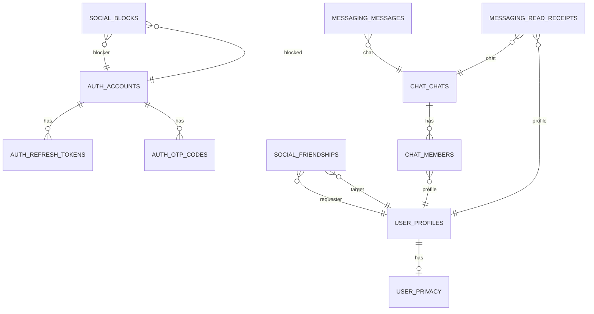

# Схемы PostgreSQL (волна v1)

Детальные таблицы, индексы и внутренние связи для сервисов из [DATA_SCOPE_V1.md](../DATA_SCOPE_V1.md). Общие правила ID и ссылок между БД: [DATA_MODEL.md](../DATA_MODEL.md). Инвентарь БД: [DATA_STORES.md](../DATA_STORES.md).

| Файл | БД | Сервис |
|------|-----|--------|
| [auth-service.md](auth-service.md) | `auth_db` | Auth |
| [user-service.md](user-service.md) | `user_db` | User |
| [social-service.md](social-service.md) | `social_db` | Social |
| [chat-service.md](chat-service.md) | `chat_db` | Chat |
| [messaging-service.md](messaging-service.md) | `messaging_db` | Messaging |

Realtime в v1 без PostgreSQL; Redis — вне этого каталога.

**Целевые схемы всех БД полного приложения** (порядок введения, все сервисы с PostgreSQL + ClickHouse): [target/README.md](target/README.md).

---

## Миграции БД

- **Auth Service (Java, `VoiceAuthService`):** **Flyway**, SQL-миграции рядом с модулем сервиса.
- **Сервисы на Go** (User, Social, Chat, Messaging и остальные с PostgreSQL): **golang-migrate**, SQL-файлы (`*.up.sql` / `*.down.sql` или принятый в репозитории нейминг) в каталоге миграций этого сервиса.

Один сервис — одна логическая БД — один поток миграций. Порядок **expand → contract** и владение — [OPERATIONS.md](../OPERATIONS.md) («Миграции БД»). Содержимое миграций выравнивается с таблицами и индексами в файлах этого каталога.

---

## ER (логический, без FK между кластерами)

Связи между БД — UUID без FK в PostgreSQL ([DATA_MODEL.md](../DATA_MODEL.md)). На диаграмме показаны логические связи для ориентира.

Имена сущностей на схеме — условные префиксы по сервису; реальные имена таблиц — в соответствующих `*-service.md`.
