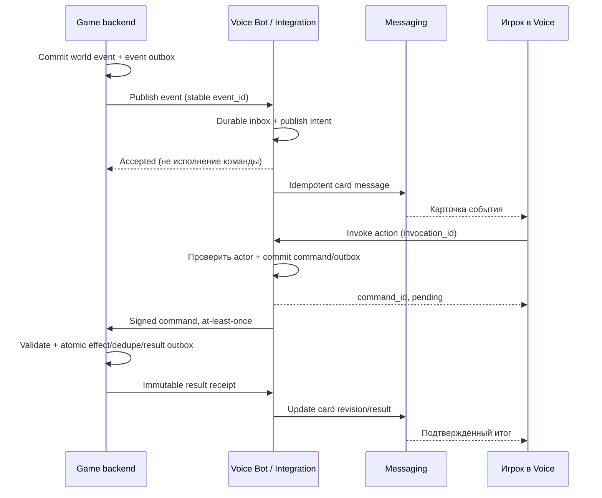

# Игровые события и команды через ботов

**Proposed target + source audit, 2026-09-26, baseline `77ec7240a`.**
[Общий продукт](game-integrations.md), [Bot v1](bots.md),
[Bot Service](../microservices/bot-service.md),
[Game API](../architecture/game-integration-api.md).

## Можно ли реализовать игру через бота

**Да, базовая цепочка поддержана исходниками:** backend игры отправляет текст
в разрешённый чат; пользователь вызывает slash-команду; webhook/polling передаёт
interaction backend игры; бот отвечает. Игровая логика и проверка владения
персонажем остаются на сервере игры.

**Нет, полный сценарий Dejavu ещё не готов:** текущие контракты не дают карточки
с кнопками, инициативные opt-in DM и гарантированную durable доставку всех команд.
Ниже перечислены проверенные source capabilities и обязательные расширения.
Это чтение кода/тестов, не результат запущенного live E2E или production sign-off.

## Проверка текущей реализации

| Capability | Доказательство в baseline | Практическое ограничение |
|---|---|---|
| Game → chat | [Gateway](../../src/backend/gateway/transcode_bots.go), route `POST /api/v1/bots/me/messages`; [SendMessage](../../src/backend/bot/internal/grpcsvc/interaction.go) | Bot Token и whitelist; send-scope enforcement имеет gap ниже; только текст |
| Player → game | `ExecuteSlashInteraction` в том же interaction.go; [proto](../../protos/voice/bot/v1/bot.proto) | Передаются invoker profile, chat, options; права на персонажа проверяет игра |
| Slash UI | [chat panel](../../src/frontend/lib/ui/chat/chat_room_panel.dart), [providers](../../src/frontend/lib/state/bot_providers.dart) | Menu/options, ephemeral/deferred path; не доказательство rich cards |
| Webhook | [deliver.go](../../src/backend/bot/internal/webhook/deliver.go) | HMAC, 3s attempt timeout, retry 408/429/5xx; default 3 попытки всего (2 повтора), не durable promise |
| Deferred reply | [deferred tests](../../src/backend/bot/internal/grpcsvc/interaction_deferred_chat_type_test.go) | Привязка к исходному destination; durable deferred не равен durable execution команды |
| Polling | [PollEvents](../../src/backend/bot/internal/grpcsvc/bot.go), Gateway `/api/v1/bots/me/interactions/poll` | Cursor не используется; delivered отмечается после stream.Send, до ACK обработки игрой |
| Обычные message.sent events | [message delivery store](../../src/backend/bot/internal/store/message_delivery.go), [consumer](../../src/backend/bot/internal/consumer/message_events.go) | Recipient outbox и dedupe `(bot_id,message_id)`; отдельный путь, не гарантия slash |
| Cards/buttons | Send/Edit schema в bot.proto и response payload | Нет component/action contracts; нужны Messaging + Realtime + Flutter изменения |
| Proactive DM | `DM_SEND requires interaction context` в SendMessage | Opt-in DM — post-v1 в bots.md; общий флаг согласия сейчас не включает эту возможность |
| Message idempotency | `postMessage` vs `postInteractionMessage` в interaction.go | Обычная отправка не передаёт стабильный client message ID; deferred выводит его из bot/token |

### Обнаруженные gaps перед pilot с реальными игровыми последствиями

1. Slash path игнорирует ошибку `EnqueueEvent`, а webhook запускается goroutine с
   process-local ожиданием. Нельзя обещать восстановление каждой команды после
   crash. Нужны durable acceptance и outbox worker.
2. Polling подтверждает доставку раньше обработки получателем; потеря HTTP-ответа
   может оставить команду без обработки. Текущий polling — только local dev;
   production polling требует leased delivery + explicit ACK, если будет включён.
3. `ExecuteSlashInteraction` сам не доказывает membership вызывающего профиля;
   whitelist бота недостаточен для user authorization. End-to-end проверка доступа
   нужна на каждом публичном пути, включая прямые обращения и revoked membership.
4. `CompleteInteraction` использует Hub до bot-bound SQL lookup deferred fallback.
   В целевом контракте credential/token/destination должны проверяться одинаково
   на live и recovery путях, до side effect.
5. Выбор recipients обычных сообщений в `QueueMessageRecipients` не доказывает
   требуемый read scope. Game adapter получает commands по умолчанию; чтение всей
   переписки требует отдельного разрешения и end-to-end enforcement.
6. `thread_parent_id` существует в proto, но обычный `postMessage` не передаёт его
   дальше в Messaging. Threaded replies нельзя рекламировать как проверенный путь.
7. SendBotMessage без interaction token проверяет whitelist, но `postMessage`
   не проверяет `TEXT_CHAT_SEND_MESSAGES`. До production game notifications нужен
   одинаковый send-scope enforcement на обычном, deferred и recovery путях.

Исправления не входят в этот docs-only change. Они перечислены как activation
gates, а не обходятся повышенными правами бота.

## 1. Модель приложения и персонажа

У игры одна app identity и одна или несколько environment-specific bot
installations. Один bot может оформлять сообщения нескольких персонажей.
`character_binding_id` задаёт проверенный контекст; имя/аватар не меняют реального
автора. В UI всегда видны приложение и отметка игрового персонажа, чтобы NPC не
выглядел как обычный человек или системное сообщение Voice.

Бот действует в разрешённых чатах либо в личном app conversation после отдельного
opt-in. App conversation для первой реализации — существующий допустимый тип
DM с bot actor и расширенным consent, не новый тип `chat_type`. Необходимые Bot/Chat
изменения должны быть явно внесены в контракт; текущий v1 такого пути не обещает.
E2E DM с ключами только людей не становится доступен боту: game conversation
должен явно показывать участие backend игры и не обещать end-to-end секретность
от этого backend. Self-hosted node тоже видит обрабатываемый ею plaintext.

## 2. Событие игры

Предлагаемый `POST /api/v1/game-integrations/events` принимает service principal;
app/env выводятся из credential. Схема:

| Поле | Тип / правило |
|---|---|
| `event_id` | Стабильный UUID события, повтор сохраняет ID и payload |
| `installation_id` | UUID активной установки этой игры/окружения |
| `recipient` | Ровно один `binding_id` либо разрешённый `chat_id`; не произвольный account ID |
| `character_binding_id` | Optional UUID; игра доказывает ownership выбранному адресату |
| `event_type`, `schema_version` | Allowlisted enum/string + положительная версия |
| `occurred_at`, `expires_at` | UTC; expiry обязательно для ограниченных во времени actions |
| `state_version` | Opaque game revision для compare-and-set |
| `text`, `card` | Локализованный fallback и разрешённая component schema |
| `notification_category` | Разрешённая категория user consent, например discoveries/tasks |
| `correlation_id` | Нечувствительный tracing ID, не token |

Ingest сохраняет inbox/event record + publish intent в одной транзакции и только
после этого отвечает 202. Дубликат с тем же hash возвращает исходный result;
изменённый payload с тем же event ID → 409. Worker публикует в Messaging с
детерминированным client ID и сохраняет message ID. Crash между send и receipt
не создаёт второго сообщения при повторе. Просроченное событие может попасть в
журнал как факт, но не получает активных кнопок или запоздалого срочного push.

Game backend использует собственный transactional outbox: commit события игры и
intent отправки атомарны. Voice не может восстановить событие, которое игра
никогда durable не сохранила.

## 3. Карточки и действия

Минимальный declarative набор: text, заголовок, проверенная media reference,
список facts/costs, buttons, select с allowlisted choices. Не поддерживаются
произвольный HTML/JS, URL callbacks из сообщения и исполняемые payload.

Action хранит `action_id`, allowlisted `action_type`, label, immutable typed args,
game state version, expiry, allowed actor policy и optional confirmation summary.
Сервер хранит canonical action отдельно от отображаемой подписи. Клиент отправляет
ID, а не цену, recipient или выполняемую команду из редактируемого UI.
Update карточки создаёт новую revision; старые action IDs не получают новое
значение. Link-only «Открыть игру» не исполняет mutation и не несёт credentials.

Хранение в Messaging должно сохранять app/bot attribution, schema version,
components, revision, fallback и terminal result reference. History, message
read, realtime, edit и forwarding соблюдают одну schema. При пересылке/copy-as-new
интерактивность отключена: кнопка, рассчитанная на исходного адресата и сообщение,
не переносит полномочия в другой чат. Search индексирует безопасный текст, не
command payload или secrets.

## 4. Команда пользователя

Предлагаемый endpoint: `POST /api/v1/game-integrations/actions/{action_id}/invoke`.
Auth — delegated или обычный Voice player session выбранного профиля. Тело:
`message_id`, `card_revision`, `invocation_id` (UUID), optional typed selection.
Headers: `Idempotency-Key`. Ответ: `202 {operation_id, command_id, status:"accepted"}` после
durable acceptance; invalid/expired/revoked → 403/409/410. Это ещё не `succeeded`.

Проверки Voice: текущий session/binding/app/installation, доступ к исходному
message/chat, точный actor policy, revision/expiry, scope, block/sanction/lifecycle.
Неизвестный action или подмена chat/character не превращаются в новое действие.
После проверки Voice сохраняет command + delivery outbox, подписывает server
envelope и отправляет его на зарегистрированный endpoint игры.

Envelope содержит `command_id`, `invocation_id`, event/action/message IDs,
binding/profile context, installation/app/env, trusted actor proof,
issued/expiry timestamps, game state version и canonical arguments. Для
делегирования на удалённую ноду actor proof отдельно ограничен audience,
operation, node, space и binding revision; node identity не позволяет
самостоятельно изображать действие игрока.

Проверки игры: signature/raw body/time window, own app/env, действующий binding,
владение персонажем, allowed action, версия мира/ресурсы, command expiry и dedupe.
Членство в Voice-чате само по себе не даёт право распоряжаться персонажем.

Перед эффектом игра получает одноразовый execution admission по
[Game API](../architecture/game-integration-api.md). Voice сериализует его с
revoke в собственной БД. Отзыв, committed до admission, блокирует команду;
ранее допущенная in-flight команда может завершиться после unlink в пределах
permit window. Distributed atomic commit Voice↔game не предполагается. Игра
в своей транзакции связывает dedupe permit/command с эффектом. Назначение долгой
задачи — короткая mutation; её последующие часы симуляции не являются in-flight
webhook. Game cancel этой задачи — отдельная команда и отдельные правила.

### Состояния command

`accepted → queued → processing → succeeded | rejected | expired | cancelled`.
Transport timeout может отображаться как `reconciling` без terminal failure.
После подтверждённого игрового commit команда не может стать cancelled.
Cancel до commit — best effort с CAS в игре; UI показывает результат проверки.

Игровой handler атомарно записывает `command_id` и эффект в свою БД. Повтор
возвращает прежний result. Разные command IDs для одного одноразового event/action
также контролируются game state version/consumption record: двойной клик с двух
устройств не расходует корм дважды. Мы обещаем at-least-once delivery с
идемпотентным эффектом, а не transport exactly-once.

При acceptance создаётся неизменяемое соответствие одного `operation_id` одному
`command_id`; повтор invoke возвращает оба исходных ID. Command lifecycle выше
описывает исполнение игры; orchestration operation из Game API остаётся pending
до terminal result и затем становится succeeded/failed. Operation GET содержит
command ID и domain status. Успешная доставка webhook не завершает operation.

Игра сохраняет result outbox и передаёт signed result receipt. Предлагаемый
`POST /api/v1/game-integrations/commands/{id}/result` принимает только credential
точных app/environment/installation, владеющих командой. Body: `result_id`,
terminal status, state version, safe summary. Result ID и normalized payload hash
неизменяемы: тот же ID с другими данными → 409. Первый допустимый terminal result
фиксируется CAS; поздний противоречивый receipt не перезаписывает success,
а вызывает conflict/reconciliation с durable game command record. Voice обновляет
operation и карточку идемпотентно. Отсутствие результата не решается созданием
нового command ID. Предлагаемый `GET /.../commands/{id}` возвращает статус только
исходному актору/уполномоченному service, включая оба ID.

## 5. Webhook, replay и recovery



Пример payload события (условные ID; схема target):

```json
{
  "event_id": "<uuid>",
  "installation_id": "<uuid>",
  "recipient": {"binding_id": "<uuid>"},
  "character_binding_id": "<uuid>",
  "event_type": "creature.discovered",
  "schema_version": 1,
  "occurred_at": "2026-09-26T12:00:00Z",
  "expires_at": "2026-09-26T13:00:00Z",
  "state_version": "encounter-42:v3",
  "notification_category": "discoveries",
  "text": "Найден железный олень. Приручение: 20 единиц корма.",
  "card": {
    "schema_version": 1,
    "actions": [{
      "action_id": "<uuid>",
      "action_type": "creature.tame",
      "label": "Приручить",
      "arguments": {"encounter_id": "encounter-42"}
    }]
  }
}
```

Цена в тексте только информирует. Авторитетная стоимость вычисляется игрой по
state_version при execution. Если цена/последствия изменились, handler возвращает
`STATE_CHANGED` и новую карточку с новым action ID, а не списывает новую сумму.
Если карточка публична, приватный result не публикуется в общий чат автоматически:
audience результата не шире исходного consent/actor policy.

Сохраняем привычный v1 HMAC transport: `X-Voice-Signature: v1=<hex>`,
`X-Voice-Timestamp`, подпись raw body с timestamp. Секрет берётся из установки;
constant-time comparison, проверка окна ±5 минут и durable command ID dedupe.
Timestamp window не заменяет dedupe. Retry получает новый delivery timestamp,
но прежние command ID и semantic payload. Ключи ротируются через key ID и
ограниченное overlap окно; старый ключ после revoke не принимается.

Receiver отвечает в течение существующего 3s response budget; durable accepted
ACK означает «сохранено для обработки». Длительная работа использует defer/result.
Ошибка persistence → retryable error, не ACK. Предлагаемый outbox retry использует
exponential backoff+jitter, Retry-After для 429, bounded expiry и operator-visible
dead letter. 401/403 вызывают диагностику credential/config, а не бесконечную
бурю повторов. Retry/retention budgets публикуются как application capabilities.

Webhook URL проверяется при регистрации и доставке: HTTPS, разрешённые порты,
защита от SSRF/private/metadata destinations и DNS rebinding, без auth-bearing
redirects. Dev использует polling; webhook — staging/production по канону.

Новая durable polling capability, если будет выбрана, требует delivery lease,
opaque cursor и отдельного ACK после записи game inbox. Текущий v1 PollEvents
не переименовывается в reliable production API. Потерянная lease возвращает
событие в очередь с тем же command ID.

## 6. Уведомления и consent

Consent хранит app/env/binding/profile, разрешённые категории, channel, revision,
created/revoked timestamps. Scope бота и согласие пользователя проверяются вместе.
Подключение игры не означает разрешение на маркетинг или чтение всех сообщений.
Отписка отменяет новые уведомления и недоставленные push, но не откатывает игру.

Notification Service сохраняет канон presence, quiet hours, archive, block и
grouping; game SDK online-presence не должен незаметно подавлять нужные мобильные
уведомления — устройство/канал активности требуется согласовать перед mobile gate.
Интеграция не обходит DND через mention. Preview персонажа/локации по умолчанию
не раскрывается на lock screen без принятой настройки. Сводки и частота задаются
пользователем; срочность игры не даёт безусловный high-priority push.

Событие и push — разные сущности. Пропущенный push не удаляет журнал и command
status; доставленный push не доказывает, что пользователь прочитал/ответил.
Без мобильного delivery gate нельзя рекламировать «управление с телефона»,
хотя browser/desktop proof уже может работать.

## 7. Минимальный проверяемый путь до rich cards

Для dev-прототипа использовать sandbox Space и whitelist одного group chat:
игра отправляет текст «найден олень, event 42»; пользователь вызывает
`/dejavu decide event:42 choice:mark`; адаптер проверяет profile binding и
отвечает текстом. Начинать с read-only или безопасного игрового действия.

Существующий [Flutter live test](../../src/frontend/test/bots_slash_e2e_live_test.dart)
описывает install → polling `/ping` → persisted `pong`; он не доказывает
игровую транзакцию, card UI или proactive DM. Полезные существующие tests:
[webhook](../../src/backend/bot/internal/webhook/deliver_test.go),
[consumer](../../src/backend/bot/internal/consumer/message_events_test.go),
[deferred](../../src/backend/bot/internal/grpcsvc/interaction_deferred_chat_type_test.go).
При реализации запускать их по [TESTING](../TESTING.md) вместе с новой
[game acceptance matrix](../testing/game-integrations-acceptance.md).

## 8. Release gate

До включения irreversible/resource-spending commands обязательны: source gaps
выше закрыты; actor binding на каждом пути; durable request/result; двойной клик,
повтор webhook и crash recovery не дублируют эффект; stale/forwarded action
отклоняется; revoke до admission прекращает команду, in-flight порядок соблюдён; неизвестный результат
показывается честно. Cards и opt-in DM включаются отдельными capabilities после
своих контрактных, Flutter и live тестов. Federation не является предпосылкой.
