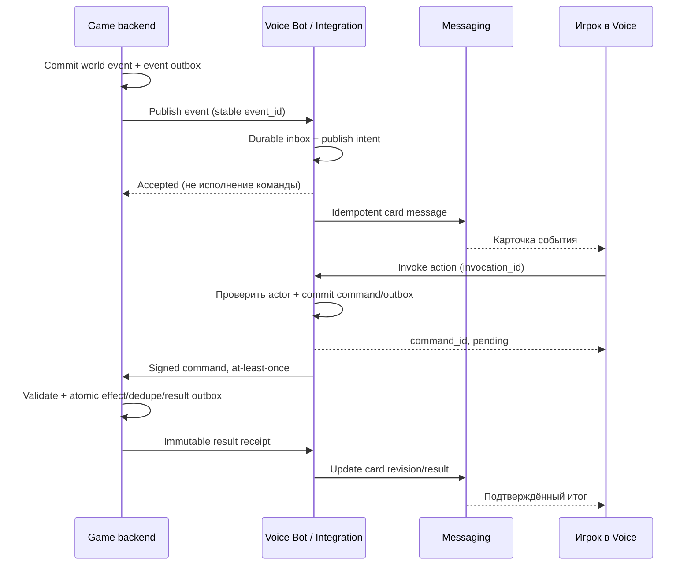

# Игровые события и команды через ботов

**Proposed target. Source audit refreshed 2026-09-28 at `b894441983b81fdce2964159bed9a123689b07e3`.**
[Общий продукт](game-integrations.md), [Bot v1](bots.md),
[Bot Service](../microservices/bot-service.md),
[Game API](../architecture/game-integration-api.md).

## Можно ли реализовать игру через бота

**Да, базовая цепочка поддержана исходниками:** backend игры отправляет текст
в разрешённый чат; пользователь вызывает slash-команду; webhook/polling передаёт
interaction backend игры; бот отвечает. Игровая логика и проверка владения
персонажем остаются на сервере игры.

**Нет, полный сценарий Dejavu ещё не готов:** текущие контракты не дают карточки
с кнопками, инициативные opt-in DM и гарантированную durable доставку всех команд.
Ниже перечислены проверенные source capabilities и обязательные расширения.
Это чтение кода/тестов, не результат запущенного live E2E или production sign-off.

## Проверка текущей реализации

Таблица и seven-gap audit ниже перепроверены на указанном source target; в
частности, durable slash webhook slice из GAME-BOT-01 уже присутствует здесь.
Это source/test review, не запуск тестов и не live E2E.

| Capability | Текущее evidence | Практическое ограничение |
|---|---|---|
| Game → chat | [Gateway](../../src/backend/gateway/transcode_bots.go), route `POST /api/v1/bots/me/messages`; [SendMessage](../../src/backend/bot/internal/grpcsvc/interaction.go), [ordinary send scope test](../../src/backend/bot/internal/grpcsvc/interaction_scope_thread_test.go) | Bot Token и chat whitelist; только текст в текущем message API |
| Player → game | `ExecuteSlashInteraction` в [interaction.go](../../src/backend/bot/internal/grpcsvc/interaction.go); [proto](../../protos/voice/bot/v1/bot.proto); [durable acceptance tests](../../src/backend/bot/internal/grpcsvc/interaction_durable_test.go) | Slash acceptance/outbox is durable; права на персонажа проверяет игра, а RPC retry ещё не имеет client-supplied invocation ID |
| Slash UI | [chat panel](../../src/frontend/lib/ui/chat/chat_room_panel.dart), [providers](../../src/frontend/lib/state/bot_providers.dart) | Menu/options, ephemeral/deferred path; не доказательство rich cards |
| Webhook slash delivery | [outbox worker](../../src/backend/bot/internal/grpcsvc/interaction_outbox.go), [delivery](../../src/backend/bot/internal/webhook/deliver.go), [restart/fencing tests](../../src/backend/bot/internal/grpcsvc/interaction_durable_test.go) | Lease/backoff survives process restart; webhook can repeat after remote side effect before receipt, so game must deduplicate stable `interaction_token` |
| Deferred reply | [deferred tests](../../src/backend/bot/internal/grpcsvc/interaction_deferred_chat_type_test.go), [authority/recovery tests](../../src/backend/bot/internal/grpcsvc/interaction_authority_test.go) | Recovery is bound to bot/interaction destination; durable slash enqueue does not make the game-side command effect exactly-once |
| Polling | [PollEvents](../../src/backend/bot/internal/grpcsvc/bot.go), Gateway `/api/v1/bots/me/interactions/poll`; [polling tests](../../src/backend/bot/internal/grpcsvc/bot_c_test.go) | Dev opt-in only; event is marked delivered after `stream.Send`, with no explicit game ACK/opaque cursor |
| Ordinary `message.sent` events | [message delivery store](../../src/backend/bot/internal/store/message_delivery.go), [consumer](../../src/backend/bot/internal/consumer/message_events.go), [scope/revocation tests](../../src/backend/bot/internal/consumer/message_events_test.go) | Recipient delivery now checks `TEXT_CHAT_READ_HISTORY`; this event outbox is separate from slash command delivery |
| Cards/buttons | Send/Edit schema в [bot.proto](../../protos/voice/bot/v1/bot.proto) и response payload | Executable component/action path ещё отсутствует; нужны Messaging + Realtime + Flutter изменения |
| Proactive DM | `DM_SEND requires interaction context` в SendMessage | Opt-in DM — post-v1 в bots.md; общий флаг согласия сейчас не включает эту возможность |
| Message idempotency and thread | [postMessage](../../src/backend/bot/internal/grpcsvc/interaction.go), [scope/thread tests](../../src/backend/bot/internal/grpcsvc/interaction_scope_thread_test.go) | Thread parent and send scope are propagated/checked; ordinary send still has no client-supplied stable message ID |

### Статусы семи gaps из исходного source audit

| Исходный gap | Состояние на текущем target |
|---|---|
| Durable slash acceptance и crash recovery | Закрыт для slash webhook enqueue/delivery: [restart test](../../src/backend/bot/internal/grpcsvc/interaction_durable_test.go) и [outbox fencing tests](../../src/backend/bot/internal/grpcsvc/interaction_outbox_fencing_test.go). Игра всё ещё должна дедуплицировать повторный webhook; результат remote side effect нельзя атомарно зафиксировать в Bot. |
| Polling ACK и crash recovery | Остаётся ограниченным dev path: stream send считается доставкой; явного game ACK/opaque cursor нет. Не является production reliable mode. |
| Slash membership/scope checks | Проверяются fail-closed перед slash admission/discovery; evidence: [membership tests](../../src/backend/bot/internal/grpcsvc/interaction_membership_test.go) и [scope/thread tests](../../src/backend/bot/internal/grpcsvc/interaction_scope_thread_test.go). Не расширяйте этот вывод на независимые новые game endpoints без их собственных checks. |
| `CompleteInteraction` bot/token/destination authority | Текущий live/recovery boundary покрыт [authority tests](../../src/backend/bot/internal/grpcsvc/interaction_authority_test.go), включая чужой bot и восстановление deferred ответа. |
| Read-history scope для обычных message events | Проверяется при выборе и повторной доставке recipients; evidence: [message delivery tests](../../src/backend/bot/internal/consumer/message_events_test.go). |
| `thread_parent_id` propagation | Обычный и deferred путь имеют тесты propagation в [scope/thread tests](../../src/backend/bot/internal/grpcsvc/interaction_scope_thread_test.go). |
| `TEXT_CHAT_SEND_MESSAGES` для обычного Bot send | Проверяется на ordinary send path в [scope/thread tests](../../src/backend/bot/internal/grpcsvc/interaction_scope_thread_test.go). |

Здесь закрытие gap означает только source/test coverage в названном Bot path.
Оно не включает rich cards/actions, подписанные game events, production polling,
game-side idempotency или полный game Bot pilot.

### Реализованный Bot slice после baseline audit

`GAME-BOT-01` добавляет для существующего slash RPC fail-closed acceptance:
`ExecuteSlashInteraction` возвращает ошибку, если запись interaction в
`bot_event_log` не сохранилась, и до этого не вызывает webhook. Webhook delivery
берётся по lease из PostgreSQL outbox; отдельный worker после рестарта повторяет
pending interaction с тем же `interaction_token`. Временная HTTP-ошибка оставляет
запись pending с backoff до восьми lease attempts или 24 часов с момента
acceptance, после чего запись становится terminal `failed`; постоянная ошибка
сразу оставляет `failed`. Переходы `pending → deferred/delivered/failed` и
retry требуют номер актуального claim и незавершённый lease, поэтому worker,
продолживший работу после lease expiry, не переписывает результат нового worker.
Timeout ожидания
синхронного ответа больше не удаляет pending intent. Перед acceptance и перед
повторной доставкой Bot запрашивает у Chat effective membership профиля и
проверяет текущие whitelist и send scopes. `PollEvents` отклоняет вызовы
webhook-бота, чтобы streaming path не забирал его pending outbox intent.

Это только надёжная постановка и доставка **slash webhook**. Повторный webhook
возможен после crash между выполнением HTTP на стороне игры и записью receipt;
игра должна дедуплицировать стабильный `interaction_token`. Текущий slash RPC
не содержит client-supplied invocation ID, поэтому повтор *самого* RPC создаёт
новую команду. Ответ webhook после client timeout не восстанавливает
синхронный ephemeral/content result в клиенте, а обычный message reply ещё не
имеет стабильного idempotency key. BOT01–13 и новый game action endpoint этим
slice не закрыты.

Дополнение T50: production polling отключён без явного
`BOT_ENABLE_DEV_POLLING=true`; это не leased polling с ACK. Получателей
`message.sent` выбирают и повторно проверяют с текущим
`TEXT_CHAT_READ_HISTORY`; отправка обычного и deferred сообщения требует
`TEXT_CHAT_SEND_MESSAGES`, а `thread_parent_id` передаётся в Messaging.
Completion, defer и send с interaction token сначала проверяют привязку к
credential bot, исходному чату, текущему whitelist/scopes и effective
membership вызывавшего профиля, затем меняют Hub или отправляют сообщение.
Slash discovery и autocomplete также требуют effective membership; completion
autocomplete привязан к credential bot. Таким образом семь baseline gaps
закрыты в Bot-owned путях, кроме production polling: оно остаётся отключённым.
Полный T50 требует интеграционного прогона с PostgreSQL/Chat/Messaging и проверки
внешних Gateway маршрутов; здесь есть лишь source и локальные тесты без Docker.

### Граница Bot для T51/T52

Game Integration Service владеет проверкой service principal, app/environment,
installation, recipient/binding/character, expiry и hash события, а также
durable inbox/outbox и ответом 202/409. На границу публикации он передаёт
только проверенный immutable intent. Его канонический wire contract —
[T51 Game Event v1](../architecture/game-integration-api.md#t51-game-event-v1-ingress-and-publication-contract).
GIS хранит event dedupe/outbox; Bot синхронно передаёт проверенный текст в
Messaging, а Messaging owns the durable message and
`(chat_id, sender_profile_id, client_message_id)` dedupe. Raw game credentials
and caller-selected account identities are never forwarded. Existing
`SendBotMessage` is not this contract: it lacks event authority and a stable
publication key.

T51 schema version 1 publishes plain fallback text only. Cards, media, actions,
and their app/character display metadata stay in T52 and require the typed
Messaging card contract; T51 does not smuggle them through message JSON/content.
GIS installation-to-Bot binding, active binding authority, and app-linked
chat/resource mapping are prerequisites and are not implemented by this
contract freeze.

Для T52 сохранение versioned card, canonical actions, app/character attribution,
forwarding/copy-as-new и history/search ACL принадлежит Messaging contract.
Bot может переслать лишь проверенную ссылку/структуру карточки через будущий
типизированный Messaging API; нынешний текстовый `SendBotMessage` не является
card transport. До согласования схемы и проверяемого потребителя Bot не создаёт
отдельный card store или обходной JSON в content.

## 1. Модель приложения и персонажа

У игры одна app identity и одна или несколько environment-specific bot
installations. Один bot может оформлять сообщения нескольких персонажей.
`character_binding_id` задаёт проверенный контекст; имя/аватар не меняют реального
автора. В UI всегда видны приложение и отметка игрового персонажа, чтобы NPC не
выглядел как обычный человек или системное сообщение Voice.

Бот действует в разрешённых чатах либо в личном app conversation после отдельного
opt-in. App conversation для первой реализации — существующий допустимый тип
DM с bot actor и расширенным consent, не новый тип `chat_type`. Необходимые Bot/Chat
изменения должны быть явно внесены в контракт; текущий v1 такого пути не обещает.
E2E DM с ключами только людей не становится доступен боту: game conversation
должен явно показывать участие backend игры и не обещать end-to-end секретность
от этого backend. Self-hosted node тоже видит обрабатываемый ею plaintext.

## 2. Событие игры

`POST /api/v1/game-integrations/events` and its schema, HMAC, event identity,
expiry, retry, and GIS→Bot→Messaging transport are frozen in the linked
[T51 Game Event v1 contract](../architecture/game-integration-api.md#t51-game-event-v1-ingress-and-publication-contract).
Schema version 1 accepts one recipient, one optional character binding, and
plain fallback text; it does not accept cards/actions or proactive DMs. GIS
persists the event and publication outbox atomically. A game backend must also
persist its game event and source send intent atomically; Voice cannot recover
an event the game never durably recorded.

## 3. Карточки и действия

Минимальный declarative набор: text, заголовок, проверенная media reference,
список facts/costs, buttons, select с allowlisted choices. Не поддерживаются
произвольный HTML/JS, URL callbacks из сообщения и исполняемые payload.

Action хранит `action_id`, allowlisted `action_type`, label, immutable typed args,
game state version, expiry, allowed actor policy и confirmation policy/summary.
Q05 contract: подтверждение не требуется только для явно allowlisted read-only
действий. Irreversible, value/currency, one-shot consumption, privacy/data export,
permission/authority и external-message действия всегда требуют challenge.
Unknown/unclassified action также требует challenge; если сервер не может
определить доверенный risk class/summary или выдать challenge, действие denied.
Этот фиксированный безопасный default можно уточнить в будущей продуктовой
версии, но реализация не должна иметь открытый allow-by-default класс.
Challenge — opaque 256-bit value, хранится только hash, истекает через 5 минут и
связывает account/profile/session epoch, app/env/installation, source message и
card revision, action и canonical argument hash. Подтверждение — явный
аутентифицированный вызов; consume challenge и acceptance команды атомарны.
Параллельные подтверждения с двух устройств используют CAS, победитель один.
Direct invoke не обходит challenge; exact idempotency retry возвращает ту же
challenge/operation, иной replay отклоняется; после истечения/revoke нужна новая
invoke. Нужны тесты на 5m-1/5m/5m+1 и конкурентный CAS.
Сервер хранит canonical action отдельно от отображаемой подписи. Клиент отправляет
ID, а не цену, recipient или выполняемую команду из редактируемого UI.
Update карточки создаёт новую revision; старые action IDs не получают новое
значение. Link-only «Открыть игру» не исполняет mutation и не несёт credentials.

Хранение в Messaging должно сохранять app/bot attribution, schema version,
components, revision, fallback и terminal result reference. History, message
read, realtime, edit и forwarding соблюдают одну schema. При пересылке/copy-as-new
интерактивность отключена: кнопка, рассчитанная на исходного адресата и сообщение,
не переносит полномочия в другой чат. Search индексирует безопасный текст, не
command payload или secrets.

## 4. Команда пользователя

Предлагаемый endpoint: `POST /api/v1/game-integrations/actions/{action_id}/invoke`.
Auth — delegated или обычный Voice player session выбранного профиля. Тело:
`message_id`, `card_revision`, `invocation_id` (UUID), optional typed selection.
Headers: `Idempotency-Key`. Ответ: `202 {operation_id, command_id, status:"accepted"}` после
durable acceptance; invalid/expired/revoked → 403/409/410. Это ещё не `succeeded`.

Проверки Voice: текущий session/binding/app/installation, доступ к исходному
message/chat, точный actor policy, revision/expiry, scope, block/sanction/lifecycle.
Неизвестный action или подмена chat/character не превращаются в новое действие.
После проверки Voice сохраняет command + delivery outbox, подписывает server
envelope и отправляет его на зарегистрированный endpoint игры.

Envelope version 1, его канонизация, key ID, HMAC bytes и request/receipt examples
определены в [Game API contract](../architecture/game-integration-api.md#t03t06-command-contract-freeze-proposed-v1).
Он содержит `command_id`, `operation_id`, `invocation_id`, event/action/message IDs,
binding/profile context, installation/app/env, trusted actor proof,
issued/expiry Unix seconds, game state version и canonical arguments. Для
делегирования на удалённую ноду actor proof отдельно ограничен audience,
operation, node, space и binding revision; node identity не позволяет
самостоятельно изображать действие игрока.

Проверки игры: signature/raw body/time window, own app/env, действующий binding,
владение персонажем, allowed action, версия мира/ресурсы, command expiry и dedupe.
Членство в Voice-чате само по себе не даёт право распоряжаться персонажем.

Перед эффектом игра получает одноразовый execution admission по
[Game API](../architecture/game-integration-api.md). Voice сериализует его с
revoke в собственной БД. Отзыв, committed до admission, блокирует команду;
ранее допущенная in-flight команда может завершиться после unlink в пределах
permit window: start строго до `permit_issued_at+10s`; commit строго до
`permit_issued_at+60s`. `permit_issued_at` выдаёт GIS при первом успешном
admission commit, не при создании command. Поэтому первое получение command на
delivery retry t=15/t=31 получает свежий permit epoch, если command ещё не
истёк и authority не отозвана. Admission retry после сохранённого permit возвращает тот же
timestamp/ID/bounds и не продлевает окно; пропущенный start не допускает нового
permit для того же command. Новый запуск требует новой user invocation. Revoke
первым в authority transaction → admission denied; permit commit первым → только
эта операция получает ограниченную +10s/+60s completion grace.
Distributed atomic commit Voice↔game не предполагается. Игра
в своей транзакции связывает dedupe permit/command с эффектом. Назначение долгой
задачи — короткая mutation; её последующие часы симуляции не являются in-flight
webhook. Game cancel этой задачи — отдельная команда и отдельные правила.

### Состояния command

`accepted → queued → processing → succeeded | rejected | expired | cancelled`.
Transport timeout может отображаться как `reconciling` без terminal failure.
После подтверждённого игрового commit команда не может стать cancelled.
Cancel до commit — best effort с CAS в игре; UI показывает результат проверки.

Игровой handler атомарно записывает `command_id` и эффект в свою БД. Повтор
возвращает прежний result. Разные command IDs для одного одноразового event/action
также контролируются game state version/consumption record: двойной клик с двух
устройств не расходует корм дважды. Мы обещаем at-least-once delivery с
идемпотентным эффектом, а не transport exactly-once.

При acceptance создаётся неизменяемое соответствие одного `operation_id` одному
`command_id`; повтор invoke возвращает оба исходных ID. Command lifecycle выше
описывает исполнение игры; orchestration operation из Game API остаётся pending
до terminal result и затем становится succeeded/failed. Operation GET содержит
command ID и domain status. Успешная доставка webhook не завершает operation.

Игра сохраняет result outbox в той же транзакции, что inbox/effect, и передаёт
signed immutable result receipt по определённому в Game API contract v1 пути. Предлагаемый
`POST /api/v1/game-integrations/commands/{id}/result` принимает только credential
точных app/environment/installation, владеющих командой. Body: `result_id`,
terminal status, state version, safe summary. Result ID и normalized payload hash
неизменяемы: тот же ID с другими данными → 409. Первый допустимый terminal result
фиксируется CAS; поздний противоречивый receipt не перезаписывает success,
а вызывает conflict/reconciliation с durable game command record. Voice обновляет
operation и карточку идемпотентно. Отсутствие результата не решается созданием
нового command ID. Предлагаемый `GET /.../commands/{id}` возвращает статус только
исходному актору/уполномоченному service, включая оба ID.

## 5. Webhook, replay и recovery


```mermaid
sequenceDiagram
  participant G as Game backend
  participant B as Voice Bot / Integration
  participant M as Messaging
  participant U as Игрок в Voice
  G->>G: Commit world event + event outbox
  G->>B: Publish event (stable event_id)
  B->>B: Durable inbox + publish intent
  B-->>G: Accepted (не исполнение команды)
  B->>M: Idempotent card message
  M-->>U: Карточка события
  U->>B: Invoke action (invocation_id)
  B->>B: Проверить actor + commit command/outbox
  B-->>U: command_id, pending
  B->>G: Signed command, at-least-once
  G->>G: Validate + atomic effect/dedupe/result outbox
  G->>B: Immutable result receipt
  B->>M: Update card revision/result
  M-->>U: Подтверждённый итог
```

Пример payload события (условные ID; схема target):

```json
{
  "event_id": "<uuid>",
  "installation_id": "<uuid>",
  "recipient": {"binding_id": "<uuid>"},
  "character_binding_id": "<uuid>",
  "event_type": "creature.discovered",
  "schema_version": 1,
  "occurred_at": "2026-09-26T12:00:00Z",
  "expires_at": "2026-09-26T13:00:00Z",
  "state_version": "encounter-42:v3",
  "notification_category": "discoveries",
  "text": "Найден железный олень. Приручение: 20 единиц корма.",
  "card": {
    "schema_version": 1,
    "actions": [{
      "action_id": "<uuid>",
      "action_type": "creature.tame",
      "label": "Приручить",
      "arguments": {"encounter_id": "encounter-42"}
    }]
  }
}
```

Цена в тексте только информирует. Авторитетная стоимость вычисляется игрой по
state_version при execution. Если цена/последствия изменились, handler возвращает
`STATE_CHANGED` и новую карточку с новым action ID, а не списывает новую сумму.
Если карточка публична, приватный result не публикуется в общий чат автоматически:
audience результата не шире исходного consent/actor policy.

Command/receipt HMAC canonicalization и key lookup следуют Game API contract v1.
Receiver имеет 3s response bound от начала HTTP attempt, включая чтение body;
durable accepted 202 означает «сохранено для обработки». Ошибка persistence —
не ACK. Доставка повторяется ровно в t=0,1,3,7,15,31 секунд (не более 6 HTTP
attempts), с 3s budget на попытку и тем же command ID/body; новая подпись получает
свежий timestamp. После шестой неудачи нет дальнейшей отправки: запись ждёт
`min(expires_at, accepted_at+120s)` в reconciling; по дедлайну она переходит в
DLQ/operator reconciliation. Поэтому DLQ не наступает сразу после шестой попытки.
Result receipt использует те же границы. Перезапуск восстанавливает попытки,
неизменяемое тело и дедлайн из durable outbox; таймер не начинается заново.
401/403 не повторяются автоматически; 409/410/422 требуют остановки/reconcile;
429, timeout/network/5xx допускают только ограниченные попытки. Proof: fake-clock
проверяет шесть timestamps и отсутствие седьмого после terminal deadline,
stalled-body test проверяет 3s end-to-end read bound, restart test проверяет
сохранение original deadline и DLQ outcome.

Webhook URL проверяется при регистрации и доставке: HTTPS, разрешённые порты,
ASCII callback path в canonical form из Game API contract (literal unreserved
segments, `/` separators, без percent escapes/query/fragment), защита от
SSRF/private/metadata destinations и DNS rebinding, без auth-bearing redirects.
Dev использует polling; webhook — staging/production по канону.

Новая durable polling capability, если будет выбрана, требует delivery lease,
opaque cursor и отдельного ACK после записи game inbox. Текущий v1 PollEvents
не переименовывается в reliable production API. Потерянная lease возвращает
событие в очередь с тем же command ID.

## 6. Уведомления и consent

Consent хранит app/env/binding/profile, разрешённые категории, channel, revision,
created/revoked timestamps. Scope бота и согласие пользователя проверяются вместе.
Подключение игры не означает разрешение на маркетинг или чтение всех сообщений.
Отписка отменяет новые уведомления и недоставленные push, но не откатывает игру.

Notification Service сохраняет канон presence, quiet hours, archive, block и
grouping; game SDK online-presence не должен незаметно подавлять нужные мобильные
уведомления — устройство/канал активности требуется согласовать перед mobile gate.
Интеграция не обходит DND через mention. Preview персонажа/локации по умолчанию
не раскрывается на lock screen без принятой настройки. Сводки и частота задаются
пользователем; срочность игры не даёт безусловный high-priority push.

Событие и push — разные сущности. Пропущенный push не удаляет журнал и command
status; доставленный push не доказывает, что пользователь прочитал/ответил.
Без мобильного delivery gate нельзя рекламировать «управление с телефона»,
хотя browser/desktop proof уже может работать.

## 7. Минимальный проверяемый путь до rich cards

Для dev-прототипа использовать sandbox Space и whitelist одного group chat:
игра отправляет текст «найден олень, event 42»; пользователь вызывает
`/dejavu decide event:42 choice:mark`; адаптер проверяет profile binding и
отвечает текстом. Начинать с read-only или безопасного игрового действия.

Существующий [Flutter live test](../../src/frontend/test/bots_slash_e2e_live_test.dart)
описывает install → polling `/ping` → persisted `pong`; он не доказывает
игровую транзакцию, card UI или proactive DM. Полезные существующие tests:
[webhook](../../src/backend/bot/internal/webhook/deliver_test.go),
[consumer](../../src/backend/bot/internal/consumer/message_events_test.go),
[deferred](../../src/backend/bot/internal/grpcsvc/interaction_deferred_chat_type_test.go).
При реализации запускать их по [TESTING](../TESTING.md) вместе с новой
[game acceptance matrix](../testing/game-integrations-acceptance.md).

## 8. Release gate

До включения irreversible/resource-spending commands обязательны: source gaps
выше закрыты; actor binding на каждом пути; durable request/result; двойной клик,
повтор webhook и crash recovery не дублируют эффект; stale/forwarded action
отклоняется; revoke до admission прекращает команду, in-flight порядок соблюдён; неизвестный результат
показывается честно. Cards и opt-in DM включаются отдельными capabilities после
своих контрактных, Flutter и live тестов. Federation не является предпосылкой.
